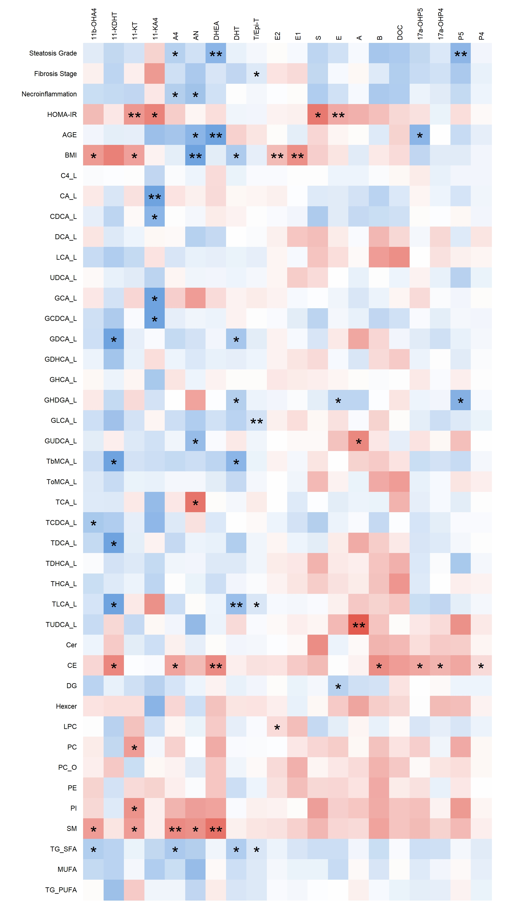

# Introduction
```{r, warning=FALSE,message=FALSE}

# Welcome to the 'steroid data analysis' webpage! a

# The procedures and explanations to make all the analysis and plots are in their individual chapters below. 
# These methods could be also easily applied to other types of data sets and metabolites than 'steroids' and their respective metadata per se. 
# In addition, there is a small 'disclaimer' also at the end of this webpage to emphasize that this site is mainly for educational purposes.
# Please let me know if you have any questions. For that, use the 'following' email: patati at the university of Turku

```

# Loading Required R Packages 
```{r, warning=FALSE, message=FALSE}
# Set library paths if needed
# .libPaths(c("C:/Program Files/R/R-4.4.1/library", .libPaths()))
# Fyi: adding echo=FALSE here (at the R markdown header) does not show this code block.

# List of libraries to load (alphabetically sorted)


packages <- c("bigsnpr", "binilib", "brickster", "car", "censReg", "circlize", "ComplexHeatmap", "correlation", 
              "corrplot", "daiR", "datarium", "dmetar", "dplyr", "effsize", "extrafont", "forcats", "fs", "FSA", 
              "ggcorrplot", "ggforce", "ggforestplot", "ggplot2", "ggplotify", "ggpubr", "ggsankey", "ggsankeyfier", 
              "ggh4x", "ggtext", "glmnet", "grid", "Hmisc", "hrbrthemes", "igraph", "insight", "lavaan", "lmtest", 
              "lme4", "lsr", "magick", "magrittr", "Maaslin2", "mdatools", "mediation", "meta", "mgcv", "mlma", 
              "MOFA2", "pheatmap", "PerformanceAnalytics", "pathviewr", "plyr", "plotrix", "ppcor", "prettydoc", 
              "psych", "quantreg", "qpgraph", "ragg", "RColorBrewer", "rcompanion", "readxl", "remotes", "reshape2", 
              "rgl", "rmarkdown", "rmdformats", "rstatix", "scales", "scater", "scatterplot3d", "sjPlot", "stringr", 
              "superb", "tibble", "tidyverse", "tint", "tufte", "viridis","WGCNA", "xlsx")

# Load all libraries
.libPaths(c("C:/Program Files/R/R-4.4.1/library", .libPaths()))
# invisible(lapply(packages, library, character.only = TRUE))

# invisible(lapply(packages, function(pkg) {
#   if (!requireNamespace(pkg, quietly = TRUE)) {
#     install.packages(pkg)
#   }
#   library(pkg, character.only = TRUE)
# }))
# 
# library(scales)
invisible(lapply(setdiff(packages, "scales"), library, character.only = TRUE))


# Note: Do not load 'forestplot' as it conflicts with 'ggforestplot'
# You may need to load both rmarkdown and rmdformats and install some dependencies (if prompted) to get this loading done.
# If done together with Github, this maybe good to know: https://stackoverflow.com/questions/11384928/change-git-repository-directory-location

# Install packages if not already installed
# renv::install() # Installs from the basic R repository
# if (!require("BiocManager", quietly = TRUE)) install.packages("BiocManager")
# BiocManager::install(c("ComplexHeatmap", "DESeq2", "dmetar", "fgsea", "ggforestplot", "ggsankey", "limma", "Maaslin2", "metagenomeSeq", "MOFA2", "qpgraph", "scater", "scRNAseq", "sevenbridges"))
# remotes::install_github(c("davidsjoberg/ggsankey", "fossbert/binilib", "MathiasHarrer/dmetar", "mattflor/chorddiag", "NightingaleHealth/ggforestplot"))
# devtools::install_github("mattflor/chorddiag") # Alternative installation method

#Fyi: Run Current Chunk:
# Ctrl + Alt + C (Windows/Linux)
# Run All Chunks Above:
# Ctrl + Alt + P (Windows/Linux)
# Run All Chunks Below:
# Ctrl + Alt + N (Windows/Linux)
# Run All Chunks in Document:
# Ctrl + Alt + R (Windows/Linux)

```

# Importing Data and Metadata 
```{r, warning=FALSE,message=FALSE}

# First set your data folder:
setwd("C:/Users/patati/Documents/GitHub/Steroid_Data_Analysis")
# or:"C:/Users/patati/Desktop/Turku/R" #check the wd with: here::here() #or getwd()
load("thereal_v2.RData") #This is so to say real data, and it is not available here (at the site).

# It is easier to load the ready stiched data in one go with .RData file than one by one as below, but
# for educational purposes I put some examples what may need to be done to get your data in ok form 
# for later purposes
setwd("C:/Users/patati/Desktop/Turku/R")
NonAlcoholicFattyLiverDisease=read_excel("NAFLD_SteroidStudy.xlsx",sheet = "LFAT_steroidsDATA") # This is partly auxiliary
columnNames=colnames(NonAlcoholicFattyLiverDisease); NonAlcoholicFattyLiverDisease=data.frame(NonAlcoholicFattyLiverDisease)

#The names of the steroid steroidGroups need to be imported early on:
steroidGroups=read.csv("groups_17823.csv", header = TRUE, sep=";")
steroidGroups=steroidGroups[,c('Group','Abbreviation')]
steroidGroups=steroidGroups[steroidGroups[,'Abbreviation']!='F',]
steroidGroups=steroidGroups[order(steroidGroups[,'Group']),]
steroidGroups[,'Abbreviation'][steroidGroups[,'Abbreviation']=='17aOH-P4']='17a-OHP4'
groupValues=steroidGroups

steroidNames=read_excel("NAFLD_SteroidStudy_for groups.xlsx",sheet = "Steroid name abbreviations") 
# This is partly auxiliary
groups2=data.frame(steroidNames)[,1:4]; g1=read.csv("groups_17823.csv", header = TRUE, sep=";")
groups2=cbind(g1[,'Group'], groups2[,c('Abbreviation','Abbreviation_old','Name')])
groups2=groups2[groups2[,'Abbreviation']!='FF',]; colnames(groups2)[1]="Group";
groups2=groups2[order(groups2[,'Group']),]
groups2[,'Abbreviation'][groups2[,'Abbreviation']=='17aOH-P4']='17a-OHP4'
groups2[,'Group'][groups2[,'Abbreviation_old']=='DOC']='Mineralocorticoids'
# head(groups2)


#P4 was found from elsewhere to have the following characteristics:
NonAlcoholicFattyLiverDisease[,'P4'] = as.numeric(NonAlcoholicFattyLiverDisease[,'P4'])
# NonAlcoholicFattyLiverDisease[,'P4'][is.na(NonAlcoholicFattyLiverDisease[,'P4'])] = 22557.3330346846 
# median(NonAlcoholicFattyLiverDisease[,'P4'], na.rm=TRUE) 
NonAlcoholicFattyLiverDisease[,5:7][NonAlcoholicFattyLiverDisease[,5:7]==0.01]=0; colnames(NonAlcoholicFattyLiverDisease)=columnNames
MetabolicAssociatedLiverDisease=read_excel("Combined.Matrix.For.Pauli.2023.10.17.Excel.Formatv2.xlsx") # This is the main file
columnNames=colnames(MetabolicAssociatedLiverDisease); MetabolicAssociatedLiverDisease=data.frame(MetabolicAssociatedLiverDisease); colnames(MetabolicAssociatedLiverDisease)=columnNames   
# All kinds of tricks are needed for getting the right data format
rownames(MetabolicAssociatedLiverDisease)=MetabolicAssociatedLiverDisease[,1]
MetabolicAssociatedLiverDisease[,'P4'] = as.numeric(MetabolicAssociatedLiverDisease[,'P4']) 
#The same comment as above
MetabolicAssociatedLiverDisease[,'P4'][is.na(MetabolicAssociatedLiverDisease[,'P4'])] = 22557.3330346846 
evaluationCriteria=c('Grade(0-3)', 'Stage(0-4)','Necroinflammation')
MetabolicAssociatedLiverDisease[,evaluationCriteria][MetabolicAssociatedLiverDisease[,evaluationCriteria]==0.01]=0; 
targetData=c('11-KDHT','AN','DHT','17a-OHP5','E2','P5','DOC')
valueList=c(103,252,51,200,26.5,253,10); valueListAdjusted=c(100,250,50,200,25,250,10)
for (i in 1:7) {MetabolicAssociatedLiverDisease[,targetData][i][MetabolicAssociatedLiverDisease[,targetData][i]==valueList[i]]=valueListAdjusted[i]} 

# These (E) are ok as per lab:
menopauseMarkers=read.csv('E_tikka231023.csv',header=TRUE, sep=";")
menopauseMarkersPatients=rownames(MetabolicAssociatedLiverDisease[MetabolicAssociatedLiverDisease[,'E']==106000,]) 
patientNumbers=menopauseMarkers[which(menopauseMarkers[,1] %in% menopauseMarkersPatients),'patient.number']
markerValues=menopauseMarkers[which(menopauseMarkers[,1] %in% menopauseMarkersPatients),'E']
MetabolicAssociatedLiverDisease[as.character(patientNumbers),'E']=markerValues
# These (11-KA4) will perhaps change in the lab (sometime after 24.10.23):
marker11KA4=read.csv('11KA4_tikka231023.csv',header=TRUE, sep=";")
# marker11KA4[,1][c(1:5,9)];MetabolicAssociatedLiverDisease[as.character(marker11KA4[,1][c(1:5,9)]),'11-KA4'] 
#These were denoted with 'big interference'
MetabolicAssociatedLiverDisease[as.character(marker11KA4[,1][c(1:5,9)]),'11-KA4'] = NA 
#Alternatively: median(MetabolicAssociatedLiverDisease[!rownames(MetabolicAssociatedLiverDisease) %in% as.character(marker11KA4[,1][c(1:5,9)]),'11-KA4'])
BMI_ordered_MASLD=MetabolicAssociatedLiverDisease[order(MetabolicAssociatedLiverDisease[,'BMI']),'BMI']
BMI_ordered_NAFLD=NonAlcoholicFattyLiverDisease[order(NonAlcoholicFattyLiverDisease[,'BMI']),'BMI']
uniqueBMIValues=unique(BMI_ordered_NAFLD[! BMI_ordered_NAFLD %in% BMI_ordered_MASLD])
NonAlcoholicFattyLiverDisease=NonAlcoholicFattyLiverDisease[order(NonAlcoholicFattyLiverDisease[,'BMI']),] 
NonAlcoholicFattyLiverDisease=NonAlcoholicFattyLiverDisease[NonAlcoholicFattyLiverDisease[,'BMI']!=uniqueBMIValues,]
MetabolicAssociatedLiverDisease=MetabolicAssociatedLiverDisease[order(MetabolicAssociatedLiverDisease[,'BMI']),]
#https://appsilon.com/imputation-in-r/ #https://www.datasciencemadesimple.com/get-minimum-value-of-a-column-in-r-2/?expand_article=1
# New data import withouth changing the conames: https://readxl.tidyverse.org/articles/column-names.html
bileAcidsLiverData=data.frame(read_excel("Liver_bile_acids_PFAS.xlsx",sheet = "Liver_BA",.name_repair = "minimal")); row.names(bileAcidsLiverData)=bileAcidsLiverData[,1]
PFASSerumData=data.frame(read_excel("Liver_bile_acids_PFAS.xlsx",sheet = "PFAS_serum",.name_repair = "minimal")); rownames(PFASSerumData)=as.vector(unlist(PFASSerumData[,1]))
serumBileAcidsData=data.frame(read_excel("Liver_bile_acids_PFAS.xlsx",sheet = "Serum_BA",.name_repair = "minimal"));rownames(serumBileAcidsData)=as.vector(unlist(serumBileAcidsData[,1]))
C4Data=data.frame(read_excel("Liver_bile_acids_PFAS.xlsx",sheet = "C4",.name_repair = "minimal")); rownames(C4Data)=as.vector(unlist(C4Data[,1]))
clinicalData=data.frame(read_excel("Matching clinical data_all.xlsx",sheet = "Sheet1",.name_repair = "minimal")); rownames(clinicalData)=as.vector(unlist(clinicalData[,1]));
#https://www.analyticsvidhya.com/blog/2021/06/hypothesis-testing-parametric-and-non-parametric-tests-in-statistics/
MetabolicAssociatedLiverDisease[1:2,2:20] #or head(MetabolicAssociatedLiverDisease);

# The below ordering needs to be changed...
bileAcidsLiverData=bileAcidsLiverData[as.character(MetabolicAssociatedLiverDisease$PatientNumber),];#bileAcidsLiverData[1:3,2:10] #https://stackoverflow.com/questions/54264980/r-how-to-set-row-names-attribute-as-numeric-from-character 
# I did otherway around
serumBileAcidsData=serumBileAcidsData[as.character(MetabolicAssociatedLiverDisease$PatientNumber),];#serumBileAcidsData[1:3,2:10]
clinicalData=clinicalData[as.character(MetabolicAssociatedLiverDisease$PatientNumber),];#clinicalData[1:3,2:10] 
# Many of these variables are irrelevant/not-used here... so not opening e.g. uniqueBMIValues, they would exhaust this file
C4Data=C4Data[as.character(MetabolicAssociatedLiverDisease$PatientNumber),];#C4Data[1:3,]
PFASSerumData=PFASSerumData[as.character(MetabolicAssociatedLiverDisease$PatientNumber),];#PFASSerumData[1:3,2:10]

# Menopause markers:
menopause=read_excel("Putative_metabolic_markers_menopause.xlsx",sheet='menopause markers',.name_repair = "minimal"); # rownames(clinicalData)=as.vector(unlist(clinicalData[,1]));
menopause=menopause[8:dim(menopause)[1],]; menopause=menopause[,-15]; menopause[2,2:14]=menopause[1,2:14]; menopause=data.frame(menopause); menopause[2,13:14]=c('v1','v2'); #dim(menopause)
colnames(menopause)=c('row_names',menopause[2,2:dim(menopause)[2]]); menopause=menopause[3:dim(menopause)[1],];rownames(menopause)=as.vector(unlist(menopause[,1]));
menopause=menopause[as.character(MetabolicAssociatedLiverDisease$PatientNumber),]
colnames(PFASSerumData)[colnames(PFASSerumData)=='PFHxA.1']='PFHxA_Branched'
PFASSerumData=PFASSerumData[,colnames(PFASSerumData)!='Benzylparaben.1']
PFASSerumData[PFASSerumData[,'Benzylparaben']>10,'Benzylparaben']=NA 

Jeihou=data.frame(read_excel("Copy of BA_liverfat_RawData.xls",.name_repair = "minimal")); row.names(Jeihou)=Jeihou[,1];Jeihou=Jeihou[as.character(MetabolicAssociatedLiverDisease$PatientNumber),]
u=Jeihou[Jeihou[,'GHDGA']=='<LLOQ',1]; a=u[!is.na(u)]; b=rownames(bileAcidsLiverData[bileAcidsLiverData[,'GHDGA']==1,]);
uu=Jeihou[Jeihou[,'GHDGA']=='No Result',1]; aa=uu[!is.na(uu)]; 
bileAcidsLiverData[as.character(a),'GHDGA']=min(bileAcidsLiverData[,'GHDGA'],na.rm=TRUE)/2
AuxBileAcid=bileAcidsLiverData[bileAcidsLiverData[,'GHDGA']==1,1] 
bileAcidsLiverData[as.character(AuxBileAcid),'GHDGA']=NA
#https://www.datasciencemadesimple.com/get-minimum-value-of-a-column-in-r-2/?expand_article=1
mat=bileAcidsLiverData[,c('TbMCA','ToMCA','TDCA','TDHCA','TLCA')]
mat[!mat>1]=10000
mat[mat==2]=10000 #Colmins did not work so I used (i.e. colmins did not work so I used):
hip=do.call(pmin, lapply(1:nrow(mat), function(i)mat[i,])) #https://stackoverflow.com/questions/13676878/fastest-way-to-get-min-from-every-column-in-a-matrix
hou=c('TbMCA','ToMCA','TDCA','TDHCA','TLCA')
for (i in 1:5) {bileAcidsLiverData[bileAcidsLiverData[,hou[i]]==1,hou[i]]=hip[i]}
for (i in 1:5) {bileAcidsLiverData[bileAcidsLiverData[,hou[i]]==2,hou[i]]=hip[i]}

# An imputation for the missing values:
C4Data[is.na(C4Data[,2]),2]=median(C4Data[!is.na(C4Data[,2]),2]) #assuming that these were not below quantitation and replacing with median
#https://www.geeksforgeeks.org/performing-logarithmic-computations-in-r-programming-log-log10-log1p-and-log2-functions/
#https://stackoverflow.com/questions/50476717/i-want-to-align-match-two-unequal-columns

#Matching two unequal columns.. match the names of one original column (dat2) to ones that are missing (dat1 with to other) #Not sure if this should be this difficult...
CombinedData=cbind(MetabolicAssociatedLiverDisease[,1],NonAlcoholicFattyLiverDisease[,2:7],clinicalData[,'HOMA.IR'],
                   MetabolicAssociatedLiverDisease[,colnames(NonAlcoholicFattyLiverDisease[,8:27])],
                   bileAcidsLiverData[,2:dim(bileAcidsLiverData)[2]],C4Data[,2:dim(C4Data)[2]],
                   serumBileAcidsData[,2:dim(serumBileAcidsData)[2]],
                   PFASSerumData[,(2:(dim(PFASSerumData)[2]))], MetabolicAssociatedLiverDisease[,'PFAS']);
colnames(CombinedData)[colnames(CombinedData)=='C4Data[, 2:dim(C4Data)[2]]']='C4Data';colnames(CombinedData)[colnames(CombinedData)=='clinicalData[, \"HOMA.IR\"]']='HOMA-IR'
colnames(CombinedData)[colnames(CombinedData)=='MetabolicAssociatedLiverDisease[, \"PFAS\"]']='PFAS';
colnames(CombinedData)[colnames(CombinedData)=="MetabolicAssociatedLiverDisease[, 1]" ]='PatientNumber';#colnames(CombinedData)#
rownames(CombinedData)=unlist(bileAcidsLiverData[,1]); 
RelevantColumns=colnames(CombinedData)[!colnames(CombinedData) %in% c( "Benzylparaben" ,"Methylparaben")] 

# Not sure when it is the best time to take not needed variables away, perhaps at the very end?
CombinedData=CombinedData[,RelevantColumns]
# Here I add the lipids. In the future, I need to divide all the steroidGroups in their own components 
# e.g. dataframe called 'lipids' so that adding uniqueBMIValues will be more straightforward:
CombinedData=cbind(CombinedData,MetabolicAssociatedLiverDisease[,(dim(MetabolicAssociatedLiverDisease)[2]-13):dim(MetabolicAssociatedLiverDisease)[2]]) 
# hupo=match(   colnames(CombinedData)[colnames(CombinedData) %in% groups2[,3]], groups2[,3] ) # do ni; https://www.geeksforgeeks.org/how-to-find-index-of-element-in-vector-in-r/
# tvauxe=CombinedData
# colnames(CombinedData)[colnames(CombinedData) %in% groups2[,3]]=groups2[hupo,2]

# CombinedData_v2
# 
# vec1=colnames(serumBileAcidsData)
# vec2=colnames(bileAcidsLiverData)
# 
# common_elements <- intersect(vec1, vec2)

colnames(CombinedData)[colnames(CombinedData)=='C4Data']='C4'

#.1:set on seerumia

# The basic preprocessing is just the below lines:
tve=CombinedData[,2:dim(CombinedData)[2]]; tve[tve == 0] <- NA; #Almost all variables are here
HalfImputedData <- tve %>% mutate(replace(., is.na(.), min(., na.rm = T)/2)) #https://mdatools.com/docs/preprocessing--autoscaling.html
Log2TransformedData <- log2(HalfImputedData);
AutoScaledData <- prep.autoscale(as.matrix(Log2TransformedData), center = TRUE, scale = TRUE);  #https://svkucheryavski.gitbooks.io/mdatools/content/preprocessing/text.html
AllData=cbind(CombinedData[,1],AutoScaledData); 

# Changing the column names needs to have separate variables for each type of variable (contaminant, steroid, etc.)
x1=colnames(AllData[,c(1:8)]); v2=dim(NonAlcoholicFattyLiverDisease)[2]+1
x2=colnames(AllData[,9:v2]);v3=(dim(bileAcidsLiverData)[2]+v2);x3=colnames(AllData[,(v2+1):(v3)]);v4=(dim(serumBileAcidsData)[2])+v3
x4=colnames(AllData[,(v3+1):(v4-1)]);x5=colnames(AllData[,(v4):(dim(AllData)[2])]); 
x3 <- paste(x3, "_L", sep="") #https://stackoverflow.com/questions/6984796/how-to-paste-a-string-on-each-element-of-a-vector-of-strings-using-apply-in-r
x4=gsub("(-[0-9]*)*.1", "", x4) #https://stackoverflow.com/questions/18997297/remove-ending-of-string-with-gsub
x4 <- paste(x4, "_S", sep="")# https://rdrr.io/bioc/qpgraph/man/qpNrr.html
x5a=x5[1:9]
x6=x5[10:length(x5)] #Dividing to lipids
x5=x5a  #Making sure that PFAS are separate
nm = c(x1,x2,x3,x4,x5,x6); nm=c('PatientNumber','Gender','AGE','BMI','Steatosis Grade','Fibrosis Stage','Necroinflammation','HOMA-IR',nm[9:length(nm)])
colnames(AllData)=nm; #AllData[1:5,1:30]; #NonAlcoholicFattyLiverDisease[1:2,1:28];
colnames(AllData)[colnames(AllData)=='MetabolicAssociatedLiverDisease[, \"PFAS\"]']='PFAS';
# This (deletion) is good to do after all the previous:
x5=x5[x5!='PFAS'];x5=x5[x5!='Perfluorodecyl.ethanoic.acid']; x6=x6[x6!='Total_TG'] # x1;x2;x3;x4;x5;
AllData=AllData[,!colnames(AllData) %in% c('Total_TG','PFAS',"Perfluorodecyl.ethanoic.acid")]

# In case you would need just the logged values:
tv_half_log22=cbind(CombinedData[,1],Log2TransformedData);
x1=colnames(tv_half_log22[,c(1:8)]); v2=dim(NonAlcoholicFattyLiverDisease)[2]+1
x2=colnames(tv_half_log22[,9:v2]);v3=(dim(bileAcidsLiverData)[2]+v2);
x3=colnames(tv_half_log22[,(v2+1):(v3)]);v4=(dim(serumBileAcidsData)[2])+v3
x3=x3[c(length(x3),1:(length(x3)-1))]
x4=colnames(tv_half_log22[,(v3+1):(v4-1)]);
x5=colnames(tv_half_log22[,(v4):(dim(tv_half_log22)[2])]);
x3 <- paste(x3, "_L", sep="") 
#https://stackoverflow.com/questions/6984796/how-to-paste-a-string-on-each-element-of-a-vector-of-strings-using-apply-in-r
x4=gsub("(-[0-9]*)*.1", "", x4) #https://stackoverflow.com/questions/18997297/remove-ending-of-string-with-gsub
x4 <- paste(x4, "_S", sep="")# https://rdrr.io/bioc/qpgraph/man/qpNrr.html
x5a=x5[1:9]
x6=x5[10:length(x5)] #dividing to lipids
x5=x5a  #making sure that PFAS are separate
nm = c(x1,x2,x3,x4,x5,x6); nm=c('PatientNumber','Gender','AGE','BMI','Steatosis Grade','Fibrosis Stage','Necroinflammation','HOMA-IR',nm[9:length(nm)])
colnames(tv_half_log22)=nm; #tv_half_log22[1:5,1:30]; #NonAlcoholicFattyLiverDisease[1:2,1:28];
colnames(tv_half_log22)[colnames(tv_half_log22)=='MetabolicAssociatedLiverDisease[, \"PFAS\"]']='PFAS';
# This (deletion) is good to do after all the previous:
x5=x5[x5!='PFAS'];x5=x5[x5!='Perfluorodecyl.ethanoic.acid']; x6=x6[x6!='Total_TG'] # x1;x2;x3;x4;x5;
tv_half_log22=tv_half_log22[,!colnames(tv_half_log22) %in% c('Total_TG','PFAS',"Perfluorodecyl.ethanoic.acid")]

# This needs to be done early on:
colnames(CombinedData)[colnames(CombinedData)=='17aOH-P4']='17a-OHP4'
colnames(tv_half_log22)[colnames(tv_half_log22)=='17aOH-P4']='17a-OHP4'
colnames(AllData)[colnames(AllData)=='17aOH-P4']='17a-OHP4'

AllData=AllData[,!colnames(AllData) %in% c('Total_TG','PFAS','Perfluorodecyl.ethanoic.acid')]
AllData=AllData[,!colnames(AllData) %in% x4]
# In case you would need nonscaled covariates and scaled/logged all other variables:
CovariatesScaledData=AllData
CovariatesNonScaledData=cbind(CombinedData[,1:8],AllData[,9:dim(AllData)[2]])
LogCovariatesScaledData=tv_half_log22
LogCovariatesNonScaledData=cbind(CombinedData[,1:8],tv_half_log22[,9:dim(tv_half_log22)[2]])
colnames(CovariatesNonScaledData)[1:8]=colnames(AllData)[1:8]
colnames(LogCovariatesNonScaledData)[1:8]=colnames(AllData)[1:8]
# This is needed occasionally:
CurrentData=CovariatesScaledData 
# https://stackoverflow.com/questions/6984796/how-to-paste-a-string-on-each-element-of-a-vector-of-strings-using-apply-in-r
# https://stackoverflow.com/questions/18997297/remove-ending-of-string-with-gsub # https://rdrr.io/bioc/qpgraph/man/qpNrr.html

hupo=match(   colnames(CurrentData)[colnames(CurrentData) %in% groups2[,3]], groups2[,3] ) 
# do ni; https://www.geeksforgeeks.org/how-to-find-index-of-element-in-vector-in-r/
tvauxe=CurrentData
colnames(CurrentData)[colnames(CurrentData) %in% groups2[,3]]=groups2[hupo,2]

# This needs to be done also soon, to gather all the treatment etc. variable names separately...: 
TreatmentVariables=colnames(AllData)[52:58];
MediatorVariables=colnames(AllData)[9:28];
OutcomeVariables=colnames(AllData)[c(29:51,59:71)]; ##https://sparkbyexamples.com/r-programming/r-remove-from-vector-with-examples/

OutcomeVariables=OutcomeVariables[!OutcomeVariables %in% c('Total_TG','PFAS','Perfluorodecyl.ethanoic.acid')]
OutcomeVariables=OutcomeVariables[! OutcomeVariables %in% x4] #https://sparkbyexamples.com/r-programming/r-remove-from-vector-with-examples/
MediatorVariables[MediatorVariables=="17aOH-P4"]="17a-OHP4"
TreatmentVariables=TreatmentVariables[!TreatmentVariables %in% c('Perfluorodecyl.ethanoic.acid')]

colnames(CovariatesScaledData)[colnames(CovariatesScaledData)=='C4Data_L']='C4_L'
colnames(CurrentData)[colnames(CurrentData)=='C4Data_L']='C4_L'
colnames(tvauxe)[colnames(tvauxe)=='C4Data_L']='C4_L'
colnames(AllData)[colnames(AllData)=='C4Data_L']='C4_L'
colnames(NonAlcoholicFattyLiverDisease)[colnames(NonAlcoholicFattyLiverDisease)=='C4Data_L']='C4_L'
x3[x3=='C4Data_L']='C4_L'

# Let's introduce some randomization. First, let us define the range of the random numbers:
# min_val <- 0.83; max_val <- 1.17
# 
# # Then a function for the randomization:
# multiply_with_random <- function(df, cols, min_val, max_val) {
#   for (col in cols) {
#     if (col %in% names(df)) {
#       df[[col]] <- df[[col]] * runif(nrow(df), min = min_val, max = max_val)
#     } else {
#       warning(paste("Column", col, "does not exist in the data frame"))}}
#   return(df)}
# 
# CovariatesScaledData=multiply_with_random(CovariatesScaledData, 3:(dim(CovariatesScaledData)[2]), min_val, max_val)
# CurrentData=multiply_with_random(CurrentData, 3:(dim(CurrentData)[2]), min_val, max_val)
# tvauxe=multiply_with_random(tvauxe, 3:(dim(tvauxe)[2]), min_val, max_val)
# AllData=multiply_with_random(AllData, 3:(dim(AllData)[2]), min_val, max_val)

# Just in case:
# save.image('thereal_v2.RData')
# setwd("C:/Users/patati/Documents/GitHub/Steroid_Data_Analysis")

# Got some help for commenting and variable namings from Copilot to above code. 
# Also multiply_with_random was done together with Copilot.

```

# Setting Global Variables  
```{r, setup, warning=FALSE, message=FALSE}
options(scipen = 999) # Disable scientific notation
# rm(list = ls()) # Clear workspace; this should not be if you have the load above
thedate <- strftime(Sys.Date(), "%d%m%y") #Do not take the old date from the load...
date <- paste0('tikka', thedate) # Customize this as needed
knitr::opts_knit$set(root.dir = 'C:/Users/patati/Documents/GitHub/Steroid_Data_Analysis') #Is this working? Yes, but in knitr:https://forum.posit.co/t/setting-working-directory-in-rmarkdown/70849

# Example installation commands
# remotes::install_github("fossbert/binilib", force=TRUE)
# install.packages(c('tidyverse', 'tibble'))
# if (!require("BiocManager", quietly = TRUE)) install.packages("BiocManager")
# BiocManager::install("Maaslin2")
# devtools::install_github("davidsjoberg/ggforestplot")
# remotes::install_version("insight", version = "0.20.5", repos = "http://cran.us.r-project.org", force=TRUE)
# font_import() # Import fonts if not already done
# loadfonts(device = "win") # Load fonts for Windows
# renv::status() # Check renv status
# library(rmarkdown); render("path/to/file.Rmd") # Render R Markdown document
# remove.packages("DelayedArray")
# BiocManager::install("DelayedArray")
# install.packages("Require") # Install 'Require' package
# If the installation to the project file is problematic, do it to the general folder and add it to the .libPaths(), as above library import.
```


# Making Boxplots  
```{r, warning=FALSE,message=FALSE,fig.width=8.0}
#https://r-graph-gallery.com/265-grouped-boxplot-with-ggplot2.html
#https://stackoverflow.com/questions/53724834/why-does-the-plot-size-differ-between-docx-and-html-in-rmarkdownrender
CreateBoxplots <- function(tvt, Group, OutcomeVariables, Out, oute, other) {
  # Filter data based on gender
  tvt <- tvt %>%
    filter(if (Group == 'Male') Gender == 2 else if (Group == 'Female') Gender == 1 else TRUE)
  
  # Prepare data for plotting
  Steroid <- rep(colnames(tvt[, 9:28]), each = nrow(tvt))
  data2 <- rep('Control', nrow(tvt))
  num <- ifelse(OutcomeVariables == 'HOMA-IR', 1.5, min(tvt[[OutcomeVariables]]))
  data2[tvt[[OutcomeVariables]] > num] <- 'Case'
  TreatmentVariables <- data2
  Concentration <- as.vector(unlist(tvt[, 9:28]))
  data <- data.frame(Steroid, TreatmentVariables, Concentration)
  data$Group <- 0
  
  # Correct steroid names if the level exists
  if ("17aOH-P4" %in% levels(data$Steroid)) {
    data <- data %>%
      mutate(Steroid = fct_recode(Steroid, '17a-OHP4' = '17aOH-P4'))
  }
  
  # Assign steroidGroups
  rownames(groups3) <- 1:20
  for (i in seq_len(nrow(groups3))) {
    data[data$Steroid %in% groups3$Abbreviation[i], 'Group'] <- groups3$Group[i]
  }
  
  # Set plot title
  title <- paste(Out, "'s Effect on Concentrations of Steroids in ", Group, sep = "")
  
  # Define legend labels
  e1 <- ifelse(num == 1.5, paste('Case (>', num, ')', sep = ""), paste('Case (>', 0, ')', sep = ""))
  e2 <- ifelse(num == 1.5, paste('Control (<=', num, ')', sep = ""), paste('Control (=', 0, ')', sep = ""))
  
  # Remove rows with NA concentrations
  data <- data %>% filter(!is.na(Concentration))
  
  # Create a named vector for mapping (this and the below line was as per Copilot)
  abbreviation_map <- setNames(groups3$Abbreviation_old, groups3$Abbreviation)
  # Map the Steroid values to Abbreviation_old values
  data$Abbreviation_old <- abbreviation_map[data$Steroid]
  colnames(data)[1]='BigName'
  colnames(data)[5]='Steroid'
  data=data[,c(5,2,3,4)]

  # Create boxplot
# Create boxplot
# Create boxplot
p <- ggplot(data, aes(x = Steroid, y = Concentration, fill = TreatmentVariables)) +
  geom_boxplot(notch = FALSE, notchwidth = 0.5, outlier.shape = 1, outlier.size = 2, coef = 1.5) +
  theme_classic2() +
  theme(
    axis.text.x = element_text(angle = 90, hjust = 0.95, vjust = 0.2, size = 16),
    axis.text = element_text(color = "black"),
    panel.grid.minor = element_blank(),
    text = element_text(size = 16, family = "Calibri"),
    axis.title = element_text(size = 16),
    plot.title = element_text(size = 16),
    legend.text = element_text(size = 16),
    legend.title = element_text(size = 16)
  ) +
  labs(x = "Steroids", y = "Log2 of Picomolar Concentrations", title = title) +
  scale_fill_manual(values = c("orange", "blue"), name = oute, labels = c(e1, e2)) +
  facet_grid(~Group, scales = "free_x", space = "free") +
  stat_compare_means(
    hide.ns = TRUE, label = "p.signif", method = "wilcox.test",
    symnum.args = list(
      cutpoints = c(0, 0.001, 0.01, 0.05, 0.1, 1),
      symbols = c("****", "***", "**", "*", "ns")
    ),
    size = 8, paired = FALSE, label.y = 15.5
  )

# Define output path
path <- "C:/Users/patati/Documents/GitHub/Steroid_Data_Analysis/"
fs::dir_create(path)  # Ensure directory exists

# Save as PNG
pngfile <- fs::path(path, paste0(Group, Out, "BoxB", ".png"))
try({
  ragg::agg_png(filename = pngfile, width = 60, height = 36, units = "cm", res = 300, scaling = 2)
  print(p)
  dev.off()
  if (file.exists(pngfile)) {
    message("✅ PNG saved successfully: ", pngfile)
  } else {
    warning("❌ PNG file not found after saving.")
  }
}, silent = FALSE)

# Save as JPEG
jpgfile <- fs::path(path, paste0(Group, Out, "BoxB", ".jpg"))
try({
  if (requireNamespace("ragg", quietly = TRUE) && "agg_jpeg" %in% getNamespaceExports("ragg")) {
    ragg::agg_jpeg(filename = jpgfile, width = 60, height = 36, units = "cm", res = 300, scaling = 2, quality = 95)
  } else {
    grDevices::jpeg(filename = jpgfile, width = 60, height = 36, units = "cm", res = 300, quality = 95)
  }
  print(p)
  dev.off()
  if (file.exists(jpgfile)) {
    message("✅ JPEG saved successfully: ", jpgfile)
  } else {
    warning("❌ JPEG file not found after saving.")
  }
}, silent = FALSE)

# Convert PNG to PDF
pdffile <- fs::path(path, paste0(Group, Out, "BoxB", ".pdf"))
try({
  daiR::image_to_pdf(files = as.character(pngfile), pdf_name = as.character(pdffile))
  if (file.exists(pdffile)) {
    message("✅ PDF created successfully: ", pdffile)
  } else {
    warning("❌ PDF file not found after conversion.")
  }
}, silent = FALSE)

# Optionally include PNG in document (e.g., RMarkdown)
if (file.exists(pngfile)) {
  knitr::include_graphics(pngfile)
}

}

# Example usage
LogCovariatesNonScaledData[, '11-KA4'][LogCovariatesNonScaledData[, '11-KA4'] == 
                                         min(LogCovariatesNonScaledData[, '11-KA4'])] <- median(LogCovariatesNonScaledData[, '11-KA4'])
# other <- '261124'
ie <- LogCovariatesNonScaledData#

# This is partly auxiliary
# setwd("C:/Users/patati/Desktop/Turku/R")
# or:"C:/Users/patati/Desktop/Turku/R" 
# groups2=data.frame(steroidNames)[,1:4]; g1=read.csv("C:/Users/patati/Desktop/Turku/R/groups_17823.csv", header = TRUE, sep=";")
# groups2=cbind(g1[,'Group'], groups2[,c('Abbreviation','Abbreviation_old','Name')])
# groups2=groups2[groups2[,'Abbreviation']!='FF',]; colnames(groups2)[1]="Group";
# groups2=groups2[order(groups2[,'Group']),]
# groups2[,'Group'][groups2[,'Abbreviation_old']=='DOC']='Mineralocorticoids'
# 
# groups2[,'Abbreviation'][groups2[,'Abbreviation']=='17aOH-P4']='17a-OHP4'
# #The Further Abbreviations:
groups3=groups2
groups3[groups3[,1]=='Glucocorticoids',1]  ='Glucoc.' #'Glucoc.' G.C.'
groups3[groups3[,1]=='Mineralocorticoids',1]  ='Mineralc.' #'Miner.c.' M.C.
#groups2[groups2[,1]=='Progestogens',1]  ='P.G.' #''
#groups2[groups2[,1]=='Estrogens',1]  ='E.G.' #''

setwd("C:/Users/patati/Documents/GitHub/Steroid_Data_Analysis")
hupo <- match(colnames(ie)[colnames(ie) %in% groups2[, 3]], groups2[, 3])
colnames(ie)[colnames(ie) %in% groups2[, 3]] <- groups2[hupo, 2]
windowsFonts(A = windowsFont("Calibri (Body)"))
knitr::opts_knit$set(root.dir = 'C:/Users/patati/Documents/GitHub/Steroid_Data_Analysis')

# The significance levels are: '****<0.001', '***<0.01', '**<0.05', '*<0.1'
OutcomeVariables='Steatosis Grade';Out='Steatosis'; oute='Steatosis Grade';num=0;Group='All';
CreateBoxplots(ie,Group,OutcomeVariables,Out,oute,other);

Group='Female';
CreateBoxplots(ie,Group,OutcomeVariables,Out,oute,other);Group='Male';
CreateBoxplots(ie,Group,OutcomeVariables,Out,oute,other)

OutcomeVariables='Fibrosis Stage';Out='Fibrosis'; oute='Fibrosis Stage';num=0;Group='All';
CreateBoxplots(ie,Group,OutcomeVariables,Out,oute,other);Group='Female';
CreateBoxplots(ie,Group,OutcomeVariables,Out,oute,other);Group='Male';
CreateBoxplots(ie,Group,OutcomeVariables,Out,oute,other) 
# https://www.elsevier.es/en-revista-annals-hepatology-16-articulo-assessment-hepatic-fibrosis-necroinflammation-among-S1665268119314590 #So it is in grade
OutcomeVariables='Necroinflammation';Out='Necroinflammation'; oute='Necroinflammation Grade';num=0;Group='All';
CreateBoxplots(ie,Group,OutcomeVariables,Out,oute,other);Group='Female';
CreateBoxplots(ie,Group,OutcomeVariables,Out,oute,other);Group='Male';
CreateBoxplots(ie,Group,OutcomeVariables,Out,oute,other)
OutcomeVariables='HOMA-IR';Out='HOMA-IR'; oute='HOMA-IR';num=1.5;Group='All';
CreateBoxplots(ie,Group,OutcomeVariables,Out,oute,other);Group='Female';
CreateBoxplots(ie,Group,OutcomeVariables,Out,oute,other);Group='Male';
CreateBoxplots(ie,Group,OutcomeVariables,Out,oute,other)

```


# Making Forest Plots  
```{r, warning=FALSE,message=FALSE,fig.width=6.0,fig.align="left",results='hide'} 

# Define the NonAlcoholicFattyLiverDisease dataset by selecting the first 28 columns from CombinedData
NonAlcoholicFattyLiverDisease <- CombinedData[, 1:28]
# Convert specific columns to binary values using vectorized operations
cols_to_binary <- c(5, 6, 7)
NonAlcoholicFattyLiverDisease[, cols_to_binary] <- (NonAlcoholicFattyLiverDisease[, cols_to_binary] > 0) * 1
# Convert column 8 to binary based on the threshold of 1.5
NonAlcoholicFattyLiverDisease[, 8] <- (NonAlcoholicFattyLiverDisease[, 8] > 1.5) * 1
# Clean column names to remove special characters and make uniqueBMIValues consistent
patterns <- c("-", "/", "11", "17", "#")
replacements <- c(".", ".", "X11", "X17", ".") #?
# Ensure patterns and replacements are correctly paired
if (length(patterns) == length(replacements)) {
  for (i in seq_along(patterns)) {
    colnames(NonAlcoholicFattyLiverDisease) <- gsub(patterns[i], replacements[i], colnames(NonAlcoholicFattyLiverDisease))}} else {
      stop("Patterns and replacements vectors must be of the same length.")}

#' CalculateErrors
#' Builds ratio (case/control) with log CI, maps groups via groups2, creates forest plot, saves images.
#' @param NonAlcoholicFattyLiverDisease data.frame
#' @param OutcomeVariables character; binary outcome column in NAFLD data (0 vs >0)
#' @param Group character; "Male" | "Female" | "All"
#' @param name character; output file stem (e.g., "MyPlot")
#' @param ordera character vector of abbreviations to order rows; if NULL, inferred from groups2
#' @param oute (kept for compatibility; unused in this function)
#' @param first logical; when Group=="All" and first==TRUE, reverse order
#' @param e character; reference analyte used for ratio construction (kept from your code)
#' @param xlim numeric length-2 or NULL; x axis limits (log scale). If NULL, inferred from data
#' @param groups2 data.frame with columns: Group, Abbreviation, Abbreviation_old, Name
#' @return ordera vector used for the y order

CalculateErrors <- function(NonAlcoholicFattyLiverDisease,
                            OutcomeVariables,
                            Group,
                            name,
                            ordera = NULL,
                            oute = NULL,
                            first = FALSE,
                            e,
                            xlim = NULL,
                            groups2) {
  
  ## ---- Safety checks ----
  stopifnot(is.data.frame(NonAlcoholicFattyLiverDisease))
  if (!OutcomeVariables %in% colnames(NonAlcoholicFattyLiverDisease)) {
    stop("OutcomeVariables='", OutcomeVariables, "' not found in data.")
  }
  if (!'SEX.1F.2M' %in% colnames(NonAlcoholicFattyLiverDisease)) {
    stop("'SEX.1F.2M' column not found in data.")
  }
  needed_g2 <- c("Group", "Abbreviation", "Abbreviation_old", "Name")
  if (!all(needed_g2 %in% colnames(groups2))) {
    stop("groups2 must contain columns: ", paste(needed_g2, collapse = ", "))
  }
  
  ## ---- Helper: name normalization used for matching ----
  norm_key <- function(x) {
    x <- toupper(as.character(x))
    x <- gsub("^X(?=[0-9])", "", x, perl = TRUE) # drop leading X before digits
    gsub("[^A-Z0-9]", "", x)                     # strip non-alphanumerics
  }
  
  ## ---- 1) Filter by Group ----
  NAFLDo <- switch(Group,
                   "Male"   = NonAlcoholicFattyLiverDisease[NonAlcoholicFattyLiverDisease[, 'SEX.1F.2M'] == 2, ],
                   "Female" = NonAlcoholicFattyLiverDisease[NonAlcoholicFattyLiverDisease[, 'SEX.1F.2M'] == 1, ],
                   "All"    = NonAlcoholicFattyLiverDisease,
                   stop("Group must be one of 'Male', 'Female', 'All'."))
  if (nrow(NAFLDo) == 0) stop("No rows after filtering by Group = '", Group, "'.")
  
  ## ---- 2) Find analyte (steroid) columns dynamically via groups2 ----
  keys   <- unique(na.omit(c(groups2$Abbreviation, groups2$Abbreviation_old, groups2$Name)))
  keys_n <- norm_key(keys)
  cn     <- colnames(NAFLDo)
  cn_n   <- norm_key(cn)
  
  match_idx    <- which(cn_n %in% keys_n)
  measure_cols <- cn[match_idx]
  # Exclude non-measure columns
  measure_cols <- setdiff(measure_cols, c(OutcomeVariables, "SEX.1F.2M"))
  # Keep numeric
  measure_cols <- measure_cols[sapply(measure_cols, function(v) is.numeric(NAFLDo[[v]]))]
  
  if (length(measure_cols) == 0) {
    stop(
      "Could not find any analyte columns by matching groups2 to your data.\n",
      "Check that your data column names correspond to groups2 Abbreviation/Abbreviation_old/Name."
    )
  }
  
  ## ---- 3) Split by outcome and summarize ----
  sample_data <- vector("list", 2)
  n0 <- n1 <- 0
  
  for (i in 1:2) {
    SG0 <- if (i == 1) {
      NAFLDo[NAFLDo[[OutcomeVariables]] == 0, , drop = FALSE]
    } else {
      NAFLDo[NAFLDo[[OutcomeVariables]] > 0, , drop = FALSE]
    }
    if (i == 1) n0 <- nrow(SG0) else n1 <- nrow(SG0)
    if (nrow(SG0) == 0) stop("Outcome split ", i, " has zero rows. Check '", OutcomeVariables, "' coding.")
    
    means <- sapply(measure_cols, function(v) median(SG0[[v]], na.rm = TRUE))
    sds   <- sapply(measure_cols, function(v) sd(SG0[[v]],     na.rm = TRUE))
    
    sample_data[[i]] <- data.frame(
      study  = measure_cols,
      index  = measure_cols,
      result = as.numeric(means),
      error  = as.numeric(sds),
      stringsAsFactors = FALSE
    )
  }
  
  # Merge (control arm i=1 with case arm i=2) by analyte name
  df <- merge(sample_data[[1]], sample_data[[2]], by = c("study", "index"), suffixes = c("", ".1"))
  
  ## ---- 4) Wilcoxon p-values per analyte (vector interface, avoids formula pitfalls) ----
  ov <- NAFLDo[[OutcomeVariables]]
  ctrl_rows <- ov == 0
  case_rows <- ov > 0
  
  ps <- sapply(measure_cols, function(v) {
    x <- NAFLDo[ctrl_rows, v]
    y <- NAFLDo[case_rows, v]
    x <- x[is.finite(x)]
    y <- y[is.finite(y)]
    if (length(x) < 1 || length(y) < 1) return(NA_real_)
    tryCatch(wilcox.test(x, y, exact = FALSE)$p.value, error = function(e) NA_real_)
  })
  names(ps) <- measure_cols
  ## ---- 5) Ratio/log values & cleanup ----
  # Keep your 'e' reference ratio (not used downstream, but retained)
  suppressWarnings({
    a <- tryCatch(
      df[df[, "study"] == e, 'result.1'] / df[df[, "study"] == e, 'result'],
      error = function(e) NA_real_
    )
  })
  
  ResComb <- data.frame(log(df$result.1 / df$result))
  ResComb$result   <- ResComb[, 1]
  ResComb$name_raw <- df$study
  ResComb          <- ResComb[, c("result", "name_raw")]
  
  # Pretty names for plotting (match your prior cleanup)
  ResComb$name <- ResComb$name_raw
  ResComb$name <- gsub("\\.", "-", ResComb$name)
  ResComb$name <- sub("^X11", "11", ResComb$name)
  ResComb$name <- sub("^X17", "17", ResComb$name)
  ResComb$name[ResComb$name == "T-Epi-T"] <- "T/Epi-T"
  
  # Attach p‑values by original raw colname
  ResComb$pval <- ps[match(ResComb$name_raw, names(ps))]
  
  ## ---- 6) Error / CI on ratio (as in your code) ----
  ResComb$result_pure <- df$result.1 / df$result
  ResComb$error <- (abs((1 / df$result) * df$error.1) +
                      abs((df$result.1 / (df$result^2)) * df$error)) / nrow(NAFLDo) * 1.64
  
  # Cap extremes
  medE <- median(ResComb$error, na.rm = TRUE)
  sdE  <- sd(ResComb$error,     na.rm = TRUE)
  ResComb$error <- ifelse(ResComb$error > (medE + sdE), medE * 1.25, ResComb$error)
  
  # Bounds + log transform (guard negative/zero to avoid -Inf)
  ResComb$errord1a <- pmax(ResComb$result_pure - ResComb$error, .Machine$double.eps)
  ResComb$errord2a <- pmax(ResComb$result_pure + ResComb$error, .Machine$double.eps)
  ResComb$errord1  <- log(ResComb$errord1a)
  ResComb$errord2  <- log(ResComb$errord2a)
  ResComb$result   <- log(ResComb$result_pure)
  ResComb$Control  <- df$result
  ResComb$Case     <- df$result.1
  # P-values & flags
  ResComb$pval0 <- ResComb$pval
  ResComb$pval1 <- ResComb$pval
  ResComb$Significance0 <- ifelse(ResComb$pval0 < 0.1, 'Yes', 'No')
  ResComb$Color0        <- ifelse(ResComb$pval0 < 0.1, 'blue', 'grey')
  ResComb$Significance1 <- ifelse(ResComb$pval1 < 0.1, 'Yes', 'No')
  ResComb$Color1        <- ifelse(ResComb$pval1 < 0.1, 'blue', 'grey')
  
  ## ---- 7) Map Group via groups2 (match by Abbrev / old / Name) ----
  key_tbl <- unique(do.call(rbind, list(
    data.frame(key = as.character(groups2$Abbreviation),     Group = groups2$Group, stringsAsFactors = FALSE),
    data.frame(key = as.character(groups2$Abbreviation_old), Group = groups2$Group, stringsAsFactors = FALSE),
    data.frame(key = as.character(groups2$Name),             Group = groups2$Group, stringsAsFactors = FALSE)
  )))
  key_tbl <- key_tbl[!is.na(key_tbl$key) & nzchar(key_tbl$key), ]
  key_tbl$key_norm <- norm_key(key_tbl$key)
  ResComb$key_norm <- norm_key(ResComb$name)
  
  map_df <- merge(ResComb[, c("name", "key_norm")],
                  unique(key_tbl[, c("key_norm", "Group")]),
                  by = "key_norm", all.x = TRUE)
  ResComb$Group <- map_df$Group[match(ResComb$key_norm, map_df$key_norm)]
  
  # Warn on unmapped
  unmapped <- sort(unique(ResComb$name[is.na(ResComb$Group)]))
  if (length(unmapped)) {
    warning("Some analytes could not be mapped to a group in groups2: ",
            paste(unmapped, collapse = ", "))
  }
  
  # Facet order: as in groups2
  group_levels <- unique(groups2$Group)
  ResComb$Group <- factor(ResComb$Group, levels = group_levels)
  
  ## ---- 8) Order y-axis levels (names) ----
  if (is.null(ordera)) {
    g2_abbr  <- groups2$Abbreviation
    ordera_n <- norm_key(g2_abbr)
    present  <- g2_abbr[ordera_n %in% unique(ResComb$key_norm)]
    ordera   <- present
    if (identical(Group, "All") && isTRUE(first)) ordera <- rev(ordera)
  } else {
    if (identical(Group, "All") && isTRUE(first)) ordera <- rev(ordera)
  }
  
  # Convert ordera (abbreviations) to displayed levels present in ResComb$name
  ordera_norm     <- norm_key(ordera)
  display_levels  <- ResComb$name[match(ordera_norm, ResComb$key_norm)]
  display_levels  <- display_levels[!is.na(display_levels)]
  if (length(display_levels) == 0) display_levels <- ResComb$name
  ResComb$name <- factor(ResComb$name, levels = unique(display_levels))
  
  # Numeric group index for strip fills
  ResComb$Group2 <- as.numeric(as.factor(ResComb$Group))
  
  ## ---- 9) xlim ----
  if (is.null(xlim) || length(xlim) != 2 || any(!is.finite(xlim))) {
    xlim <- range(c(ResComb$errord1, ResComb$errord2), na.rm = TRUE)
  }
  
  ## ---- 10) Build forest plot ----
  plote2 <- forestplot(
    df       = ResComb,
    estimate = result,
    se       = 0,
    pvalue   = pval1,
    psignif  = 0.1,
    xlim     = xlim,
    xlab     = 'Logged Ratio between Raw Concentrations of Case and Control with 90% CI',
    ylab     = 'Steroid Groups',
    title    = '',
    colour   = Significance1
  ) +
    ggforce::facet_col(facets = ~Group, scales = "free_y", space = "free", strip.position = 'left') +
    geom_errorbarh(aes(xmin = errord1, xmax = errord2, height = .0, colour = Significance1))
  
  # Point color palette
  hp <- if (sum(ResComb$Significance1 == 'Yes', na.rm = TRUE) == length(levels(ResComb$name))) {
    c('blue', 'blue')
  } else {
    c('#999999', 'blue')
  }
  
  # Try stripes transparency (guard in case layer indexing differs)
  try({ plote2$layers[[1]]$aes_params$odd <- "#00000000" }, silent = TRUE)
  
  PlotVar  <- plote2 + theme(axis.text.y = element_blank()) + theme_classic2()
  PlotVar2 <- PlotVar +
    geom_point(aes(colour = factor(Significance1)), colour = ResComb$Color1) +
    scale_color_manual(values = hp) +
    theme(legend.position = "none") +
    theme(strip.text.y = element_text(size = -Inf))
  
  # Customize facet strip colors
  g      <- ggplot_gtable(ggplot_build(PlotVar2))
  stripr <- which(grepl('strip-l', g$layout$name))
  fills  <- c("red", "green", "blue", "yellow", "brown")
  if (length(stripr) > 0) {
    fills <- rep(fills, length.out = length(stripr))
    for (i in seq_along(stripr)) {
      j <- tryCatch(which(grepl('rect', g$grobs[[stripr[i]]]$grobs[[1]]$childrenOrder)),
                    error = function(e) integer(0))
      if (length(j) > 0) {
        g$grobs[[stripr[i]]]$grobs[[1]]$children[[j]]$gp$fill <- fills[i]
      }
    }
  }
  
  ## ---- 11) Save outputs ----
  setwd("C:/Users/patati/Documents/GitHub/Steroid_Data_Analysis")
  
  jpeg(paste0(name, "divi.jpg"), width = 7500, height = 11000, quality = 100, pointsize = 16, res = 1000)
  print(grid::grid.draw(g))
  dev.off()
  
  daiR::image_to_pdf(paste0(name, "divi.jpg"), pdf_name = paste0(paste0(name, "divi.jpg"), '.pdf'))
  my_image <- magick::image_read(paste0(name, "divi.jpg"))
  my_svg   <- magick::image_convert(my_image, format = "svg")
  magick::image_write(my_svg, paste0(name, "divi.svg"))
  
  return(ordera)
}


# This is with first(!!). Use it. 
OutcomeVariables='Steatosis.Grade.0.To.3';Out='Steatosis'; oute='Steatosis';first=TRUE; e='P4';ordera=c();
Group='All';name1=paste("Forest plot of",Group, "Steroid Ratios in",Out);
hel=CalculateErrors(NonAlcoholicFattyLiverDisease,OutcomeVariables,Group,name1,ordera,oute,first,e,xlim, groups2)
# #Afterwards:
first=FALSE;
Group='Female';name2=paste("Forest plot of",Group, "Steroid Ratios in",Out);
CalculateErrors(NonAlcoholicFattyLiverDisease,OutcomeVariables,Group,name2,ordera,oute,first,e,xlim, groups2)
Group='Male'; name3=paste("Forest plot of",Group, "Steroid Ratios in",Out);
CalculateErrors(NonAlcoholicFattyLiverDisease,OutcomeVariables,Group,name3,ordera,oute,first,e,xlim, groups2)
# 
OutcomeVariables='Fibrosis.Stage.0.to.4'; Out='Fibrosis';oute='Fibrosis';
Group='All'; name4=paste("Forest plot of",Group, "Steroid Ratios in",Out);
CalculateErrors(NonAlcoholicFattyLiverDisease,OutcomeVariables,Group,name4,ordera,oute,first,e,xlim, groups2)
Group='Female';name5=paste("Forest plot of",Group, "Steroid Ratios in",Out);
CalculateErrors(NonAlcoholicFattyLiverDisease,OutcomeVariables,Group,name5,ordera,oute,first,e,xlim, groups2)
Group='Male'; name6=paste("Forest plot of",Group, "Steroid Ratios in",Out);
CalculateErrors(NonAlcoholicFattyLiverDisease,OutcomeVariables,Group,name6,ordera=hel,oute,first,e,xlim, groups2)
# 
OutcomeVariables='Necroinflammation'; Out='Necroinflammation';oute='Necroinflammation';
Group='All'; name7=paste("Forest plot of",Group, "Steroid Ratios in",Out); 
CalculateErrors(NonAlcoholicFattyLiverDisease,OutcomeVariables,Group,name7,ordera=hel,oute,first,e,xlim, groups2) #not the very first though...
Group='Female';name8=paste("Forest plot of",Group, "Steroid Ratios in",Out);
CalculateErrors(NonAlcoholicFattyLiverDisease,OutcomeVariables,Group,name8,ordera=hel,oute,first,e,xlim, groups2)
Group='Male'; name9=paste("Forest plot of",Group, "Steroid Ratios in",Out); 
CalculateErrors(NonAlcoholicFattyLiverDisease,OutcomeVariables,Group,name9,ordera=hel,oute,first,e,xlim, groups2)
# 
OutcomeVariables='HOMA.IR';Out='HOMA-IR';oute='HOMAIR';
Group='All';name10=paste("Forest plot of",Group, "Steroid Ratios in",Out);
CalculateErrors(NonAlcoholicFattyLiverDisease,OutcomeVariables,Group,name10,ordera=hel,oute,first,e,xlim, groups2) #not the very first though...
Group='Female';name11=paste("Forest plot of",Group, "Steroid Ratios in",Out); 
CalculateErrors(NonAlcoholicFattyLiverDisease,OutcomeVariables,Group,name11,ordera=hel,oute,first,e,xlim, groups2)
Group='Male'; name12=paste("Forest plot of",Group, "Steroid Ratios in",Out); 
CalculateErrors(NonAlcoholicFattyLiverDisease,OutcomeVariables,Group,name12,ordera=hel,oute,first,e,xlim, groups2)
# Fyi: I was able to revise some of the above codes with Copilot...


```
 
```{r,echo=FALSE, out.width="25%",fig.cap=name1,fig.align="left"} 
path="C:/Users/patati/Documents/GitHub/Steroid_Data_Analysis/"; knitr::include_graphics(paste0(path,paste(name1 ,"divi.jpg")))
```
```{r,echo=FALSE, out.width="25%",fig.cap=name2,fig.align="left"}
path="C:/Users/patati/Documents/GitHub/Steroid_Data_Analysis/"; knitr::include_graphics(paste0(path,paste(name2 ,"divi.jpg")))
```
```{r,echo=FALSE, out.width="25%",fig.cap=name3,fig.align="left"}
path="C:/Users/patati/Documents/GitHub/Steroid_Data_Analysis/"; knitr::include_graphics(paste0(path,paste(name3 ,"divi.jpg")))
```
```{r,echo=FALSE, out.width="25%",fig.cap=name4,fig.align="left"}
path="C:/Users/patati/Documents/GitHub/Steroid_Data_Analysis/"; knitr::include_graphics(paste0(path,paste(name4 ,"divi.jpg")))
```
```{r,echo=FALSE, out.width="25%",fig.cap=name5,fig.align="left"}
path="C:/Users/patati/Documents/GitHub/Steroid_Data_Analysis/"; knitr::include_graphics(paste0(path,paste(name5 ,"divi.jpg")))
```
```{r,echo=FALSE, out.width="25%",fig.cap=name6,fig.align="left"}
path="C:/Users/patati/Documents/GitHub/Steroid_Data_Analysis/"; knitr::include_graphics(paste0(path,paste(name6 ,"divi.jpg")))
```
```{r,echo=FALSE, out.width="25%",fig.cap=name7,fig.align="left",echo=FALSE,eval = FALSE }
path="C:/Users/patati/Documents/GitHub/Steroid_Data_Analysis/"; knitr::include_graphics(paste0(path,paste(name7 ,"divi.jpg")))
```
```{r,echo=FALSE, out.width="25%",fig.cap=name8,fig.align="left",echo=FALSE,eval = FALSE }
path="C:/Users/patati/Documents/GitHub/Steroid_Data_Analysis/"; knitr::include_graphics(paste0(path,paste(name8 ,"divi.jpg")))
```
```{r,echo=FALSE, out.width="25%",fig.cap=name9,fig.align="left",echo=FALSE,eval = FALSE }
path="C:/Users/patati/Documents/GitHub/Steroid_Data_Analysis/"; knitr::include_graphics(paste0(path,paste(name9 ,"divi.jpg")))
```
```{r,echo=FALSE, out.width="25%",fig.cap=name10,fig.align="left",echo=FALSE,eval = FALSE }
path="C:/Users/patati/Documents/GitHub/Steroid_Data_Analysis/"; knitr::include_graphics(paste0(path,paste(name10 ,"divi.jpg")))
```
```{r,echo=FALSE, out.width="25%",fig.cap=name11,fig.align="left",echo=FALSE,eval = FALSE }
path="C:/Users/patati/Documents/GitHub/Steroid_Data_Analysis/"; knitr::include_graphics(paste0(path,paste(name11 ,"divi.jpg")))
```
```{r,echo=FALSE, out.width="25%",fig.cap=name12,fig.align="left",echo=FALSE,eval = FALSE }
path="C:/Users/patati/Documents/GitHub/Steroid_Data_Analysis/"; knitr::include_graphics(paste0(path,paste(name12 ,"divi.jpg")))
```


# Making Chord Diagrams  
```{r, warning=FALSE,message=FALSE,fig.width=9.0,fig.align="left"}
# First the correlations for the chord diagrams (both male and female as well as total subjects):

# Copy the tvauxe to  CurrentData
CurrentData = tvauxe
# setwd("C:/Users/patati/Documents/GitHub/Steroid_Data_Analysis")
# knitr::opts_knit$set(root.dir = 'C:/Users/patati/Documents/GitHub/Steroid_Data_Analysis')

# Match column names in CurrentData with the third column in groups2 and get their indices
hupo = match(colnames(CurrentData)[colnames(CurrentData) %in% groups2[, 3]], groups2[, 3])
# Replace matched column names in CurrentData with corresponding values from the second column in groups2
colnames(CurrentData)[colnames(CurrentData) %in% groups2[, 3]] = groups2[hupo, 2]
ok = colnames(CurrentData)

# Convert CurrentData to data frame
CurrentData = data.frame(CurrentData)
# Remove specific columns from CurrentData
CurrentData = CurrentData[, !colnames(CurrentData) %in% c('Total_TG', 'PFAS', "Perfluorodecyl.ethanoic.acid")]

# Separate data by gender
tvf = CurrentData[CurrentData[, 'Gender'] == min(CurrentData[, 'Gender']), 1:dim(CurrentData)[2]]
tvm = CurrentData[CurrentData[, 'Gender'] == max(CurrentData[, 'Gender']), 1:dim(CurrentData)[2]]

# Create a list of data frames for total, female, and male subjects
tvtest = list(CurrentData, tvf, tvm)

# Clean up column names in each data frame in tvtest
for (i in 1:3) {
  colnames(tvtest[[i]]) <- gsub("\\.", "-", colnames(tvtest[[i]]))
  colnames(tvtest[[i]]) <- gsub("X11", "11", colnames(tvtest[[i]]))
  colnames(tvtest[[i]]) <- gsub("X17", "17", colnames(tvtest[[i]]))
  colnames(tvtest[[i]])[colnames(tvtest[[i]]) == "T-Epi-T"] = "T/Epi-T"
  colnames(tvtest[[i]])[colnames(tvtest[[i]]) == "Steatosis-Grade"] = "Steatosis Grade"
  colnames(tvtest[[i]])[colnames(tvtest[[i]]) == "Fibrosis-Stage"] = "Fibrosis Stage"
  colnames(tvtest[[i]])[colnames(tvtest[[i]]) == "17aOH-P4"] = "17a-OHP4"
  colnames(tvtest[[i]])[colnames(tvtest[[i]]) == "HOMA IR"] = "HOMA-IR"}

# Assign cleaned data frames back to CurrentData, tvf, and tvm
CurrentData = tvtest[[1]]
tvf = tvtest[[2]]
tvm = tvtest[[3]]

# Rename specific value in x4
x4[x4 == "X7.oxo.DCA_S"] = "X7-oxo-DCA_S"

colnames(CurrentData)[9:28]=colnames(LogCovariatesNonScaledData)[9:28]
colnames(tvf)[9:28]=colnames(LogCovariatesNonScaledData)[9:28]
colnames(tvm)[9:28]=colnames(LogCovariatesNonScaledData)[9:28]
ok = colnames(CurrentData)

# Calculate Spearman correlations for total subjects
dat = CurrentData
dat = dat %>% select(-c('PatientNumber'))  # Remove 'PatientNumber' column
resulta <- (rcorr(as.matrix(dat), type = c('spearman')))$r  # Calculate correlation matrix
colnames(resulta) = ok[2:dim(CurrentData)[2]]
rownames(resulta) = ok[2:dim(CurrentData)[2]]

# Calculate Spearman correlations for female subjects
dat = tvf
dat = dat %>% select(-c('PatientNumber', 'Gender'))  # Remove 'PatientNumber' and 'Gender' columns
resultaf <- (rcorr(as.matrix(dat), type = c('spearman')))$r
colnames(resultaf) = ok[3:dim(CurrentData)[2]]
rownames(resultaf) = ok[3:dim(CurrentData)[2]]

# Calculate Spearman correlations for male subjects
dat = tvm
dat = dat %>% select(-c('PatientNumber', 'Gender'))  # Remove 'PatientNumber' and 'Gender' columns
resultam <- (rcorr(as.matrix(dat), type = c('spearman')))$r
colnames(resultam) = ok[3:dim(CurrentData)[2]]
rownames(resultam) = ok[3:dim(CurrentData)[2]]

# Define column steroidGroups for different variables
at = colnames(resulta)[1:(length(x1) - 1)]  # Clinicals
bt = colnames(resulta)[(length(at) + 1):(length(at) + length(x2))]  # Steroids
ct = colnames(resulta)[(length(at) + length(bt) + 1):(length(at) + length(bt) + length(x3))]  # BA_l
dt = colnames(resulta)[(length(at) + length(bt) + length(ct) + 1):(length(at) + length(bt) + length(ct) + length(x4))]  # BA_s
et = colnames(resulta)[(length(at) + length(bt) + length(ct) + length(dt) + 1):(length(at) + length(bt) + length(ct) + length(dt) + length(x5))]  # PFAS
ft = colnames(resulta)[(length(at) + length(bt) + length(ct) + length(dt) + length(et) + 1):(length(at) + length(bt) + length(ct) + length(dt) + length(et) + length(x6))]  #

# Store lengths of each group
atl = length(at)
btl = length(bt)
ctl = length(ct)
dtl = length(dt)
etl = length(et)
ftl = length(ft)

# Set significance level for correlations
n_level = 0.01

# Filter correlations based on significance level for total subjects
Nrr = qpNrr(resulta, verbose = FALSE)
Nrr[is.na(Nrr)] = 1
cond = data.frame(as.matrix(Nrr < n_level))
RN = data.frame(resulta)
GraphMat = cond * RN
GraphMat = as.matrix(GraphMat)
resulta = GraphMat
colnames(resulta) = ok[2:dim(CurrentData)[2]]
rownames(resulta) = ok[2:dim(CurrentData)[2]]

# Filter correlations based on significance level for female subjects
Nrr = qpNrr(resultaf, verbose = FALSE)
Nrr[is.na(Nrr)] = 1
cond = data.frame(as.matrix(Nrr < n_level))
RN = data.frame(resultaf)
GraphMat = cond * RN
GraphMat = as.matrix(GraphMat)
resultaf = GraphMat

# Filter correlations based on significance level for male subjects
Nrr = qpNrr(resultam, verbose = FALSE)
Nrr[is.na(Nrr)] = 1
cond = data.frame(as.matrix(Nrr < n_level))
RN = data.frame(resultam)
GraphMat = cond * RN
GraphMat = as.matrix(GraphMat)
resultam = GraphMat

# Rename 'Gender' column to 'Sex(F-M+)' in correlation matrices
colnames(resulta)[colnames(resulta) == 'Gender'] <- 'Sex(F-M+)'
rownames(resulta)[rownames(resulta) == 'Gender'] <- 'Sex(F-M+)'

# Update column and row names in correlation matrices
# colnames(resulta)[2:dim(resulta)[2]] = ok[3:dim(CurrentData)[2]]
# rownames(resulta)[2:dim(resulta)[2]] = ok[3:dim(CurrentData)[2]]
# colnames(resultaf)[2:dim(resultaf)[2]] = ok[4:dim(CurrentData)[2]]
# rownames(resultaf)[2:dim(resultaf)[2]] = ok[4:dim(CurrentData)[2]]
# colnames(resultam)[2:dim(resultam)[2]] = ok[4:dim(CurrentData)[2]]
# rownames(resultam)[2:dim(resultam)[2]] = ok[4:dim(CurrentData)[2]]

# Function to create chord diagrams for different steroidGroups
CreateChordDiagrams <- function(vars, n_level, big, rem, modi, colt, gend, colors, a, b, c, d, e, f) {
  # vars=vars[[2]]
  classes <- 5
  tot <- rownames(resulta)[2:dim(resulta)[1]]
  range <- 1:(a + b + c + e + f)
  layout(matrix(1:1, 1, 1))
  title <- 'Sex'
  genders <- gend
  windowsFonts(A = windowsFont("Calibri (Body)"))
  i <- 1
  GraphMat <- vars    
  
  # Set column and row names based on gender
    if (gend == 'All') {
    colnames(GraphMat) <- rownames(resulta)
    rownames(GraphMat) <- rownames(resulta) } else {
    colnames(GraphMat) <- rownames(resultaf)
    rownames(GraphMat) <- rownames(resultaf)}
  
  # Define steroidGroups for different variables
  g1 <- c(rep('Clinical', a), rep('Steroids', b), rep('Bile Acids', c), rep('Contaminants', e), rep('Lipids', f))
  
  # Remove self-correlations within each group
  GraphMat[1:a, 1:a] <- 0
  GraphMat[(a + 1):(a + b), (a + 1):(a + b)] <- 0
  GraphMat[(a + b + 1):(a + b + c), (a + b + 1):(a + b + c)] <- 0
  GraphMat[(a + b + c + 1):(a + b + c + e), (a + b + c + 1):(a + b + c + e)] <- 0
  GraphMat[(a + b + c + e + 1):(a + b + c + e + f), (a + b + c + e + 1):(a + b + c + e + f)] <- 0
  
  # Define group structure and color palette
  group <- structure(g1, names = colnames(GraphMat))
  grid.col <- structure(c(rep('#93c29f', a), rep('#a83277', b), rep('red', c), rep('grey', e), rep('black', f)),
                        names = rownames(GraphMat))
  
  # Filter and adjust correlation matrix
  GraphMat <- GraphMat[range, range]
  grid.col <- grid.col[range]
  g <- graph.adjacency(GraphMat, mode = "upper", weighted = TRUE, diag = FALSE)
  e <- get.edgelist(g)
  df <- as.data.frame(cbind(e, E(g)$weight))
  df[, 3] <- as.numeric(df[, 3])
  
  # Define color function for edges
  col_fun <- colorRamp2(c(-1, 0, 1), c("blue", 'white', "orange"), transparency = 0.25)
  # c("orange", "blue")
  
  # Remove specified elements from the data frame
  df <- df[!df$V1 %in% rem, ]
  df <- df[!df$V2 %in% rem, ]
  
  # Define legends for the plot
  
  # Define legends for the plot with larger font size
  lgd_group <- Legend(at = gend, type = "points", legend_gp = gpar(col = colors, fontsize = 24), title_position = "topleft", title = title)
  lgd_points <- Legend(at = unique(g1), type = "points", legend_gp = gpar(col = unique(grid.col), fontsize = 24), title_position = "topleft", title = "Class")
  lgd_lines <- Legend(at = c("Positive", "Negative"), type = "points", legend_gp = gpar(col = c("orange", "blue"), fontsize = 24), title_position = "topleft", title = "Correlation")
  lgd_edges <- Legend(at = c(-1, 1), col_fun = col_fun, title_position = "topleft", title = "Edges", legend_gp = gpar(fontsize = 24))
  lgd_list_vertical <- packLegend(lgd_group, lgd_points, lgd_lines, lgd_edges)

     # jpeg(filename = paste0(gend, n_level, 'cd.jpg'), width = 17, height = 16.5, units = "in", res = 1000)

  
  # Set parameters for the chord diagram
  circos.par(gap.after = 1.5, start.degree = 90)

  chordDiagram(df, annotationTrack = c("grid"), grid.col = grid.col, directional = FALSE, symmetric = TRUE, scale = FALSE,
               link.lwd = 0.3, link.border = "white", order = rownames(GraphMat), preAllocateTracks = 1, col = col_fun, transparency = 0.25, big.gap = 10, small.gap = 1)
  
  # Add text and axis to the plot
  circos.trackPlotRegion(track.index = 1, panel.fun = function(x, y) {
    xlim <- get.cell.meta.data("xlim")
    ylim <- get.cell.meta.data("ylim")
    sector.name <- get.cell.meta.data("sector.index")
    circos.text(mean(xlim), ylim[1] + .1, sector.name, facing = "clockwise", niceFacing = TRUE, adj = c(0, 0.5),cex = 1.57)
    circos.axis(h = "top", labels.cex = 0.000001, major.tick.length = 0.2, sector.index = sector.name, track.index = 2)
  }, bg.border = NA)
  
  # Set font and draw legends
  windowsFonts(A = windowsFont("Calibri (Body)"))
  draw(lgd_list_vertical, x = unit(5, "mm"), y = unit(5, "mm"), just = c("left", "bottom"))
  
  # Save the plot as a JPEG file
  dev.copy(jpeg, paste0(gend, n_level, 'cd.jpg'), width = 17, height = 16.5, units = "in", res = 1000)
  dev.off() #sometimes the male print do not work, then drive separately this, including different name
  
  # Include the plot in the report and convert it PDF and SVG
  knitr::include_graphics(paste0(gend, n_level, 'cd.jpg'))
  daiR::image_to_pdf(paste0(gend, n_level, 'cd.jpg'), pdf_name = paste0(paste0(gend, n_level, 'cd'), '.pdf'))
  my_image <- image_read(paste0(gend, n_level, 'cd.jpg'))
  my_svg <- image_convert(my_image, format = "svg")
  image_write(my_svg, paste(paste0(gend, n_level, 'cde'), ".svg"))
}

# For all 
# n_level = 0.2
circos.clear()

#All Variables
vars = list(resulta)
big = 'Yes'
title = 'All Variables'
rem = x4
modi = 5
colt = 'black'
a = length(x1) -1 #check this '-1' together with length of resulta and column names
b = length(x2)
c = length(x3)
d = length(x4)
e = length(x5)
f = length(x6)
gend = c('All')
colors = c('blue')
CreateChordDiagrams(vars[[1]], n_level, big, rem, modi, colt, gend, colors, a, b, c, d, e, f)

# Genderwise:
gend = 'Female'
# circos.clear()
vars = list(resultaf, resultam)
big = 'No'
title = 'Genders Separated_v2'
rem = x4
modi = 4
colt = 'black'
a = length(x1) - 2
b = length(x2)
c = length(x3)
d = length(x4)
e = length(x5)
f = length(x6)
colors = c('white')
CreateChordDiagrams(vars[[1]], n_level, big, rem, modi, colt, gend, colors, a, b, c, d, e, f)

gend = 'Male'
# circos.clear()
vars = list(resultaf, resultam)
big = 'No'
title = 'Genders Separated_v2'
rem = x4
modi = 4
colt = 'black'
a = length(x1) - 2
b = length(x2)
c = length(x3)
d = length(x4)
e = length(x5)
f = length(x6)
colors = c('black')
circos.clear()
CreateChordDiagrams(vars[[2]], n_level, big, rem, modi, colt, gend, colors, a, b, c, d, e, f)


#Copiloting is not working very well here, so I just let it comment some of the lines ...
```

# Making Variance Explained Plots
```{r, warning=FALSE,message=FALSE,fig.width=6.0,fig.align="left"}
# Some info regarding of making the data for the variance explained plot:
# This is it! https://bioconductor.org/packages/release/bioc/vignettes/scater/inst/doc/overview.html
# https://stats.stackexchange.com/questions/79399/calculate-variance-explained-by-each-predictor-in-multiple-regression-using-r
# https://rdrr.io/github/MRCIEU/TwoSampleMR/man/get_r_from_pn.html
# https://onlinestatbook.com/2/effect_size/variance_explained.html
# https://stackoverflow.com/questions/10441437/why-am-i-getting-x-in-my-column-names-when-reading-a-data-frame
# https://stackoverflow.com/questions/27044727/removing-characters-from-string-in-r

# This function does as its name is indicating:
PlotVarianceExplained <- function(AllData, Group) {
  # Initialize error flag
  an.error.occured <- FALSE
  tv_all2 <- AllData
  
  # Check if 'Gender' column exists
  tryCatch({
    tv_all2[, 'Gender']
  }, error = function(e) {
    an.error.occured <<- TRUE
  })
  
  # Determine condition based on Group and presence of 'Gender' column
  cond <- if (an.error.occured) {
    if (Group == 'female') {
      tv_all2[, 'SEX.1F.2M'] == min(tv_all2[, 'SEX.1F.2M'])
    } else if (Group == 'male') {
      tv_all2[, 'SEX.1F.2M'] == max(tv_all2[, 'SEX.1F.2M'])
    } else {
      rep(TRUE, nrow(tv_all2))
    }
  } else {
    if (Group == 'female') {
      tv_all2[, 'Gender'] == min(tv_all2[, 'Gender'])
    } else if (Group == 'male') {
      tv_all2[, 'Gender'] == max(tv_all2[, 'Gender'])
    } else {
      rep(TRUE, nrow(tv_all2))
    }
  }
  
  # Filter data based on condition
  tv_red <- tv_all2[cond, ]
  RelevantColumns <- tv_red
  colnames(RelevantColumns)[1:8] <- colnames(tv_red)[1:8]
  
  # Transpose the data for SingleCellExperiment
  tv2 <- t(RelevantColumns[, 9:ncol(tv_red)])
  
  # Create SingleCellExperiment object
  sce <- SingleCellExperiment(tv2)
  logcounts(sce) <- tv2
  sce@colData <- DataFrame(RelevantColumns[, 2:8])
  colnames(colData(sce)) <- colnames(AllData)[2:8]
  colnames(colData(sce))[1] <- 'The Gender'

  # Calculate variance explained
  vars <- getVarianceExplained(sce, variables = colnames(colData(sce))[1:7])
  colVars(vars)

  # Set font and color palette
  windowsFonts(A = windowsFont("Calibri (Body)"))
  mypalette <- scales::hue_pal()(ncol(colData(sce)))
  names(mypalette) <- colnames(AllData)[2:8]
  
  # Adjust vars if Group is not 'All'
  if (Group != 'All') {
    vars <- vars[, 2:7]
  }
  
  # Plot explanatory variables
  p <- plotExplanatoryVariables(vars) +
    theme(text = element_text(size = 25, family = "Calibri")) +
    theme(axis.text = element_text(size = 20, family = "Calibri"))
  
  # Clean up plot data
  p[[1]] <- p[[1]][!is.na(p[[1]][, 1]), ]
  p[[1]][, 1] <- as.vector(unlist(p[[1]][, 1]))
  p[[1]] <- p[[1]][order(p[[1]][, 1]), ]

  # Save plot as PNG
  path <- "C:/Users/patati/Documents/GitHub/Steroid_Data_Analysis/"
  sips <- paste0(Group, 'vex', ".png")
  pngfile <- fs::path(path, sips)
  agg_png(pngfile, width = 60, height = 36, units = "cm", res = 300, scaling = 2)
  plot(p)
  invisible(dev.off())
  
  # Include plot in report
  knitr::include_graphics(pngfile)
  
  # Convert image to PDF and SVG
  daiR::image_to_pdf(sips, pdf_name = paste0(sips, '.pdf'))
  my_image <- image_read(sips)
  my_svg <- image_convert(my_image, format = "svg")
  image_write(my_svg, paste(sips, ".svg"))
  p
  }

# Example usage:
PlotVarianceExplained(AllData, Group = 'All')
PlotVarianceExplained(AllData, Group = 'female')
PlotVarianceExplained(AllData, Group = 'male')

#Copilot helped a bit with the commenting here.

```


# Making Heatmap with Effect Sizes  
```{r, warning=FALSE,message=FALSE,fig.width=9.0,fig.align="left", results='hide'}

# Function to calculate Cohen's d effect sizes, which is based on https://www.statology.org/cohens-d-in-r/
CalculateCohensD <- function(NonAlcoholicFattyLiverDisease, CombinedData, Group, OutcomeVariables) {
  
  # Filter data based on gender
  if (Group == 'Male') {
    NAFLDo <- NonAlcoholicFattyLiverDisease[NonAlcoholicFattyLiverDisease[, 'Gender'] == max(NonAlcoholicFattyLiverDisease[, 'Gender']), ]
    tva <- CombinedData[CombinedData[, 'SEX.1F.2M'] == max(CombinedData[, 'SEX.1F.2M']), ]
  } else if (Group == 'Female') {
    NAFLDo <- NonAlcoholicFattyLiverDisease[NonAlcoholicFattyLiverDisease[, 'Gender'] == min(NonAlcoholicFattyLiverDisease[, 'Gender']), ]
    tva <- CombinedData[CombinedData[, 'SEX.1F.2M'] == min(CombinedData[, 'SEX.1F.2M']), ]
  } else {
    NAFLDo <- NonAlcoholicFattyLiverDisease
    tva <- CombinedData}
  
  # Check if the OutcomeVariables column exists
  if (!OutcomeVariables %in% colnames(NAFLDo)) {
    stop("The specified OutcomeVariables column does not exist in the data frame.")}
  
  # Filter data based on outcome
  if (OutcomeVariables != 'HOMA-IR') {
    SG0 <- NAFLDo[NAFLDo[, OutcomeVariables] == min(NAFLDo[, OutcomeVariables]), ]
    SG1 <- NAFLDo[NAFLDo[, OutcomeVariables] > min(NAFLDo[, OutcomeVariables]), ]
  } else {
    SG0 <- NAFLDo[tva[, 'HOMA-IR'] <= 1.5, ]
    SG1 <- NAFLDo[tva[, 'HOMA-IR'] > 1.5, ]}
  
  # Initialize vector to store Cohen's d values
  cd <- numeric(20)
  
  # Calculate Cohen's d for each variable
  for (i in 1:20) {
    group1 <- SG0[, i + 8]
    group2 <- SG1[, i + 8]
    
    data <- data.frame(
      value = c(group1, group2),
      group = factor(rep(c("group1", "group2"), c(length(group1), length(group2)))))
    
    result <- cohen.d(value ~ group, data = data)
    cd[i] <- result$cohen.d[2]}
  
  return(cd)}

# Initialize an empty vector
d <- c()

# Define the dataset
NonAlcoholicFattyLiverDisease <- AllData

# Function to calculate Cohen's d for different steroidGroups and outcomes
calculate_cohd <- function(outcome) {
  Group <- 'All'
  a <- CalculateCohensD(NonAlcoholicFattyLiverDisease, CombinedData, Group, outcome)
  Group <- 'Female'
  b <- CalculateCohensD(NonAlcoholicFattyLiverDisease, CombinedData, Group, outcome)
  Group <- 'Male'
  c <- CalculateCohensD(NonAlcoholicFattyLiverDisease, CombinedData, Group, outcome)
  cbind(a, b, c)}

# Calculate Cohen's d for different outcomes and combine results
outcomes <- c('Steatosis Grade', 'Fibrosis Stage', 'Necroinflammation', 'HOMA-IR')
for (outcome in outcomes) {
  d <- cbind(d, calculate_cohd(outcome))}

# Set row names
rownames(d) <- colnames(AllData[, 9:28])

# Create column names with steroidGroups and outcomes
colnames(d) <- unlist(lapply(outcomes, function(outcome) {
  paste(c('All', 'Female', 'Male'), outcome, sep = "_")}))

# Save the results as CSV file
write.csv(d, paste0('cohens_da_', thedate, '.csv'))

# Convert the results as data frame
n <- d
x <- data.frame(n)
row.names(x) <- colnames(AllData[, 9:28])

# Adjust group names
steroidGroupse <- steroidGroups
# steroidGroupse[steroidGroupse[,'Abbreviation'] == "17aOH-P4",2] <- "17a-OHP4"
op <- steroidGroupse[order(steroidGroupse$Group), 'Abbreviation']
op <- op[op %in% row.names(x)]
x <- x[op, ]

# Function to create breaks for the heatmap
brks_heatmap <- function(mat, color_palette) {
  rng <- range(mat, na.rm = TRUE)
  lpal <- length(color_palette)
  c(seq(rng[1], 0, length.out = ceiling(lpal / 2) + 1),
    seq(rng[2] / dim(mat)[1], rng[2], length.out = floor(lpal / 2)))}

# Define color palette
color_palette <- colorRampPalette(c('blue', 'white', 'orange'), alpha = TRUE)(150)
c("orange", "blue")

# Save heatmap as JPEG
setwd("C:/Users/patati/Documents/GitHub/Steroid_Data_Analysis")
jpeg(paste0("cohensd_e2", date, ".jpg"), width = 9, height = 12, units = "in", res = 1000)

# Set viewport for the heatmap
setHook("grid.newpage", function() pushViewport(viewport(x = 1, y = 1, width = 0.9, height = 0.9, name = "vp", just = c("right", "top"))), action = "prepend")

# Generate heatmap
pheatmap(x, cluster_cols = FALSE, cluster_rows = FALSE, breaks = brks_heatmap(x, color_palette), color = color_palette, column_names_side = "bottom", angle_col = 90)

# Reset viewport hook
setHook("grid.newpage", NULL, "replace")

# Add text annotations
grid.text("Steatosis, Fibrosis, Necroinflammation, HOMA-IR", y = -0.07, x = 0.4, gp = gpar(fontsize = 16))
grid.text("Steroids (Androgens, Estrogens, Gluc., Mineraloc., Progestogens)", 
          x = -0.07, rot = 90, gp = gpar(fontsize = 16))

# Save the plot again for quality reasons
dev.copy(jpeg, paste0("cohensd_e2", date, ".jpg"), width = 9, height = 12, units = "in", res = 1000)
dev.off()

# Include the image in the document
knitr::include_graphics(paste0("cohensd_e2", date, ".jpg"));dev.off()

# Convert image to PDF
daiR::image_to_pdf(paste0("cohensd_e2", date, ".jpg"), pdf_name = paste0("cohensd_e2", date, ".pdf"));#dev.off()

# Convert image to SVG
my_image <- image_read(paste0("cohensd_e2", date, ".jpg"))
my_svg <- image_convert(my_image, format = "svg")
image_write(my_svg, paste0("cohensd_e2", date, ".svg"))

# Fyi: Revising with Copilot the above codes works partially...

```

# Making Heatmaps with Correlations 
```{r, warning=FALSE,message=FALSE,fig.width=9.0,fig.align="left",results='hide'}

# These codes show different ways to calculate and plot correlation coefficients with heatmaps

# Function to calculate correlation matrices
calculate_correlations <- function(data) {
  result <- rcorr(as.matrix(data), type = 'spearman')$r
  p.mat <- rcorr(as.matrix(data), type = 'spearman')$P
  p.mat[is.na(p.mat)] <- 1
  p.mat.adjusted <- matrix(p.adjust(p.mat, method = "BH"), nrow = dim(p.mat)[1], ncol = dim(p.mat)[2])
  rownames(p.mat.adjusted) <- rownames(p.mat)
  colnames(p.mat.adjusted) <- colnames(p.mat)
  result[result == 1] <- 0
  return(list(result = result, p.mat.adjusted = p.mat.adjusted))}

# Function to generate plots
generate_plots <- function(result, filename_prefix, n_level, order, range, corre, method,width = width, height = width) {
    # Print plot to Rmd screen
  corrplot(result, type = "lower", order = order, method = method, 
           tl.col = "black", tl.srt = 90, diag = FALSE, col = rev(COL2('RdBu')), is.corr = FALSE)
  jpeg(paste0(filename_prefix, n_level, order, range, corre, method, ".jpg"), width = 8000, 
       height = 8000, quality = 100, pointsize = 23, res = 300)
  corrplot(result, type = "lower", order = order, method = method, width = width, height = width, 
           tl.col = "black", tl.srt = 90, diag = FALSE, col = rev(COL2('RdBu')), is.corr = FALSE)
  dev.off()
  eoh <- paste0(filename_prefix, n_level, order, range, corre, method, ".jpg")
  daiR::image_to_pdf(eoh, pdf_name = paste0(eoh, '.pdf'))
  my_image <- image_read(eoh)
  my_svg <- image_convert(my_image, format = "svg")
  image_write(my_svg, paste0(eoh, ".svg"))}

# Prepare data
setwd("C:/Users/patati/Documents/GitHub/Steroid_Data_Analysis")
CurrentData <- CurrentData[, c(1:3, 4:(dim(CurrentData)[2]))]
CurrentData <- CurrentData[, !colnames(CurrentData) %in% c('Total_TG', 'PFAS', 'Perfluorodecyl.ethanoic.acid')]
CurrentData <- CurrentData[, !colnames(CurrentData) %in% x4]
colnames(CurrentData)[colnames(CurrentData) == "17aOH-P4"] <- "17a-OHP4"
tvf <- CurrentData[CurrentData[, 'Gender'] == min(CurrentData[, 'Gender']), 1:dim(CurrentData)[2]]
tvm <- CurrentData[CurrentData[, 'Gender'] == max(CurrentData[, 'Gender']), 1:dim(CurrentData)[2]]
n_level=1

# Calculate correlations
dat_list <- list(CurrentData, tvf, tvm)
correlation_results <- lapply(dat_list, function(dat) {
  dat <- dat[, !colnames(dat) %in% c('Gender', 'PatientNumber')]
  calculate_correlations(dat)})

# Extract specific results
resulta <- correlation_results[[1]]$result
p.mat.a <- correlation_results[[1]]$p.mat.adjusted
resultaf <- correlation_results[[2]]$result
p.mat.f <- correlation_results[[2]]$p.mat.adjusted
resultam <- correlation_results[[3]]$result
p.mat.m <- correlation_results[[3]]$p.mat.adjusted

# The correlations are ok with the above matrices. 
# http://www.sthda.com/english/wiki/visualize-correlation-matrix-using-correlogram
# In addition, squares are good for individual associations, because the order is the same
# More info regarding the function:
# https://jokergoo.github.io/circlize_book/book/legends.html
# https://cran.r-project.org/web/packages/ggplotify/vignettes/ggplotify.html
# https://bioinfo4all.wordpress.com/2021/03/13/tutorial-7-how-to-do-chord-diagram-using-r/
# https://jokergoo.github.io/circlize_book/book/advanced-usage-of-chorddiagram.html
# https://jokergoo.github.io/circlize_book/book/a-complex-example-of-chord-diagram.html

# Generate plots
order="original"; range='orig';corre='re_renormae'; method='color';width = 8000; height = 8000 
filenames <- c("Correlations with Full Plot of All_vok_nes", 
               "Correlations with Full Plot of Female_voek", 
               "Correlations with Full Plot of Male_voeka")

for (i in 1:length(correlation_results)) {
  generate_plots(correlation_results[[i]]$result, filenames[i], n_level, order, range, corre, method,width = width, height = width)}

# Additional processing
x1 <- colnames(correlation_results[[1]]$result)[c(1:6)]
x1 <- c(x1[3:6], x1[1], x1[2])
x5 <- x5[!x5 == 'Perfluorodecyl.ethanoic.acid']
colnames(correlation_results[[1]]$result)[colnames(correlation_results[[1]]$result) == "17aOH-P4"] <- "17a-OHP4"
colnames(correlation_results[[1]]$p.mat.adjusted)[colnames(correlation_results[[1]]$p.mat.adjusted) == "17aOH-P4"] <- "17a-OHP4"
# x2[x2 == "17aOH-P4"] <- "17a-OHP4"
# x2 <- x2[order(match(x2, steroidGroups[, 2]))]
x5 <- x5[!x5 == 'Perfluorodecyl.ethanoic.acid']

# Extract specific results (bile acids and lipids vs. PFAS)
resulta1 <- correlation_results[[1]]$result[c(x3, x6), x5]
p.mat.a1 <- correlation_results[[1]]$p.mat.adjusted[c(x3, x6), x5]
resulta2 <- correlation_results[[2]]$result[c(x3, x6), x5]
p.mat.f1 <- correlation_results[[2]]$p.mat.adjusted[c(x3, x6), x5]
resulta3 <- correlation_results[[3]]$result[c(x3, x6), x5]
p.mat.m1 <- correlation_results[[3]]$p.mat.adjusted[c(x3, x6), x5]

# Transpose results
resulta1 <- t(resulta1)
resulta2 <- t(resulta2)
resulta3 <- t(resulta3)
p.mat.a1 <- t(p.mat.a1)
p.mat.f1 <- t(p.mat.f1)
p.mat.m1 <- t(p.mat.m1)

# Apply threshold
apply_threshold <- function(res) {
  res[res > 0.4] <- 0.4
  res[res < -0.4] <- -0.4
  return(res)}

resulta1 <- apply_threshold(resulta1)
resulta2 <- apply_threshold(resulta2)
resulta3 <- apply_threshold(resulta3)

# Generate plots
# #https://www.rdocumentation.org/packages/corrplot/versions/0.92/topics/corrplot
# #https://cran.r-project.org/web/packages/corrplot/vignettes/corrplot-intro.html
# #https://statisticsglobe.com/change-font-size-corrplot-r
# #order can be: alphabet, hclust, original #https://stackoverflow.com/questions/51115495/how-to-keep-order-of-the-correlation-plot-labels-as-same-in-the-datafile
order="original"; range='orig';corre='no_rendorm'; type='full'; 
method='color';ga='All';gf='Female';gm='Male' #color square
hip1='transpose';width = 2400;height=6000;pch.cex=1.2;ho='PFAS vs. BAs and lipids'
col = colorRampPalette(c('blue', 'white','orange'), alpha = TRUE)(100)
# c("orange", "blue")
cl.offset=1.0;cl.length=5;cl.cex = 1.3;
pch.cex=0.75;
pch=15;cl.pos = 'r';#cl.pos = 'b' ;#pch.cex=0.95,1.3; height=6300; pos 'b' cl.pos = 'b'
filenames <- c("Correlations with Full Plot of All_vok_nes", "Correlations with Full Plot of Female_voek", "Correlations with Full Plot of Male_voeka")

for (i in 1:length(correlation_results)) {
  generate_plots(correlation_results[[i]]$result, filenames[i], n_level, order, range, corre, method,width = width, height = width)}

# I need one set of data made manually:
CurrentData=CovariatesScaledData#tv_half_log22
colnames(CurrentData)=colnames(tvauxe)
CurrentData=CurrentData[,!colnames(CurrentData) %in% c('Total_TG','PFAS','Perfluorodecyl.ethanoic.acid')]
CurrentData=CurrentData[,!colnames(CurrentData) %in% x4]
colnames(CurrentData)[colnames(CurrentData)=="17aOH-P4"]="17a-OHP4"
tvm=CurrentData[CurrentData[,'Gender']==max(CurrentData[,'Gender']),1:dim(CurrentData)[2]]
tvf=CurrentData[CurrentData[,'Gender']==min(CurrentData[,'Gender']),1:dim(CurrentData)[2]]
dat = CurrentData;
dat=dat[,!colnames(dat) %in% c('Gender','PatientNumber')] #SEX.1F.2M
resulta <- (rcorr(as.matrix(dat), type = c('spearman')))$r
p.mat.a=rcorr(as.matrix(dat), type = c('spearman'))$P;
p.mat.a[is.na(p.mat.a)]=1;
p.mat.aa=matrix(p.adjust(p.mat.a,method="BH"),nrow=dim(p.mat.a)[1],ncol=dim(p.mat.a)[2]);
rownames(p.mat.aa)=rownames(p.mat.a);colnames(p.mat.aa)=colnames(p.mat.a)
dat=tvf; #
dat=dat[,!colnames(dat) %in% c('Gender','PatientNumber')] #SEX.1F.2M
resultaf <- (rcorr(as.matrix(dat), type = c('spearman')))$r #compare pearson# intersect(colnames(resultaf), rownames(resultaf)) #https://stackoverflow.com/questions/45271448/r-finding-intersection-between-two-vectors
p.mat.f=rcorr(as.matrix(dat), type = c('spearman'))$P
p.mat.f[is.na(p.mat.f)]=1;
p.mat.ff=matrix(p.adjust(p.mat.f,method="BH"),nrow=dim(p.mat.f)[1],ncol=dim(p.mat.f)[2]);
rownames(p.mat.ff)=rownames(p.mat.f);colnames(p.mat.ff)=colnames(p.mat.f)
dat=tvm;  #
dat=dat[,!colnames(dat) %in% c('Gender','PatientNumber')] #dat= dat %>% select(-c('Gender')) #this is quite nice way to delete columns, please remember...
resultam <- (rcorr(as.matrix(dat), type = c('spearman')))$r #compare pearson # intersect(colnames(resultam), rownames(resultam)) #https://stackoverflow.com/questions/45271448/r-finding-intersection-between-two-vectors
p.mat.m=rcorr(as.matrix(dat), type = c('spearman'))$P
p.mat.m[is.na(p.mat.m)]=1;
p.mat.mm=matrix(p.adjust(p.mat.m,method="BH"),nrow=dim(p.mat.m)[1],ncol=dim(p.mat.m)[2]);
rownames(p.mat.mm)=rownames(p.mat.m);colnames(p.mat.mm)=colnames(p.mat.m)
resulta[resulta==1]=0
resultam[resultam==1]=0
resultaf[resultaf==1]=0;#min(resultaf);max(resultaf);

setwd("C:/Users/patati/Desktop/Turku/R")
groups=read.csv("groups_17823.csv", header = TRUE, sep=";")
setwd("C:/Users/patati/Documents/GitHub/Steroid_Data_Analysis")

#The ok ones:
x1=colnames(resulta)[c(1:6)]
x1=c(x1[3:6],x1[1],x1[2])#x1[2],
x5=x5[!x5=='Perfluorodecyl.ethanoic.acid']
colnames(resulta)[colnames(resulta)=="17aOH-P4"]="17a-OHP4"
colnames(p.mat.a)[colnames(p.mat.a)=="17aOH-P4"]="17a-OHP4"
x2=groups2[,'Abbreviation_old']
# x2[x2=="17aOH-P4"]="17a-OHP4"
# x2=x2[order(match(x2,groups2[,2]))] #https://stackoverflow.com/questions/1568511/how-do-i-sort-one-vector-based-on-values-of-another
x5=x5[!x5=='Perfluorodecyl.ethanoic.acid']

resulta11=resulta[c(x1,x3,x6),x2];  p.mat.a11=p.mat.aa[c(x1,x3,x6),x2]
resulta22=resultaf[c(x1,x3,x6),x2]; p.mat.f22=p.mat.ff[c(x1,x3,x6),x2]
resulta33=resultam[c(x1,x3,x6),x2]; p.mat.m33=p.mat.mm[c(x1,x3,x6),x2]

resulta11[resulta11 >0.5] = 0.5
resulta11[resulta11 < -0.5] = -0.5
resulta22[resulta22 >0.5] = 0.5
resulta22[resulta22 < -0.5] = -0.5
resulta33[resulta33 >0.5] = 0.5
resulta33[resulta33 < -0.5] = -0.5

# Function to generate and save plots
generate_and_save_plots <- function(result, p.mat, filename, width, height, col, cl.cex, pch.cex, pch, cl.pos, cl.offset, cl.length) {
  # 
  p=corrplot(result, type = "full", order = "original", method = "color", p.mat = p.mat, 
           tl.col = "black", cl.cex = cl.cex, pch.cex = pch.cex, pch.col = 'black', pch = pch, sig.level = c(.001, .05, .2), 
           cl.pos = cl.pos, insig = "label_sig", cl.offset = cl.offset, cl.length = cl.length, tl.srt = 90, diag = TRUE, 
           col = col, is.corr = FALSE, col.lim = c(-0.5, 0.5))
  # dev.off()
  # jpeg(filename, width = width, height = height, quality = 100, pointsize = 14, res = 300)
  
  # Save the plot again for quality reasons
  dev.copy(jpeg, paste0(filename, date, ".jpg"), width = 9, height = 12, units = "in", res = 1000)
  dev.off()
  daiR::image_to_pdf(filename, pdf_name = paste0(filename, '.pdf'))
  my_image <- image_read(filename)
  my_svg <- image_convert(my_image, format = "svg")
  image_write(my_svg, paste0(filename, ".svg"))
  }

# Generate additional plots with specific results
hip1 <- 'transpose'
width = 3200;height=2000
ho <- 'steroids vs. all others except PFAS'
ps <- 28
col <- colorRampPalette(c('blue', 'white', 'orange'), alpha = TRUE)(150)
# c("orange", "blue")
hip1='transpose'; ho='steroids vs. all others except PFAS';ps=12 #pch=10;

cl.offset <- 1.5
cl.length <- 5
cl.cex <- 0.7
pch.cex <- 0.7 #0.7 1.1
pch <- 16
cl.pos <- 'r'

# Loop for imaging plots
plot_data <- list(
  list(result = resulta11, p.mat = p.mat.a11, filename = paste("Square Correlation Plot ofrra", ho, "All", hip1, "3.jpg")),
  list(result = resulta22, p.mat = p.mat.f22, filename = paste("Square Correlation Plot ofa", ho, "Female", hip1, "3.jpg")),
  list(result = resulta33, p.mat = p.mat.m33, filename = paste("Square Correlation Plot ofa", ho, "Male", hip1, "3.jpg"))
  )

for (plot_info in plot_data) {
  generate_and_save_plots(plot_info$result, plot_info$p.mat, plot_info$filename, width, height, col, cl.cex, pch.cex, pch, cl.pos, cl.offset, cl.length)}

#FYI: Copilot did help a bit for the previous one and the code looks a bit neater.

```

<!-- {r, echo=FALSE, out.width="50%", fig.cap="Square Correlation Plot of steroids vs. all others except PFAS",fig.align="left"} -->
<!-- knitr::include_graphics("Square Correlation Plot ofrr steroids vs. all others except PFAS All transpose 3.jpg .svg") -->


# Making Heatmaps with Linear Model Estimates 
```{r fig.align="left", fig.width=7.0, message=FALSE, warning=FALSE}

# This function calculates linear model estimates for selected 'max wanted' group, and they should be ok, 
# since they/results scale similarly to the correlations.
# In overall, you may need  rather big function to calculate the estimates and plot at the same time, 
# since the spaces of exper. interest have been reduced from the max dataset size.
CalculateEstimates=function(CombinedData,Group,ok,fn,adj,sig.level,sick,sick_group,joo) { #  ok,aa,bb
  CombinedData <- CovariatesScaledData
  if (Group == 'male') {
    NAFLDo <- CombinedData[CombinedData[, 'Gender'] == max(CombinedData[, 'Gender']), ]
  } else if (Group == 'female') {
    NAFLDo <- CombinedData[CombinedData[, 'Gender'] == min(CombinedData[, 'Gender']), ]
  } else if (Group == 'All') {
    NAFLDo <- CombinedData
  }
  
  SG0 <- NAFLDo[, c(2:dim(CombinedData)[2])]
  columnNames <- colnames(SG0)
  SG0 <- data.frame(SG0)
  colnames(SG0[, 8:27]) <- gsub("-", ".", colnames(SG0[, 8:27]))
  colnames(SG0[, 8:27]) <- gsub("/", ".", colnames(SG0[, 8:27]))
  
  lin_mod_summary <- data.frame()
  
  TreatmentVariables <- colnames(AllData)[52:58]
  MediatorVariables <- colnames(AllData)[9:28]
  OutcomeVariables <- colnames(AllData)[c(29:51, 59:71)]
  Treatment2 <- TreatmentVariables  # Define Treatment2
  
  xnam_list <- list(colnames(SG0)[c(4:7)], colnames(SG0)[c(2)], colnames(SG0)[c(3)], Treatment2, c(x3, x6), c('AGE', 'BMI', colnames(SG0)[c(4:7)]), c(x3, x6))
  y_list <- list(Treatment2, Treatment2, Treatment2, colnames(SG0[, 8:27]), colnames(SG0[, 8:27]), colnames(SG0[, 8:27]), colnames(AllData)[52:58])
  
  for (k in 1:length(xnam_list)) {
    xnam <- xnam_list[[k]]
    y <- y_list[[k]]
    for (i in 1:length(xnam)) {
      for (j in 1:length(y)) {
        if (Group != 'All') {
          fmla <- as.formula(paste(paste(c(y[j], " ~ "), collapse = ""), paste(c(xnam[i], 'BMI', 'AGE'), collapse = "+")))
        } else if (Group == 'All') {
          fmla <- as.formula(paste(paste(c(y[j], " ~ "), collapse = ""), paste(c(xnam[i], 'BMI', 'AGE', 'Gender'), collapse = "+")))
        }
        poissone <- lm(fmla, data = SG0)
        pss <- summary(poissone)[[4]]
        hoesh <- c(y[j], xnam[i], Group, pss[2, 1], pss[2, 4], pss[2, 2])
        lin_mod_summary <- rbind(lin_mod_summary, hoesh)
      }
    }
  }
  
  lin_mod_summary <- as.data.frame(lin_mod_summary)
  colnames(lin_mod_summary) <- c('y', 'x', 'Gender', 'r', 'p', 'var_x')
  
  hesa=lin_mod_summary
  hoi=as.data.frame(lin_mod_summary)
  
  
  lin_mod_summaries=hoi
  colnames(lin_mod_summaries)=c('y','x','Gender','r','p','var_x')
  colnames(hoi)=c('y','x','Gender','r','p','var_x')
  
  #This in case you want to print to your local computer: ... :)
  # main_dir <- paste0(c("C://Users//patati//Desktop//Turku//R//",fn),collapse="")
  main_dir <- paste0(c("C://Users//patati//Documents//GitHub//Steroid_Data_Analysis//"),collapse="")
  setwd(main_dir)
  
  meds=names(table(hoi[,1]))[!names(table(hoi[,1])) %in% c(x3,x5,x6)]
  covas=c('Steatosis.Grade','Fibrosis.Stage','Necroinflammation','HOMA.IR','AGE','BMI')
  
  if (adj=='ok') {
    # p.adjust(p=lin_mod_summaries[,5], method = 'BH', n = length(lin_mod_summaries[,5]))
    hoi[,5]=p.adjust(p=lin_mod_summaries[,5], method = 'BH', n = length(lin_mod_summaries[,5]))
    lin_mod_summaries[,5]=p.adjust(p=lin_mod_summaries[,5], method = 'BH', n = length(lin_mod_summaries[,5]))
  }
  
  if (ok=='big') {
    
    rsa=c();joi=c()
    
    # Two are still needed, i.e. ...
    # 1) BA/lipid=covar and steroids, and 2) steroid=covar

    meds=names(table(hoi[,1]))[!names(table(hoi[,1])) %in% c(x3,x5,x6)]
    covas=c('Steatosis.Grade','Fibrosis.Stage','Necroinflammation','HOMA.IR','AGE','BMI')
    
    c1=hoi[,2] %in% covas
    c2=hoi[,1] %in% meds
    hyy=c1 & c2
    m1=hoi[hyy,]
    colnames(m1)=c('y','x','Gender','r','p','var_x') #c('y','x','Gender','r','p','radj')
    c1=hoi[,2] %in% c(x3,x6); c2=hoi[,1] %in% meds
    hyy=c1 & c2; m2=hoi[hyy,]
    colnames(m2)=c('y','x','Gender','r','p','var_x') # hist(as.numeric(m2[,6]),breaks=50)
    joi=rbind(m1,m2)
    i=4;rs=c()
    
    for (i in 4:5) {
      rs=joi[,c(1,2,i)] # rs=data.frame(rs)
      rs=reshape(rs,idvar="x",timevar="y",direction="wide")
      rownames(rs)=rs[,1]
      rs=rs[,-1]

      library(stringr)
      colnames(rs)=str_sub(colnames(rs),3,-1)
      
      colnames(rs) <- gsub("\\.", "-", colnames(rs))
      colnames(rs) <- gsub("X11", "11", colnames(rs))
      colnames(rs) <- gsub("X17", "17", colnames(rs))
      colnames(rs)[colnames(rs)=="T-Epi-T"]="T/Epi-T"
      
      rownames(rs)[rownames(rs)=="Steatosis.Grade"]="Steatosis Grade"
      rownames(rs)[rownames(rs)=="Fibrosis.Stage"]="Fibrosis Stage"
      rownames(rs)[rownames(rs)=="HOMA.IR"]="HOMA-IR"
      covas[covas=="Steatosis.Grade"]="Steatosis Grade"
      covas[covas=="Fibrosis.Stage"]="Fibrosis Stage"
      covas[covas=="HOMA.IR"]="HOMA-IR"
      
      AuxSteroidCheck=c(steroidGroups[,2]) #check that you have driven the steroid data vis file...
      AuxSteroidCheck[AuxSteroidCheck=="17aOH-P4"]="17a-OHP4"
      cme1=match(AuxSteroidCheck,colnames(rs))
      cme2=match(c(covas,x3,x6),rownames(rs))
      rs=rs[cme2,cme1]
      rsa=rbind(rsa,rs) }
    
    
    rs1a=rsa[1:dim(rs)[1],];
    rs2a=rsa[(dim(rs1a)[1]+1):(dim(rs1a)[1]+dim(rs1a)[1]),]
  
    rs1=rs1a;rs2=rs2a
    rownames(rs2)=str_sub(rownames(rs2), end = -2)
    rownames(rs1) <- gsub("\\.", " ", rownames(rs1))
    rownames(rs2) <- gsub("\\.", " ", rownames(rs2))
    rownames(rs1)[rownames(rs1)=="HOMA IR"]="HOMA-IR";rownames(rs2)[rownames(rs2)=="HOMA IR"]="HOMA-IR"
    
    rownames(rs1)[rownames(rs1)=="Gender"]="HOMA-IR";rownames(rs2)[rownames(rs2)=="HOMA IR"]="HOMA-IR"
    
    rango = function(x,mi,ma) {(ma-mi)/(max(x)-min(x))*(x-min(x))+mi}
    rs1 <- mutate_all(rs1, function(x) as.numeric(as.character(x)))
    rs2 <- mutate_all(rs2, function(x) as.numeric(as.character(x)))
    # rs1=rango(rs1,-0.5,0.5) #check this if needed
  
    rs1=as.matrix(rs1)
    rs2=as.matrix(rs2)
    
        rs1[rs1>0.5]=0.5;rs1[rs1 < -0.5]=-0.5;

    
    width=2500; height=4400
    order="original"; range='orig';corre='no_renorm'; type='full'; method='color';#ga='All';gf='Female';gm='Male' #color square
    cl.offset=1.0;cl.length=5;cl.cex = 1.09;pch.cex=1.27;pch=16;cl.pos = 'n';#cl.pos = 'b' ;#pch.cex=0.95,1.3; height=6300; pos 'b' cl.pos = 'b', cl.length=15
    ho=Group;hip1='BAs_lipids_as_y vs. steroids_as_x'

    # https://www.rdocumentation.org/packages/corrplot/versions/0.94/topics/corrplot
    # Oh! https://www.tidyverse.org/blog/2020/08/taking-control-of-plot-scaling/
    # https://r4ds.had.co.nz/graphics-for-communication.html#figure-sizing

#I have driven these separately for html: 
    # for that you need:
    setwd("C:/Users/patati/Documents/GitHub/Steroid_Data_Analysis")
    jpeg(paste("Linear Model Estimate Plot of (big)",hip1,Group,".jpg"), width = width, height = height, quality = 100,pointsize = 16, res=300);

    hepio=colorRampPalette(c('blue', 'white','orange'), alpha = TRUE)(150) #rev(COL2('RdBu')[25:(length(COL2('RdBu'))-25)])
    c("orange", "blue")
    
    
    corrplot(rs1, type = type, order = order,method=method, p.mat=rs2, tl.col = "black", cl.cex = cl.cex,pch.cex=pch.cex,pch.col='black',pch=pch, ,sig.level = c(.001, .01, .05),cl.pos = cl.pos, 
             insig = "label_sig",cl.offset=cl.offset,cl.length=cl.length,tl.cex=0.9, tl.srt = 90, diag = TRUE, #tl.pos='n'
             col = hepio ,is.corr = FALSE,col.lim=c(-0.5,0.5));   #colorRampPalette(c('blue', 'white','orange'), alpha = TRUE)(100)
    #https://cran.r-project.org/web/packages/corrplot/vignettes/corrplot-intro.html#change-color-spectra-color-legend-and-text-legend
    
    dev.off()  #,is.corr = FALSE
    eoh=paste("Linear Model Estimate Plot of (big)",hip1,Group,".jpg")
    daiR::image_to_pdf(eoh, pdf_name=paste0(eoh,'.pdf'))
    my_image <- image_read(eoh);my_svg <- image_convert(my_image, format="svg"); image_write(my_svg, paste(eoh,".svg"))

    #https://stackoverflow.com/questions/26574054/how-to-change-font-size-of-the-correlation-coefficient-in-corrplot
    #https://stackoverflow.com/questions/9543343/plot-a-jpg-image-using-base-graphics-in-r
    #oh, classical: https://forum.posit.co/t/r-markdown-html-document-doesnt-show-image/41629/2

    
  } else {
    
    rsa=c();rs1=c();rs2=c()
  
    c1=hoi[,1] %in% x5
    hoi[c1,] # This gives you the PFAS (x5) ok. This gives answers directly to the first seven PFASes (and not any other PFASes)
    c2=hoi[,1] %in% names(table(hoi[,1]))[!names(table(hoi[,1])) %in% c(x3,x5,x6)] #There could be a better way thant his
    hyy=c1 & c2
    hoi2=hoi[c2 | c1 ,] #Likewise...
    rownames(hoi2)=1:dim(hoi2)[1]
    hoi2=hoi2[1:182,]
    a=hoi2[1:42,1];b=hoi2[1:42,2]
    hoi2[1:42,]=cbind(b,a,hoi2[1:42,3:5])    
    hoi2=hoi2[,c(2,1,3:5)] 
    
    i=4;
    rse=c()
    for (i in 4:5) {
      
      rse=hoi2[,c(1,2,i)] 
      rse=rse[order(rse[,1]),]
      rs=reshape(rse,idvar="x",timevar="y",direction="wide")
      rownames(rs)=rs[,1]
      rs=rs[,-1]
      
      library(stringr) 
      colnames(rs)=str_sub(colnames(rs),3,-1)

      colnames(rs) <- gsub("\\.", "-", colnames(rs))
      colnames(rs) <- gsub("X11", "11", colnames(rs))
      colnames(rs) <- gsub("X17", "17", colnames(rs))
      colnames(rs)[colnames(rs)=="T-Epi-T"]="T/Epi-T"
      colnames(rs)[colnames(rs)=="T-E-T"]="T/Epi-T"
      colnames(rs)[colnames(rs)=="Steatosis-Grade"]="Steatosis Grade"
      colnames(rs)[colnames(rs)=="Fibrosis-Stage"]="Fibrosis Stage"
      colnames(rs)[colnames(rs)=="17aOH-P4"]="17a-OHP4"
      AuxSteroidCheck=c(covas,steroidGroups[,2])
      AuxSteroidCheck <- gsub("\\.", " ", AuxSteroidCheck)
      AuxSteroidCheck[AuxSteroidCheck=="HOMA IR"]="HOMA-IR"
      AuxSteroidCheck[AuxSteroidCheck=="17aOH-P4"]="17a-OHP4"
      ccc=match(AuxSteroidCheck,colnames(rs))

      rs=rs[,ccc]
      rsa=rbind(rsa,rs) 
    }
    
    rs1a=rsa[1:7,];
    rs2a=rsa[8:14,]
    rs1=rs1a;rs2=rs2a

    rs1 <- mutate_all(rs1, function(x) as.numeric(as.character(x)))
    rs2 <- mutate_all(rs2, function(x) as.numeric(as.character(x)))
    # rs1=rango(rs1,-0.5,0.5) #check if needed

    rs1=as.matrix(rs1)
    rs2=as.matrix(rs2)
    
    rs1[rs1>0.4]=0.4;rs1[rs1 < -0.4]=-0.4;

  order="original"; range='orig';corre='no_renorm'; type='full'; method='color'; #ga='All';gf='Female';gm='Male' #color square
  cl.offset=1.0;cl.length=5;cl.cex = 1.4;pch.cex=2.0;pch=24;cl.pos = 'n';#cl.pos = 'b' ;#pch.cex=0.95,1.3; height=6300; pos 'b' cl.pos = 'b', cl.length=11
  ho=Group;hip1='Steroids_y vs. PFAS_as_x'
  width=5500; height=1800
  hepio=colorRampPalette(c('blue', 'white','orange'), alpha = TRUE)(150)
#I have driven these separately for html: 
setwd("C:/Users/patati/Documents/GitHub/Steroid_Data_Analysis")
jpeg(paste("Linear Model Estimate Plot of (small)",hip1,Group,".jpg"), width = width, height = height, quality = 100,pointsize = 16, res=300);

corrplot(rs1, type = type, order = order,method=method, p.mat=rs2, tl.col = "black", cl.cex = cl.cex,pch.cex=pch.cex,pch.col='black',pch=pch,
sig.level = c(.001, .01, .05),cl.pos =  cl.pos, insig = "label_sig",cl.offset=cl.offset,cl.length=cl.length, tl.cex=1.2, #tl.pos='n',
tl.srt = 90, diag = TRUE,col = hepio,is.corr = FALSE,col.lim=c(-0.4,0.4)); #colorRampPalette(c('blue','white', 'orange'), alpha = TRUE)(100)

# https://cran.r-project.org/web/packages/corrplot/vignettes/corrplot-intro.html#change-color-spectra-color-legend-and-text-legend
dev.off();
    eoh=paste("Linear Model Estimate Plot of (small)",hip1,Group,".jpg")
    daiR::image_to_pdf(eoh, pdf_name=paste0(eoh,'.pdf'))
    my_image <- image_read(eoh);my_svg <- image_convert(my_image, format="svg"); image_write(my_svg, paste(eoh,".svg"))
  } 
  
  return(list(lin_mod_summaries))
}

# The scaling here just in case:
rango = function(x,mi,ma) {(ma-mi)/(max(x)-min(x))*(x-min(x))+mi}

#To apply to all steroidGroups at one go:
RunAnalysis=function(CombinedData,adj,sig.level,sick,sick_group,joo) {
  RunAnalysis=c();huusa=c();heijaa=c('All','female','male'); ok=c('big','small')  ; jj=c()
  hyp=1;hrt=1;#oo="C:/Users/patati/Documents/GitHub/Steroid_Data_Analysis/lme/"
  for (hyp in 1:2) {
    for (hrt in 1:3) {
      # CalculateEstimates=function(CombinedData,Group,ok,aa,bb,fn,adj)
      RunAnalysis=append(RunAnalysis,CalculateEstimates(CombinedData,heijaa[hrt],ok[hyp],fn,adj,sig.level,sick,sick_group,joo))}}

  return(RunAnalysis)}

# Driving the function with the parameters as follows:
adj='nook'; sig.level=c(.001,0.01, 0.05); sick='no'; joo='joo' #sickGroup..
metanorm_S_non_fdr=RunAnalysis(AllData,adj,sig.level,sick,sick_group,joo) #This prints to your current folder 'Steroid_Data_Analysis

# I was able to revise the above codes together with Copilot a bit, but perhaps not enough for a general readability.


```


```{r, echo=FALSE, out.width="50%", fig.cap="Heatmap of LMEs (linear model estimates) from Steroids vs. BAs & Lipids & Covariates with All Subjects",fig.align="left"} 
setwd("C:/Users/patati/Documents/GitHub/Steroid_Data_Analysis")

```
```{r, echo=FALSE, out.width="50%", fig.cap="Heatmap of LMEs from Steroids vs. BAs & Lipids & Covariates with Female Subjects",fig.align="left"}
setwd("C:/Users/patati/Documents/GitHub/Steroid_Data_Analysis")

```
```{r, echo=FALSE, out.width="50%", fig.cap="Heatmap of LMEs from Steroids vs. BAs & Lipids & Covariates with Male Subjects",fig.align="left"}
setwd("C:/Users/patati/Documents/GitHub/Steroid_Data_Analysis")

```
```{r, echo=FALSE, out.width="50%", fig.cap="Heatmap of LMEs from Steroids vs. PFAS & Covariates with All Subjects",fig.align="left"}
setwd("C:/Users/patati/Documents/GitHub/Steroid_Data_Analysis")

```
```{r, echo=FALSE, out.width="50%", fig.cap="Heatmap of LMEs from Steroids vs. PFAS & Covariates with Female Subjects",fig.align="left"}
setwd("C:/Users/patati/Documents/GitHub/Steroid_Data_Analysis")

```
```{r, echo=FALSE, out.width="50%", fig.cap="Heatmap of LMEs from Steroids vs. PFAS & Covariates with Male Subjects",fig.align="left"}
#fig.cap="Linear Model Estimates between Steroids and Variables"
setwd("C:/Users/patati/Documents/GitHub/Steroid_Data_Analysis")

# [1] "Linear Model Estimate Plot of BAs_lipids_as_y vs. steroids_as_x All .jpg"   
# [2] "Linear Model Estimate Plot of BAs_lipids_as_y vs. steroids_as_x female .jpg"
# [3] "Linear Model Estimate Plot of BAs_lipids_as_y vs. steroids_as_x male .jpg"  
# [4] "Linear Model Estimate Plot of Steroids_y vs. PFAS_as_x All .jpg"            
# [5] "Linear Model Estimate Plot of Steroids_y vs. PFAS_as_x female .jpg"         
# [6] "Linear Model Estimate Plot of Steroids_y vs. PFAS_as_x male .jpg"  
```


# Making Scatter Plots with Models 
```{r, warning=FALSE,message=FALSE,fig.width=10.0,fig.align="left"}


# This looks similar as the linear model code, but is not exactly so. 
# With this you can draw a scatter plot for each individual combination of two variables within dataset
# This should be as good as it gets... 
CreateScatterPlots=function(AllData, Group, lin_mod_summaries, aa, bb, fn) {
    # main_dir <- paste0(c("C://Users//patati//Documents//GitHub//Steroid_Data_Analysis//", fn, Group, "/"), collapse = "")
    # dir.create(file.path(main_dir)); setwd(file.path(main_dir))
  
  
  # Filter data based on the specified group
  if (Group == 'male') {
    NAFLDo = AllData[AllData[,'Gender'] == max(AllData[,'Gender']),]
  } else if (Group == 'female') {
    NAFLDo = AllData[AllData[,'Gender'] == min(AllData[,'Gender']),]
  } else if (Group == 'All') {
    NAFLDo = AllData
  }
  
  # Select relevant columns from the filtered data
  SG0 = NAFLDo[, c(2:dim(AllData)[2])]
  
  # Fix column names by replacing spaces and special characters
  columnNames = colnames(SG0)
  SG0 = data.frame(SG0)
  colnames(SG0[, 8:27]) <- gsub("-", ".", colnames(SG0[, 8:27]))
  colnames(SG0[, 8:27]) <- gsub("/", ".", colnames(SG0[, 8:27]))
  
  lin_mod_summary = c(); MedAnPlot=c()
  xnam = colnames(SG0)[c(4:7)]
  TreatmentVariables = colnames(AllData)[52:58]
  y = TreatmentVariables
  TreatmentN = TreatmentVariables
  
  # Loop through each combination of xnam and y to calculate correlations
  for (i in 1:length(xnam)) {
    for (j in 1:length(y)) {
      # Extract relevant rows from lin_mod_summaries based on conditions
      lin_mod_essentials = lin_mod_summaries[lin_mod_summaries[, 1] == y[j] & lin_mod_summaries[, 2] == xnam[i] & lin_mod_summaries[, 3] == Group,]
      
      # Prepare data for plotting
      jeps = SG0
      r = as.numeric(lin_mod_essentials[4][1,])
      p.valueList = as.numeric(lin_mod_essentials[5][1,])
      rsadj = as.numeric(lin_mod_essentials[6][1,])
      colnames(jeps) = colnames(AllData)[2:dim(AllData)[2]]
      TreatmentVariables = as.character(lin_mod_essentials[2][1,])
      MediatorVariables = as.character(lin_mod_essentials[1][1,])
      
      # Clean up MediatorVariables names
      MediatorVariables <- gsub("\\.", "-", MediatorVariables)
      MediatorVariables <- gsub("X", "", MediatorVariables)
      if (MediatorVariables == "T-Epi-T") {
        MediatorVariables[MediatorVariables == "T-Epi-T"] = "T/Epi-T"
      }
      Treatment2 = TreatmentVariables
      colnames(jeps)[colnames(jeps) == 'HOMA-IR'] = 'HOMA.IR'
      colnames(jeps) <- gsub(" ", "\\.", colnames(jeps))
      
      # Set up directory for saving plots
      # setwd("C:/Users/patati/Documents/GitHub/Steroid_Data_Analysis")
      main_dir <- paste0(c("C://Users//patati//Documents//GitHub//Steroid_Data_Analysis//", fn, Group, "/"), collapse = "")
      dir.create(file.path(main_dir)); setwd(file.path(main_dir))
      
      sub_dir <- TreatmentVariables
      if (file.exists(file.path(main_dir, sub_dir))) {
        setwd(file.path(main_dir, sub_dir))
      } else {
        dir.create(file.path(main_dir, sub_dir))
        setwd(file.path(main_dir, sub_dir))
      }
      
      # Save plots as JPEG files
      if (MediatorVariables != "T/Epi-T") {
        jpeg(paste("Correlations plotted", Group, Treatment2, MediatorVariables, ".jpg"), width = 1000, height = 1000, quality = 100, pointsize = 20, res = 300)
      } else {
        jpeg(paste("Correlations plotted_alle", Treatment2, 'T.Epi.T', ".jpg"), width = 1000, height = 1000, quality = 100, pointsize = 20, res = 300)
      }
      
      # Plot correlations using ggplot2
      xcx = jeps[, TreatmentVariables]
      ycy = jeps[, MediatorVariables]
      MedAnPlot = round(sd(ycy) / 2, 2)
      a = ggplot(jeps, aes(y = ycy, x = xcx)) +
        geom_point() +
        xlab(TreatmentVariables) +
        ylab(MediatorVariables) +
        geom_smooth(method = "lm", col = "black") +
        annotate("text", x = min(xcx), y = max(ycy), hjust = 0, vjust = 0, label = paste0("r = ", round(r, 5))) +
        annotate("text", x = min(xcx), y = max(ycy) - MedAnPlot, hjust = 0, vjust = 0, label = paste0("p = ", round(p.valueList, 5))) +
        theme_classic()
      
      print(a)
      dev.off()
    }
  }
  
  # Repeat the process for different combinations of xnam and y
  xnam <- colnames(SG0)[c(2)]
  y <- TreatmentN
  for (i in 1:length(xnam)) {
    for (j in 1:length(y)) {
      lin_mod_essentials = lin_mod_summaries[lin_mod_summaries[, 1] == y[j] & lin_mod_summaries[, 2] == xnam[i] & lin_mod_summaries[, 3] == Group,]
      jeps = SG0
      r = as.numeric(lin_mod_essentials[4][1,])
      p.valueList = as.numeric(lin_mod_essentials[5][1,])
      rsadj = as.numeric(lin_mod_essentials[6][1,])
      colnames(jeps) = colnames(AllData)[2:dim(AllData)[2]]
      TreatmentVariables = as.character(lin_mod_essentials[2][1,])
      MediatorVariables = as.character(lin_mod_essentials[1][1,])
      MediatorVariables <- gsub("\\.", "-", MediatorVariables)
      MediatorVariables <- gsub("X", "", MediatorVariables)
      if (MediatorVariables == "T-Epi-T") {
        MediatorVariables[MediatorVariables == "T-Epi-T"] = "T/Epi-T"
      }
      colnames(jeps)[colnames(jeps) == 'HOMA-IR'] = 'HOMA.IR'
      colnames(jeps) <- gsub(" ", "\\.", colnames(jeps))
      # C://Users//patati//Desktop//Turku//R// C://Users//patati//Documents//GitHub//Steroid_Data_Analysis//
      main_dir <- paste0(c("C://Users//patati//Documents//GitHub//Steroid_Data_Analysis//", fn, Group, "/"), collapse = "")
      dir.create(file.path(main_dir)); setwd(file.path(main_dir))
      sub_dir <- TreatmentVariables
      if (file.exists(file.path(main_dir, sub_dir))) {
        setwd(file.path(main_dir, sub_dir))
      } else {
        dir.create(file.path(main_dir, sub_dir))
        setwd(file.path(main_dir, sub_dir))
      }
      if (MediatorVariables != "T/Epi-T") {
        jpeg(paste("Correlations plotted", Group, Treatment2, MediatorVariables, ".jpg"), width = 1000, height = 1000, quality = 100, pointsize = 20, res = 300)
      } else {
        jpeg(paste("Correlations plotted", Treatment2, 'T.Epi.T', ".jpg"), width = 1000, height = 1000, quality = 100, pointsize = 20, res = 300)
      }
      xcx = jeps[, TreatmentVariables]
      ycy = jeps[, MediatorVariables]
      MedAnPlot = round(sd(ycy) / 2, 2)
      a = ggplot(jeps, aes(y = ycy, x = xcx)) +
        geom_point() +
        xlab(TreatmentVariables) +
        ylab(MediatorVariables) +
        geom_smooth(method = "lm", col = "black") +
        annotate("text", x = min(xcx), y = max(ycy), hjust = 0, vjust = 0, label = paste0("r = ", round(r, 4))) +
        annotate("text", x = min(xcx), y = max(ycy) - MedAnPlot, hjust = 0, vjust = 0, label = paste0("p = ", round(p.valueList, 5))) +
        theme_classic()
      print(a)
      dev.off()
      lin_mod_summary = rbind(lin_mod_summary, c(y[j], xnam[i], Group, r, p.valueList, rsadj))
    }
  }
  
  # Repeat the process for different combinations of xnam and y
  xnam <- colnames(SG0)[c(3)]
  y <- TreatmentN
  for (i in 1:length(xnam)) {
    for (j in 1:length(y)) {
      lin_mod_essentials = lin_mod_summaries[lin_mod_summaries[, 1] == y[j] & lin_mod_summaries[, 2] == xnam[i] & lin_mod_summaries[, 3] == Group,]
      jeps = SG0
      r = as.numeric(lin_mod_essentials[4][1,])
      p.valueList = as.numeric(lin_mod_essentials[5][1,])
      rsadj = as.numeric(lin_mod_essentials[6][1,])
      colnames(jeps) = colnames(AllData)[2:dim(AllData)[2]]
      TreatmentVariables = as.character(lin_mod_essentials[2][1,])
      MediatorVariables = as.character(lin_mod_essentials[1][1,])
      MediatorVariables <- gsub("\\.", "-", MediatorVariables)
      MediatorVariables <- gsub("X", "", MediatorVariables)
      if (MediatorVariables == "T-Epi-T") {
        MediatorVariables[MediatorVariables == "T-Epi-T"] = "T/Epi-T"
      }
      Treatment2 = TreatmentVariables
      colnames(jeps)[colnames(jeps) == 'HOMA-IR'] = 'HOMA.IR'
      colnames(jeps) <- gsub(" ", "\\.", colnames(jeps))
      main_dir <- paste0(c("C://Users//patati//Documents//GitHub//Steroid_Data_Analysis//", fn, Group, "/"), collapse = "")
      dir.create(file.path(main_dir)); setwd(file.path(main_dir))
      
      sub_dir <- TreatmentVariables
      if (file.exists(file.path(main_dir, sub_dir))) {
        setwd(file.path(main_dir, sub_dir))
      } else {
        dir.create(file.path(main_dir, sub_dir))
        setwd(file.path(main_dir, sub_dir))
      }
      if (MediatorVariables != "T/Epi-T") {
        jpeg(paste("Correlations plotted_alle", Treatment2, MediatorVariables, ".jpg"), width = 1000, height = 1000, quality = 100, pointsize = 20, res = 300)
      } else {
        jpeg(paste("Correlations plotted", Treatment2, 'T.Epi.T', ".jpg"), width = 1000, height = 1000, quality = 100, pointsize = 20, res = 300)
      }
      
      xcx = jeps[, TreatmentVariables]
      ycy = jeps[, MediatorVariables]
      MedAnPlot = round(sd(ycy) / 2, 2)
      a = ggplot(jeps, aes(y = ycy, x = xcx)) +
        geom_point() +
        xlab(TreatmentVariables) +
        ylab(MediatorVariables) +
        geom_smooth(method = "lm", col = "black") +
        annotate("text", x = min(xcx), y = max(ycy), hjust = 0, vjust = 0, label = paste0("r = ", round(r, 5))) +
        annotate("text", x = min(xcx), y = max(ycy) - MedAnPlot, hjust = 0, vjust = 0, label = paste0("p = ", round(p.valueList, 5))) +
        theme_classic()
      print(a)
      dev.off()
    }
  }
  
  # Repeat the process for different combinations of xnam and y
  xnam <- TreatmentN
  y = colnames(SG0[, 8:27])
  for (i in 1:length(xnam)) {
    for (j in 1:length(y)) {
      lin_mod_essentials = lin_mod_summaries[lin_mod_summaries[, 1] == y[j] & lin_mod_summaries[, 2] == xnam[i] & lin_mod_summaries[, 3] == Group,]
      jeps = SG0
      r = as.numeric(lin_mod_essentials[4][1,])
      p.valueList = as.numeric(lin_mod_essentials[5][1,])
      rsadj = as.numeric(lin_mod_essentials[6][1,])
      colnames(jeps) = colnames(AllData)[2:dim(AllData)[2]]
      TreatmentVariables = as.character(lin_mod_essentials[2][1,])
      MediatorVariables = as.character(lin_mod_essentials[1][1,])
      MediatorVariables <- gsub("\\.", "-", MediatorVariables)
      MediatorVariables <- gsub("X", "", MediatorVariables)
      if (MediatorVariables == "T-Epi-T") {
        MediatorVariables[MediatorVariables == "T-Epi-T"] = "T/Epi-T"
      }
      Treatment2 = TreatmentVariables
      colnames(jeps)[colnames(jeps) == 'HOMA-IR'] = 'HOMA.IR'
      colnames(jeps) <- gsub(" ", "\\.", colnames(jeps))
      main_dir <- paste0(c("C://Users//patati//Documents//GitHub//Steroid_Data_Analysis//", fn, Group, "/"), collapse = "")
      dir.create(file.path(main_dir)); setwd(file.path(main_dir))
      sub_dir <- TreatmentVariables
      if (file.exists(file.path(main_dir, sub_dir))) {
        setwd(file.path(main_dir, sub_dir))
      } else {
        dir.create(file.path(main_dir, sub_dir))
        setwd(file.path(main_dir, sub_dir))
      }
      if (MediatorVariables != "T/Epi-T") {
        jpeg(paste("Correlations plotted", Group, Treatment2, MediatorVariables, ".jpg"), width = 1000, height = 1000, quality = 100, pointsize = 20, res = 300)
      } else {
        jpeg(paste("Correlations plotted", Treatment2, 'T.Epi.T', ".jpg"), width = 1000, height = 1000, quality = 100, pointsize = 20, res = 300)
      }
      xcx = jeps[, TreatmentVariables]
      ycy = jeps[, MediatorVariables]
      MedAnPlot = round(sd(ycy) / 2, 2)
      a = ggplot(jeps, aes(y = ycy, x = xcx)) +
        geom_point() +
        xlab(TreatmentVariables) +
        ylab(MediatorVariables) +
        geom_smooth(method = "lm", col = "black") +
        annotate("text", x = min(xcx), y = max(ycy), hjust = 0, vjust = 0, label = paste0("r = ", round(r, 4))) +
        annotate("text", x = min(xcx), y = max(ycy) - MedAnPlot, hjust = 0, vjust = 0, label = paste0("p = ", round(p.valueList, 5))) +
        theme_classic()
      print(a)
      dev.off()
    }
  }
  
  # Additional analysis for specific combinations of xnam and y
  xnam <- c(x3, x6)
  y <- c(colnames(SG0[, 8:27]))
  for (i in 1:length(xnam)) {
    for (j in 1:length(y)) {
      lin_mod_essentials = lin_mod_summaries[lin_mod_summaries[, 1] == y[j] & lin_mod_summaries[, 2] == xnam[i] & lin_mod_summaries[, 3] == Group,]
      jeps = SG0
      r = as.numeric(lin_mod_essentials[4][1,])
      p.valueList = as.numeric(lin_mod_essentials[5][1,])
      rsadj = as.numeric(lin_mod_essentials[6][1,])
      colnames(jeps) = colnames(AllData)[2:dim(AllData)[2]]
      TreatmentVariables = as.character(lin_mod_essentials[2][1,])
      MediatorVariables = as.character(lin_mod_essentials[1][1,])
      MediatorVariables <- gsub("\\.", "-", MediatorVariables)
      MediatorVariables <- gsub("X", "", MediatorVariables)
      if (MediatorVariables == "T-Epi-T") {
        MediatorVariables[MediatorVariables == "T-Epi-T"] = "T/Epi-T"
      }
      Treatment2 = TreatmentVariables
      colnames(jeps)[colnames(jeps) == 'HOMA-IR'] = 'HOMA.IR'
      colnames(jeps) <- gsub(" ", "\\.", colnames(jeps))
      main_dir <- paste0(c("C://Users//patati//Documents//GitHub//Steroid_Data_Analysis//", fn, Group, "/"), collapse = "")
      dir.create(file.path(main_dir)); setwd(file.path(main_dir))
      sub_dir <- TreatmentVariables
      if (file.exists(file.path(main_dir, sub_dir))) {
        setwd(file.path(main_dir, sub_dir))
      } else {
        dir.create(file.path(main_dir, sub_dir))
        setwd(file.path(main_dir, sub_dir))
      }
      if (MediatorVariables != "T/Epi-T") {
        jpeg(paste("Correlations plotted", Group, Treatment2, MediatorVariables, ".jpg"), width = 1000, height = 1000, quality = 100, pointsize = 20, res = 300)
      } else {
        jpeg(paste("Correlations plotted", Treatment2, 'T.Epi.T', ".jpg"), width = 1000, height = 1000, quality = 100, pointsize = 20, res = 300)
      }
      xcx = jeps[, TreatmentVariables]
      ycy = jeps[, MediatorVariables]
      MedAnPlot = round(sd(ycy) / 2, 2)
      a = ggplot(jeps, aes(y = ycy, x = xcx)) +
        geom_point() +
        xlab(TreatmentVariables) +
        ylab(MediatorVariables) +
        geom_smooth(method = "lm", col = "black") +
        annotate("text", x = min(xcx), y = max(ycy), hjust = 0, vjust = 0, label = paste0("r = ", round(r, 5))) +
        annotate("text", x = min(xcx), y = max(ycy) - MedAnPlot, hjust = 0, vjust = 0, label = paste0("p = ", round(p.valueList, 5))) +
        theme_classic()
      print(a)
      dev.off()
      lin_mod_summary = rbind(lin_mod_summary, c(y[j], xnam[i], Group, r, p.valueList, rsadj))
    }
  }
  
  # Final analysis for specific combinations of xnam and y
  xnam <- c('AGE', 'BMI', colnames(SG0)[c(4:7)])
  y <- c(colnames(SG0[, 8:27]))
  for (i in 1:length(xnam)) {
    for (j in 1:length(y)) {
      lin_mod_essentials = lin_mod_summaries[lin_mod_summaries[, 1] == y[j] & lin_mod_summaries[, 2] == xnam[i] & lin_mod_summaries[, 3] == Group,]
      jeps = SG0
      r = as.numeric(lin_mod_essentials[4][1,])
      p.valueList = as.numeric(lin_mod_essentials[5][1,])
      rsadj = as.numeric(lin_mod_essentials[6][1,])
      colnames(jeps) = colnames(AllData)[2:dim(AllData)[2]]
      TreatmentVariables = as.character(lin_mod_essentials[2][1,])
      MediatorVariables = as.character(lin_mod_essentials[1][1,])
      MediatorVariables <- gsub("\\.", "-", MediatorVariables)
      MediatorVariables <- gsub("X", "", MediatorVariables)
      if (MediatorVariables == "T-Epi-T") {
        MediatorVariables[MediatorVariables == "T-Epi-T"] = "T/Epi-T"
      }
      Treatment2 = TreatmentVariables
      colnames(jeps)[colnames(jeps) == 'HOMA-IR'] = 'HOMA.IR'
      colnames(jeps) <- gsub(" ", "\\.", colnames(jeps))
      main_dir <- paste0(c("C://Users//patati//Documents//GitHub//Steroid_Data_Analysis//", fn, Group, "/"), collapse = "")
      dir.create(file.path(main_dir)); setwd(file.path(main_dir))
      sub_dir <- TreatmentVariables
      if (file.exists(file.path(main_dir, sub_dir))) {
        setwd(file.path(main_dir, sub_dir))
      } else {
        dir.create(file.path(main_dir, sub_dir))
        setwd(file.path(main_dir, sub_dir))
      }
      if (MediatorVariables != "T/Epi-T") {
        jpeg(paste("Correlations plotted", Group, Treatment2, MediatorVariables, ".jpg"), width = 1000, height = 1000, quality = 100, pointsize = 20, res = 300)
      } else {
        jpeg(paste("Correlations plotted_", Treatment2, 'T.Epi.T', ".jpg"), width = 1000, height = 1000, quality = 100, pointsize = 20, res = 300)
      }
      xcx = jeps[, TreatmentVariables]
      ycy = jeps[, MediatorVariables]
      MedAnPlot = round(sd(ycy) / 2, 2)
      a = ggplot(jeps, aes(y = ycy, x = xcx)) +
        geom_point() +
        xlab(TreatmentVariables) +
        ylab(MediatorVariables) +
        geom_smooth(method = "lm", col = "black") +
        annotate("text", x = min(xcx), y = max(ycy), hjust = 0, vjust = 0, label = paste0("r = ", round(r, 5))) +
        annotate("text", x = min(xcx), y = max(ycy) - MedAnPlot, hjust = 0, vjust = 0, label = paste0("p = ", round(p.valueList, 5))) +
        theme_classic()
      print(a)
      dev.off()
      lin_mod_summary = rbind(lin_mod_summary, c(y[j], xnam[i], Group, r, p.valueList, rsadj))}}
  
  # Convert results to a data frame and return
  hesa = lin_mod_summary
  hoi = as.data.frame(lin_mod_summary)
  # main_dir <- paste0(c("C://Users//patati//Documents//GitHub//Steroid_Data_Analysis//", fn), collapse = "")
  # dir.create(file.path(main_dir)); setwd(file.path(main_dir))
  setwd(main_dir)
  
  return(list(lin_mod_summaries))}

RunScatterPlotAnalysis=function(AllData,lin_mod_summaries) {
  RunAnalysis=c();heijaa=c('All','female','male'); 
  fn='metabnorm//covScaled//non_fdr//'## this was excessive: fn='For' #:)...
  for (hrt in 1:3) {
    RunAnalysis=append(RunAnalysis,CreateScatterPlots(AllData,heijaa[hrt],lin_mod_summaries,aa,bb,fn))}
  return(RunAnalysis)}


# Now I'll be just showing some examples, but this works and if you drive this, you can find all the combos in the folders.
# E.g.: ".../R/metabnorm/covScaled/non_fdr/'Subject'/Hexcer/Correlations plotted All Hexcer S .jpg" 
# fyi: do the 'subject' folders (all, male, fem.) separately
aa=-0.5; bb=0.5; adj='nook'; sig.level=c(.001,0.01, 0.05)
fn='metabnorm//covScaled//non_fdr//'#
metanorm_S_non_fdr=RunAnalysis(CovariatesScaledData,adj,sig.level) # This was already done above
metanorm_S_fdr_non_tot=ldply(metanorm_S_non_fdr, data.frame) #Making the above ok for the next:
non_fdr_check=RunScatterPlotAnalysis(CovariatesScaledData,metanorm_S_fdr_non_tot) # This plots all the combinations, so it takes some time

# The above code in this segment does not get easily better with Copilot, but I let it comment it a bit.
# Moreover, it would not be better (quickly) with ChatGPT.
# It would be nice to improve this, so I'll leave it as a 'under-development-but-working' version. 
# (Not to myself: Function.R can be found in the main folder of this analysis, 
# there's more there, e.g., one mini-function is working.


#Making some 3d plots:

# Load the dataset
data <- CovariatesScaledData

# Plot a 3D scatter plot for PFOA, T/Epi-T, and PE
plot3d(
  y = data[,'PFOA'],
  x = data[,'T/Epi-T'],
  z = data[,'PE'],
  col = 'black',
  type = 's',
  radius = .2,
  ylab = "PFHxS",
  xlab = "T/Epi-T",
  zlab = "PE")

# Fit a linear model for PFHxS based on T/Epi-T and PE
my.lm <- lm(data[,'PFHxS'] ~ data[,'T/Epi-T'] + data[,'PE'])

# Extract the variables for the scatter plot
x <- data[,'T/Epi-T']
y <- data[,'PFHxS']
z <- data[,'PE']

# Create a 3D scatter plot with the fitted plane
s3d <- scatterplot3d(
  x, y, z, pch = 20, mar = c(5, 3, 4, 3),
  main = "3D Scatter Plot of Compounds and Their Residuals",
  angle = 55, scale.y = 0.5,
  xlab = "T/Epi-T",
  ylab = "PFHxS",
  zlab = "PE")

s3d$plane3d(my.lm, lty = "dotted")

# Convert coordinates for the original points and the fitted plane
orig <- s3d$xyz.convert(x, y, z)
plane <- s3d$xyz.convert(x, y, fitted(my.lm))

# Determine the color and line type for the residuals
i.negpos <- 1 + (resid(my.lm) > 0)
segments(orig$x, orig$y, plane$x, plane$y,
         col = c("blue", "red")[i.negpos], lty = (2:1)[i.negpos])

# Load the dataset again
data <- CovariatesScaledData

# Plot a 3D scatter plot for PFOA, AN, and PC_O
plot3d(
  y = data[,'PFOA'],
  x = data[,'AN'],
  z = data[,'PC_O'],
  col = 'black',
  type = 's',
  radius = .2,
  ylab = "PFOA",
  xlab = "AN",
  zlab = "PC_O")

# Fit a linear model for PFOA based on AN and PC_O
my.lm <- lm(data[,'PFOA'] ~ data[,'AN'] + data[,'PC_O'])

# Extract the variables for the scatter plot
y <- data[,'PFOA']
x <- data[,'AN']
z <- data[,'PC_O']

# Create a 3D scatter plot with the fitted plane
s3d <- scatterplot3d(
  x, y, z, pch = 20, mar = c(5, 3, 4, 3),
  main = "3D Scatter Plot of Compounds and Their Residuals",
  angle = 55, scale.y = 0.5,
  xlab = "AN",
  ylab = "PFOA",
  zlab = "PC_O")

s3d$plane3d(my.lm, lty = "dotted")

# Convert coordinates for the original points and the fitted plane
orig <- s3d$xyz.convert(x, y, z)
plane <- s3d$xyz.convert(x, y, fitted(my.lm))

# Determine the color and line type for the residuals
i.negpos <- 1 + (resid(my.lm) > 0)
segments(orig$x, orig$y, plane$x, plane$y,
         col = c("blue", "red")[i.negpos], lty = (2:1)[i.negpos])

# Load the dataset again
data <- CovariatesScaledData

# Plot a 3D scatter plot for PFHxA, DHEA, and PC
plot3d(
  y = data[,'PFHxA'],
  x = data[,'DHEA'],
  z = data[,'PC_O'],
  col = 'black',
  type = 's',
  radius = .2,
  ylab = "PFHxA",
  xlab = "DHEA",
  zlab = "PC")

# Fit a linear model for PFHxA based on DHEA and PC
my.lm <- lm(data[,'PFHxA'] ~ data[,'DHEA'] + data[,'PC'])

# Extract the variables for the scatter plot
y <- data[,'PFHxA']
x <- data[,'DHEA']
z <- data[,'PC']

# Create a 3D scatter plot with the fitted plane
s3d <- scatterplot3d(
  x, y, z, pch = 20, mar = c(5, 3, 4, 3),
  main = "3D Scatter Plot of Compounds and Their Residuals",
  angle = 55, scale.y = 0.5,
  xlab = "DHEA",
  ylab = "PFHxA",
  zlab = "PC")

s3d$plane3d(my.lm, lty = "dotted")

# Convert coordinates for the original points and the fitted plane
orig <- s3d$xyz.convert(x, y, z)
plane <- s3d$xyz.convert(x, y, fitted(my.lm))

# Determine the color and line type for the residuals
i.negpos <- 1 + (resid(my.lm) > 0)
segments(orig$x, orig$y, plane$x, plane$y,
         col = c("blue", "red")[i.negpos], lty = (2:1)[i.negpos])


#This is for female subjects. Checking estrogen levels at menopausal age.
CombinedData_f=CombinedData[CombinedData[,'SEX.1F.2M']==min(CombinedData[,'SEX.1F.2M']),]
# CombinedData_f=CombinedData
AllData_f=AllData[AllData[,'Gender']==min(AllData[,'Gender']),]
# AllData_f=AllData

# CombinedData_fa=cbind(CombinedData_f[,'AGE'],AllData_f[,'E2']/AllData_f[,'E1'])
# CombinedData_fa=cbind(CombinedData_f[,'AGE'],AllData_f[,'E2'])
CombinedData_fa=cbind(CombinedData_f[,'AGE'],CombinedData_f[,'E2']/CombinedData_f[,'E1'])
colnames(CombinedData_fa) = c('AGE', 'E2_per_E1')

# Remove outliers using z-score
# Assuming CombinedData_fa is your original data frame
z_scores <- data.frame(scale(CombinedData_fa))

# Rename your data frame to avoid conflict
df <- CombinedData_fa; df_clean <- df
# Remove outliers using z-score
# df_clean <- df[apply(abs(z_scores), 1, function(row) all(row < 3)), ]

# Fit linear model
model <- lm(E2_per_E1 ~ AGE, data = data.frame(df_clean))
summary_model <- summary(model)

# Extract coefficients and R-squared
slope <- coef(model)[2]
intercept <- coef(model)[1]
r_squared <- summary_model$r.squared

# Create plot
var='E2/E1'
ggplot(df_clean, aes(x = AGE, y = E2_per_E1)) +
  geom_point(color = "blue") +
  geom_smooth(method = "lm", se = FALSE, color = "red") +
  labs(title = "Scatter Plot with Linear Regression (for Female Subjects)",
    subtitle = paste0("y = ", round(slope, 2), "x + ", round(intercept, 2),
                      ", R² = ", round(r_squared, 2)),
    x = "AGE (years)",
    y = paste0(var, " (pM)")) + 
  theme_minimal()


```
```{r, echo=FALSE, out.width="50%", fig.cap="Correlations Scatter Plotted_All_Hexcer S",fig.align="left"}
knitr::include_graphics('C:/Users/patati/Documents/GitHub/Steroid_Data_Analysis/ForAll/Hexcer/Correlations plotted All Hexcer S .jpg')
```
```{r, echo=FALSE, out.width="50%", fig.cap="Correlations Scatter Plotted_Female_Hexcer S",fig.align="left"}
knitr::include_graphics('C:/Users/patati/Documents/GitHub/Steroid_Data_Analysis/Forfemale/Hexcer/Correlations plotted female Hexcer S .jpg')
```
```{r, echo=FALSE, out.width="50%", fig.cap="Correlations Scatter Plotted_Male_Hexcer S",fig.align="left"}
knitr::include_graphics('C:/Users/patati/Documents/GitHub/Steroid_Data_Analysis/Formale/Hexcer/Correlations plotted male Hexcer S .jpg')
```
```{r, echo=FALSE, out.width="50%", fig.cap="Correlations Scatter Plotted_All_C4_L P5",fig.align="left"}
knitr::include_graphics('C:/Users/patati/Documents/GitHub/Steroid_Data_Analysis/ForAll/CA_L/Correlations plotted All CA_L A .jpg')
```
```{r, echo=FALSE, out.width="50%", fig.cap="Correlations Scatter Plotted_Female_C4_L P5",fig.align="left"}
knitr::include_graphics('C:/Users/patati/Documents/GitHub/Steroid_Data_Analysis/Forfemale/CA_L/Correlations plotted female CA_L A .jpg')
```
```{r, echo=FALSE, out.width="50%", fig.cap="Correlations Scatter Plotted_Male_C4_L P5",fig.align="left"}
knitr::include_graphics('C:/Users/patati/Documents/GitHub/Steroid_Data_Analysis/Formale/CA_L/Correlations plotted male CA_L A .jpg')
```


# Making Network Plot 
```{r, warning=FALSE,message=FALSE,fig.width=10.0,fig.align="left",results='hide'}

# Following the previous work for doing the network plot (https://r-graph-gallery.com/network.html)

# Here the main data of the plot takes correlations:
# Remove specific columns from CurrentData
CurrentData=CurrentData[,!colnames(CurrentData) %in% c('Total_TG','PFAS','Perfluorodecyl.ethanoic.acid')]; 
# Remove columns specified in x4 from CurrentData
CurrentData=CurrentData[,!colnames(CurrentData) %in% x4] 
# Rename column '17aOH-P4' to '17a-OHP4'
colnames(CurrentData)[colnames(CurrentData)=="17aOH-P4"]="17a-OHP4" 
dat = CurrentData; 
# Remove 'Gender' and 'PatientNumber' columns from dat
dat=dat[,!colnames(dat) %in% c('Gender','PatientNumber')] 
# Calculate Spearman correlation matrix
resulta <- (rcorr(as.matrix(dat), type = c('spearman')))$r 
# Set threshold level for connections between vertices (pampulat)
n_level=0.9 
# Calculate Nrr and replace NA values with 1
Nrr=qpNrr(resulta, verbose=FALSE);Nrr[is.na(Nrr)]=1;
# Create a condition matrix based on n_level threshold
cond=data.frame(as.matrix(Nrr<n_level)) 
# Elementwise matrix multiplication and update column names to match row names # https://www.geeksforgeeks.org/elementwise-matrix-multiplication-in-r/
RN=data.frame(resulta);GraphMat=cond*RN;GraphMat=as.matrix(GraphMat);resulta=GraphMat;colnames(resulta)=rownames(resulta) 
GraphMat=resulta
# Calculate lengths of x1 to x6 and assign  variables a to f
a=length(x1)-2;b=length(x2);c=length(x3);d=length(x4);e=length(x5);f=length(x6); 

# Removing self-correlation
GraphMat[1:a,1:a]=0
GraphMat[(a+1):(a+b),(a+1):(a+b)]=0
GraphMat[(a+b+1):(a+b+c),(a+b+1):(a+b+c)]=0
GraphMat[(a+b+c+1):(a+b+c+e),(a+b+c+1):(a+b+c+e)]=0
GraphMat[(a+b+c+e+1):(a+b+c+e+f),(a+b+c+e+1):(a+b+c+e+f)]=0

# Select a subset of GraphMat based on column names
GraphMat = GraphMat[colnames(GraphMat)[7:66], colnames(GraphMat)[7:66]]

# Create a graph from adjacency matrix
g <- graph_from_adjacency_matrix(GraphMat, mode="upper", weighted=TRUE, diag=FALSE)

# Convert graph to edge list and create a data frame with weights
e <- as_edgelist(g)
df <- as.data.frame(cbind(e, E(g)$weight))

# Convert the third column to numeric
df[, 3] = as.numeric(df[, 3])
hoi=df 
hoi=hoi[!duplicated(hoi[,c(1,2)]),] # Remove duplicate rows based on the first two columns

# Load igraph library if needed
# https://r-graph-gallery.com/249-igraph-network-map-a-color.html
# Create a data frame for links with source, target, and importance
links <- data.frame(
  source=c("A","A", "A", "A", "A","J", "B", "B", "C", "C", "D","I"),
  target=c("B","B", "C", "D", "J","A","E", "F", "G", "H", "I","I"),
  importance=(sample(1:4, 12, replace=T))) 
# Set column names of hoi to match links
colnames(hoi)=colnames(links) 
links=hoi
# Get distinct sources and rename column to 'label'
sources=hoi %>% distinct(source) %>% rename(source='label')
# Get distinct targets and rename column to 'label'
destinations=hoi %>% distinct(target) %>% rename(target ='label') 
# Merge sources and destinations into nodess
nodess <- full_join(sources, destinations, by = "label") 

# The names of the variable steroidGroups, such as xc for contaminants
xc=x5[x5 %in% nodess$label]
xb=x3[x3 %in% nodess$label]
xl=x6[x6 %in% nodess$label]
x2[x2 =='17aOH-P4']='17a-OHP4' #Next time check these wrong names early on... :)
xs=x2[x2 %in% nodess$label]
nodess$label=c(xc,xb,xl,xs)

# Create a data frame 'nodes' with two columns: 'name' and 'carac'
# 'name' is taken from the first column of 'nodess'
# 'carac' is a categorical variable indicating the type of each node
nodes <- data.frame(name=nodess[,1], 
                    carac=( c(rep("Contaminants",length(xc)),rep("Bile Acids",length(xb)),rep("Lipids",length(xl)),rep("Steroids",length(xs))))) #range on kaikki +1

# Convert the data frame 'links' and 'nodes' into an igraph object
network <- graph_from_data_frame(d=links, vertices=nodes, directed=F) 

# Load necessary libraries for color palettes and graphics (library(RColorBrewer), library(ragg)) if needed

# Set the font to 'Calibri (Body)'
windowsFonts(A = windowsFont("Calibri (Body)"))

# Define a palette of 4 colors
coul  <- c('#B2BEB5','Green','Red','Orange') 

# Create a vector of colors corresponding to the 'carac' variable in the network
my_color <- coul[as.numeric(as.factor(V(network)$carac))]

# Save the plot as a JPEG file with specified dimensions and quality
setwd("C:/Users/patati/Documents/GitHub/Steroid_Data_Analysis")
jpeg('network.jpg', width=4, height=4.7, units="in", quality=100, pointsize=7, res=1000)

# Plot the network with specified parameters
plot(network, mode = "circle", vertex.color=my_color, vertex.size = 10,
     edge.arrow.size = 0.8, vertex.label.cex = 0.35, edge.width=as.numeric(E(network)$importance)*6.00 )

# Add a legend to the plot
legend("topright", legend=levels(as.factor(V(network)$carac)),
       col = coul, bty = "n", pch=20, pt.cex = 1.3, cex = 1.3, text.col=coul,
       horiz = FALSE, inset = c(0.65, 0.8))

# Close the JPEG device
dev.off()

# Read the saved JPEG image
eoh='network.jpg'
my_image <- image_read(eoh)

# Convert the image to SVG format and save it
my_svg <- image_convert(my_image, format="svg")
image_write(my_svg, paste(eoh,".svg"))

# Display the figure and convert it to PDF
knitr::include_graphics(eoh)
daiR::image_to_pdf(eoh, pdf_name=paste0(eoh,'.pdf'))

# Copilot helped here with the commenting.


```

# Making Causal Mediation Analysis 
```{r, warning=FALSE,message=FALSE,fig.align="left"}

# The basic hypothesis. All are variables (y~x+m;m~x)
RunMediationAnalysis <- function(TreatmentVariables, MediatorVariables, OutcomeVariables, AllData, Group, name, simss, t.valueList, test, sick, sick_group, date = format(Sys.Date(), "%Y-%m-%d"),fn) {
  
  # Ensure AllData is a data frame
  if (!is.data.frame(AllData)) {
    AllData <- as.data.frame(AllData)
    message("Converted AllData to data frame.")
  }

  # Determine the condition based on the group
  if (Group == 'female') {
    cond <- AllData[, 'Gender'] == min(AllData[, 'Gender'], na.rm = TRUE)
  } else if (Group == 'male') {
    cond <- AllData[, 'Gender'] == max(AllData[, 'Gender'], na.rm = TRUE)
  } else {
    cond <- rep(TRUE, nrow(AllData))
  }

  print(paste("Group:", Group, "- Rows after filtering:", sum(cond)))

  # Filter the dataset based on the condition and sickness status
  if (sick == 'yes') {
    tv_red <- AllData[cond & as.vector(sick_group), ]
  } else {
    tv_red <- AllData[cond, ]
  }

  print(paste("Group:", Group, "- Rows after sick filter:", nrow(tv_red)))

  # Extract variables
  X <- tv_red[, TreatmentVariables, drop = FALSE]
  M <- tv_red[, MediatorVariables, drop = FALSE]
  Y <- tv_red[, OutcomeVariables, drop = FALSE]

  # Combine and clean data
  Data <- na.omit(data.frame(cbind(X, M, Y)))

  # Get variable names
  x_names <- make.names(colnames(X))
  m_names <- make.names(colnames(M))
  y_names <- make.names(colnames(Y))

  # Define control and treatment values
  control.value <- colMins(as.matrix(Data[, x_names]))
  treat.value <- colMaxs(as.matrix(Data[, x_names]))

  # Initialize results
  res <- data.frame()
  rn <- c()

  for (y in y_names) {
    for (m in m_names) {
      for (x in x_names) {

        # Build formulas
        fmla1 <- as.formula(paste0("`", m, "` ~ `", x, "`"))
        fmla2 <- as.formula(paste0("`", y, "` ~ ", paste0("`", c(x, m), "`", collapse = " + ")))

        model_m <- lm(fmla1, data = Data)
        model_y <- lm(fmla2, data = Data)

        # Determine treatment and control values
        if (t.valueList == "no") {
          treat_val <- 1
          control_val <- 0
        } else if (t.valueList == "yes") {
          if (!is.na(Data[test, x])) {
            treat_val <- Data[test, x]
            control_val <- control.value[x]
          } else {
            print(paste("Skipping due to NA test value for:", x))
            next
          }
        } else if (t.valueList == "minmax") {
          treat_val <- treat.value[x]
          control_val <- control.value[x]
        } else {
          treat_val <- 1
          control_val <- 0
        }

        print(paste("Running mediation for:", x, m, y, "- Treat val:", treat_val, "- Control val:", control_val))

        # Run mediation
        med_out <- tryCatch({
          if (t.valueList == "no") {
            mediation::mediate(model_m, model_y, treat = x, mediator = m, sims = simss)
          } else if (!is.null(treat_val) && !is.null(control_val)) {
            mediation::mediate(model_m, model_y, treat = x, mediator = m, sims = simss,
                               control.value = control_val, treat.value = treat_val)
          } else {
            warning(paste("Skipping due to missing treatment/control values for:", x, m, y))
            return(NULL)
          }
        }, error = function(e) {
          warning(paste("Mediation failed for:", x, m, y, ":", e$message))
          return(NULL)
        })

        if (!is.null(med_out)) {
          summary_out <- summary(med_out)
          tmp <- c(summary_out$d0, summary_out$d0.p, summary_out$d0.ci[1], summary_out$d0.ci[2],
                   summary_out$z0, summary_out$z0.p, summary_out$z0.ci[1], summary_out$z0.ci[2],
                   summary_out$n1, summary_out$n1.p, summary_out$n1.ci[1], summary_out$n1.ci[2],
                   summary_out$tau.coef, summary_out$tau.p, summary_out$tau.ci[1], summary_out$tau.ci[2])
          res <- rbind(res, tmp)
          rn <- c(rn, paste(x, m, y, sep = "_"))
        } else {
          print(paste("Mediation returned NULL for:", x, m, y))
        }
      }
    }
  }

  # Finalize results
  # if (dim(res)[1]==0 & dim(res)[2]==0) {res=t(data.frame(rep(0,16)))}
  
# if (nrow(res) == 0) {
#   cat("No results found — saving empty file for group:", Group, "\n")
#   res <- data.frame(Note = paste("No mediation results for group:", Group))
# }
# Define column names
col_names <- c('ACME', 'd0.p', 'd0.ci_l', 'd0.ci_u',
               'ADE', 'z0.p', 'z0.ci_l', 'z0.ci_u',
               'Proportion Mediated', 'n1.p', 'n1.ci_l', 'n1.ci_u',
               'Total Effect', 'tau.p', 'tau.ci_l', 'tau.ci_u')

# If results exist, finalize and sort
if (nrow(res) > 0) {
  rownames(res) <- rn
  colnames(res) <- col_names
  res <- res[order(res[, 'd0.p']), ]
  rownames(res) <- gsub("X11", "11", rownames(res))
  rownames(res) <- gsub("X17", "17", rownames(res))
} else {
  # Create an empty data frame with the correct column names
  res <- data.frame(matrix(ncol = length(col_names), nrow = 0))
  colnames(res) <- col_names
  rownames(res) <- "No results"
  res[1, 1] <- paste("No mediation results for group (perhaps due similar output values or colinearity):", Group, fn)
  cat("No results found — saving message row for group:", Group, "\n")

}

# Save to Excel
file_path <- paste0("C:/Users/patati/Documents/GitHub/Steroid_Data_Analysis/", name, "_", fn, "_", Group, "_", date, "_mediation_results.xlsx")
cat("Saving results to:", file_path, "\n")
write.xlsx(res, file = file_path, append = FALSE, row.names = TRUE)

  return(res)
}

RunEssentialAnalysis <- function(TreatmentVariables, MediatorVariables, OutcomeVariables, AllData, Group, name, simss, t.valueList, test, sick, sick_group, date = format(Sys.Date(), "%Y-%m-%d"), fn, lkm, joo) {
  
  # Ensure AllData is a data frame
  if (!is.data.frame(AllData)) {
    AllData <- as.data.frame(AllData)
    message("Converted AllData to data frame.")
  }

  # Set the working directory
  hoi1 <- paste0("C:/Users/patati/Desktop/Turku/R/basic causal mediation with the counterfactuals/", fn)
  if (!dir.exists(hoi1)) {
    dir.create(hoi1, recursive = TRUE)
    message("Created directory: ", hoi1)
  }
  setwd(hoi1)

  # Define the name for the output files
  name <- paste(simss, 'basic_divisions')

  # Run for all
  Group <- 'All'
  message("Starting mediation analysis for group: All")
  RunAma <- tryCatch({
    RunMediationAnalysis(TreatmentVariables, MediatorVariables, OutcomeVariables, AllData, Group, name, simss, t.valueList, test, sick, sick_group, date,fn)
  }, error = function(e) {
    warning(paste("Error in All group:", e$message))
    data.frame()
  })
  save(RunAma, file = paste0(fn, 'all.RData'))

  # Run for females
  Group <- 'female'
  message("Starting mediation analysis for group: female")
  RunAf <- tryCatch({
    RunMediationAnalysis(TreatmentVariables, MediatorVariables, OutcomeVariables, AllData, Group, name, simss, t.valueList, test, sick, sick_group, date,fn)
  }, error = function(e) {
    warning(paste("Error in female group:", e$message))
    data.frame()
  })
  save(RunAf, file = paste0(fn, 'female.RData'))

  # Run for males
  Group <- 'male'
  message("Starting mediation analysis for group: male")
  RunAm <- tryCatch({
    RunMediationAnalysis(TreatmentVariables, MediatorVariables, OutcomeVariables, AllData, Group, name, simss, t.valueList, test, sick, sick_group, date,fn)
  }, error = function(e) {
    warning(paste("Error in male group:", e$message))
    data.frame()
  })
  save(RunAm, file = paste0(fn, 'male.RData'))

  message("Mediation analysis completed for all groups.")
}


# Set the number of simulations and other parameters
simss = 100
name = 'Jaot_OK_basic'
joo = 'ei'

# Extract specific columns from the dataset for analysis
# ccova = CombinedData[, c("Steatosis.Grade.0.To.3", "Fibrosis.Stage.0.to.4", "Necroinflammation", "HOMA-IR")]

# Define a group based on a condition (sum of specific columns > 4)
# sick_group = rowSums(ccova) > 4

# Define file names for different outcomes
file_names = c("Steatosis", "Fibrosis", "Necroinflammation", "HOMAIR", 'Menopause')

# Set additional parameters
lkm = 30
# joo = 'ei'
sick = 'yes'
t.valueList = 'no'
Group = 'All'
# date='houdeesh'


# Set parameters for the 'All' group analysis
joo = 'joo'
sick = 'no'

# Extract specific columns from the dataset for analysis
# ccova = CombinedData[, c("Steatosis.Grade.0.To.3", "Fibrosis.Stage.0.to.4", "Necroinflammation", "HOMA-IR")]

# Define the file name and group based on a condition (sum of specific columns > 4)
fn = 'All'
# sick_group = rowSums(ccova) > 4

# Driving the analysis takes more than 1h (with a basic laptop 2023,100sims and all three steroidGroups (all, female and male)) so drive the below only if needed:
RunEssentialAnalysis(TreatmentVariables, MediatorVariables, OutcomeVariables,AllData,Group,name,simss,t.valueList,test,sick, sick_group,fn,lkm,date,joo,ip)
# setwd("C:/Users/patati/Desktop/Turku/R/basic causal mediation with the counterfactuals/") #check this if needed...

# Error in mediate(b, c, treat = x[z], mediator = m[j], sims = simss) : 
  # unused arguments (treat = x[z], mediator = m[j], sims = simss) ...

# In case, the 'case' sample/subject analysis would be needed: 
# Steatosis
OutcomeVariables="Steatosis Grade"
ccovae=CombinedData[,c("Steatosis.Grade.0.To.3")]; sick_group=ccovae>0 #toth# # hist(ccovae,breaks=100) # hist(ccova[,'HOMA-IR'],breaks=100)
fn=file_names[1];
RunEssentialAnalysis(TreatmentVariables, MediatorVariables, OutcomeVariables, AllData, Group, name, simss, t.valueList, test, sick, sick_group, date = format(Sys.Date(), "%Y-%m-%d"), fn, lkm, joo) #toimiinnee/toimi (25725), jos ei niin copilotaa 
# #Fibrosis
OutcomeVariables="Fibrosis Stage"
ccovae=CombinedData[,c("Fibrosis.Stage.0.to.4")];
sick_group=ccovae>0 #toth#
fn=file_names[2];
RunEssentialAnalysis(TreatmentVariables, MediatorVariables, OutcomeVariables, AllData, Group, name, simss, t.valueList, test, sick, sick_group, date = format(Sys.Date(), "%Y-%m-%d"), fn, lkm, joo)

# #Necroinfl.
# OutcomeVariables="Necroinflammation"
# ccovae=CombinedData[,c("Necroinflammation")]; sick_group=ccovae>0 #toth#
# fn=file_names[3];
# RunEssentialAnalysis(TreatmentVariables, MediatorVariables, OutcomeVariables,AllData,Group,name,simss,t.valueList,test,sick,sick_group,fn,lkm,date,joo,ip)
# Homa # remember to always test the function with minimun number setting or as light parameters as possible to get it through... before big runs
# OutcomeVariables="HOMA-IR"
# joo='ei';sick='yes'
# ccovae=CombinedData[,c("HOMA-IR")]; sick_group=ccovae>1.5 #toth#
# fn=file_names[4]; 
# RunEssentialAnalysis(TreatmentVariables, MediatorVariables, OutcomeVariables,AllData,Group,name,simss,t.valueList,test,sick,sick_group,fn,lkm,date,joo,ip)

# In addition, then there is also possibility for elaborations, i.e. the adjustments, of the models, 
# but I'll leave it from here for the time being... (please do ask if needed: patati 'tilde' utu dot fi) :)
# fyi: https://bookdown.org/content/b472c7b3-ede5-40f0-9677-75c3704c7e5c/more-than-one-mediator.html


#Some commenting with Copilot was done here above segment.


```


# Making Heatmaps for Indirect and Direct Effects 
```{r, warning=FALSE,message=FALSE,fig.width=10.0,fig.align="left"}
# setwd("C:/Users/patati/Desktop/Turku/R/tests6/tests_basic/") #check this if needed...
library(readxl)
setwd("C:/Users/patati/Documents/GitHub/Steroid_Data_Analysis")
all_all=read_xlsx(path = "100basic All tikka3624 .xlsx") # #_1
# all_all=read_xlsx(path = "C:/Users/patati/Desktop/Turku/R/hypo_basic/100 hypo_b_no_not sick All tikka221024 .xlsx") # #_2 :)
all_all=as.data.frame(all_all); all_all=all_all[!is.na(all_all[,1]),];rownames(all_all)=all_all[,1]; all_all=all_all[,2:dim(all_all)[2]]; all_all=all_all[rev(order(all_all[,1])),]
all_all=all_all; #all_all=all_all[all_all[,1]>0,]
#https://stats.stackexchange.com/questions/282155/causal-mediation-analysis-negative-indirect-and-total-effect-positive-direct
#https://www.researchgate.net/post/How_can_I_interpret_a_negative_indirect_effect_for_significant_mediation
#https://stackoverflow.com/questions/31518150/gsub-in-r-is-not-replacing-dot replacing dot
steroidGroups=groupValues
steroidGroups[,'Abbreviation'][steroidGroups[,'Abbreviation']=='17aOH-P4']='17a-OHP4'

#Switch = 0: PFAS vs steroids; switch=1: PFAS vs BAs and lipids, switch=2: steroids vs BAs and lipids (0-2 with both ACME and ADE (z='dir'))

CreateHeatmaps=function(hoi, rt2, switch, mn, z, corr, date, neg) {
  indir=c(); dir=c(); ip=c(); rn=c(); rn2=c()
  OutcomeVariables=colnames(CovariatesNonScaledData)[c(29:51,59:71)]; # The final dataframe is shorter or the like so there were less variables here...
  TreatmentVariables=colnames(CovariatesNonScaledData)[52:58];
  ## https://sparkbyexamples.com/r-programming/r-remove-from-vector-with-examples/
  
  # Direct mediation analysis
  if (switch==1) {
    Mediator_ok=OutcomeVariables[OutcomeVariables %in% names(table(hoi[1:dim(hoi)[1],c(3)]))]
    for (i in 1:7) {
      for (j in 1:length(Mediator_ok)) {
        if (z=='dir') {
          ap=rt2[which(hoi[,1]==TreatmentVariables[i] & hoi[,3]==Mediator_ok[j]),]; 
          if (!is.na(median(ap[,'ADE']))) {
            if (median(ap[,'ADE']) < quantile(rt2[,'ADE'],0.5)) {
              apa=min(ap[,'ADE']);
              ape=ap[ap[,'ADE']==min(ap[,'ADE']),'z0.p']
            } else {
              apa=max(ap[,'ADE']);
              ape=ap[ap[,'ADE']==max(ap[,'ADE']),'z0.p']
            }
          } else {
            apa=0; ape=1
          }
          indir=append(indir,apa) # or c(1) hoi 1 or 5 (5 is orig)
          ip=append(ip,ape)
        } else {
          ap=rt2[which(hoi[,1]==TreatmentVariables[i] & hoi[,3]==Mediator_ok[j]),]; 
          if (!is.na(median(ap[,'ACME']))) {
            if (median(ap[,'ACME']) < quantile(rt2[,'ACME'],0.5)) {
              apa=min(ap[,'ACME']);
              ape=ap[ap[,'ACME']==min(ap[,'ACME']),'d0.p']
            } else {
              apa=max(ap[,'ACME']);
              ape=ap[ap[,'ACME']==max(ap[,'ACME']),'d0.p']
            }
          } else {
            apa=0; ape=1
          }
          indir=append(indir,apa) # or c(1) hoi 1 or 5 (5 is orig)
          ip=append(ip,ape)
        }
        rn=append(rn,hoi[,3][which(hoi[,1]==TreatmentVariables[i] & hoi[,3]==Mediator_ok[j])[1]]) # change this...
        rn2=append(rn2,hoi[,1][which(hoi[,1]==TreatmentVariables[i] & hoi[,3]==Mediator_ok[j])[1]])
        
        Matrix <- matrix(0, nrow = length(TreatmentVariables), ncol = length(Mediator_ok))
        myData <- data.frame(matrix = Matrix)
        colnames(myData) <- Mediator_ok; rownames(myData) <- TreatmentVariables
      }
    }
  } else if (switch==0) {
    # Indirect mediation analysis
    Mediator_ok=colnames(AllData)[9:28][colnames(AllData)[9:28] %in% names(table(hoi[1:dim(hoi)[1],c(2)]))]
    for (i in 1:7) {
      for (j in 1:length(Mediator_ok)) {
        if (z=='dir') {
          ap=rt2[which(hoi[,1]==TreatmentVariables[i] & hoi[,2]==Mediator_ok[j]),]; 
          if (!is.na(median(ap[,'ADE']))) {
            if (median(ap[,'ADE']) < quantile(rt2[,'ADE'],0.5)) {
              apa=min(ap[,'ADE']);
              ape=ap[ap[,'ADE']==min(ap[,'ADE']),'z0.p']
            } else {
              apa=max(ap[,'ADE']);
              ape=ap[ap[,'ADE']==max(ap[,'ADE']),'z0.p']
            }
          } else {
            apa=0; ape=1
          }
          indir=append(indir,apa) # or c(1) hoi 1 or 5 (5 is orig)
          ip=append(ip,ape)
        } else {
          ap=rt2[which(hoi[,1]==TreatmentVariables[i] & hoi[,2]==Mediator_ok[j]),]; 
          if (!is.na(median(ap[,'ACME']))) {
            if (quantile(ap[,'ACME'],0.50) < quantile(rt2[,'ACME'],0.5)) {
              apa=min(ap[,'ACME']);
              ape=ap[ap[,'ACME']==min(ap[,'ACME']),'d0.p']
            } else {
              apa=max(ap[,'ACME']);
              ape=ap[ap[,'ACME']==max(ap[,'ACME']),'d0.p']
            }
          } else {
            apa=0; ape=1
          }
          indir=append(indir,apa) # or c(1) hoi 1 or 5 (5 is orig)
          ip=append(ip,ape)
        }
        rn=append(rn,hoi[,2][which(hoi[,1]==TreatmentVariables[i] & hoi[,2]==Mediator_ok[j])[1]]) # change this...
        rn2=append(rn2,hoi[,1][which(hoi[,1]==TreatmentVariables[i] & hoi[,2]==Mediator_ok[j])[1]])
        
        Matrix <- matrix(0, nrow = length(TreatmentVariables), ncol = length(Mediator_ok))
        myData <- data.frame(matrix = Matrix)
        colnames(myData) <- Mediator_ok; rownames(myData) <- TreatmentVariables
      }
    }
  } else if (switch==2) {
    TreatmentVariables=colnames(AllData)[9:28]; # These names are a bit mixed, but the idea is ok.
    Mediator_ok=OutcomeVariables[OutcomeVariables %in% names(table(hoi[1:dim(hoi)[1],c(3)]))]
    
    for (i in 1:length(TreatmentVariables)) {
      for (j in 1:length(Mediator_ok)) {
        if (z=='dir') {
          ap=rt2[which(hoi[,2]==TreatmentVariables[i] & hoi[,3]==Mediator_ok[j]),]; 
          if (!is.na(median(ap[,'ADE']))) {
            if (median(ap[,'ADE']) < quantile(rt2[,'ADE'],0.5)) {
              apa=min(ap[,'ADE']);
              ape=ap[ap[,'ADE']==min(ap[,'ADE']),'z0.p']
            } else {
              apa=max(ap[,'ADE']);
              ape=ap[ap[,'ADE']==max(ap[,'ADE']),'z0.p']
            }
          } else {
            apa=0; ape=1
          }
          indir=append(indir,apa) # or c(1) hoi 1 or 5 (5 is orig)
          ip=append(ip,ape)
        } else {
          ap=rt2[which(hoi[,2]==TreatmentVariables[i] & hoi[,3]==Mediator_ok[j]),]; 
          if (!is.na(median(ap[,'ACME']))) {
            if (median(ap[,'ACME']) < quantile(rt2[,'ACME'],0.5)) {
              apa=min(ap[,'ACME']);
              ape=ap[ap[,'ACME']==min(ap[,'ACME']),'d0.p']
            } else {
              apa=max(ap[,'ACME']);
              ape=ap[ap[,'ACME']==max(ap[,'ACME']),'d0.p']
            }
          } else {
            apa=0; ape=1
          }
          indir=append(indir,apa) # or c(1) hoi 1 or 5 (5 is orig)
          ip=append(ip,ape)
        }
        rn=append(rn,hoi[,3][which(hoi[,2]==TreatmentVariables[i] & hoi[,3]==Mediator_ok[j])[1]]) # change this...
        rn2=append(rn2,hoi[,2][which(hoi[,2]==TreatmentVariables[i] & hoi[,3]==Mediator_ok[j])[1]])
        Matrix <- matrix(0, nrow = length(TreatmentVariables), ncol = length(Mediator_ok))
        myData <- data.frame(matrix = Matrix)
        colnames(myData) <- Mediator_ok; rownames(myData) <- TreatmentVariables
      }
    }
  } # You need three of these, yes :) ;print(ap[,'ADE']) print(rownames(ap[ap[,'ADE']==min(ap[,'ADE']),]))
  
  tot=cbind(rn2,rn,indir) # or indir or dir
  tot=tot[!is.na(tot[,1]),]
  tot=as.data.frame(tot)

  
  # Here you would need to have an evaluation for the 'else', if it is negative, it needs to be max negative, and vice versa for the
  # There does not seem to be doubles: table(tot[,1])
  
  tot[,3]=as.numeric(tot[,3])
  
  library(reshape2)
  AuxMed=dcast(tot, rn2~rn, value.var='indir')
  AuxMed[is.na(AuxMed)]=0
  rownames(AuxMed)=AuxMed[,1]
  AuxMed=AuxMed[,2:dim(AuxMed)[2]]
  AuxMed=as.data.frame(AuxMed)
  AuxMedr=matrix(as.numeric(unlist(AuxMed)),nrow=dim(AuxMed)[1],ncol=dim(AuxMed)[2])
  colnames(AuxMedr)=colnames(AuxMed); rownames(AuxMedr)=rownames(AuxMed)
  
  # Ensure all rows and columns from myData are present in AuxMedr
  if (sum(!rownames(myData) %in% rownames(AuxMedr)) > 0) {
    to_df=rownames(myData)[!rownames(myData) %in% rownames(AuxMedr)]
    AuxMedr=rbind(AuxMedr, myData[to_df,]); AuxMedr=AuxMedr[rownames(myData),]
  }
  if (sum(!colnames(myData) %in% colnames(AuxMedr)) > 0) {
    to_df=colnames(myData)[!colnames(myData) %in% colnames(AuxMedr)]
    AuxMedr=cbind(AuxMedr, myData[,to_df]); AuxMedr=AuxMedr[,colnames(myData)]
  }
  
  tot=cbind(rn2, rn, ip)
  tot=tot[!is.na(tot[,1]),]
  tot=as.data.frame(tot)
  tot[,3]=as.numeric(tot[,3])
  
  AuxMeda=dcast(tot, rn2~rn, value.var='ip')
  AuxMeda[is.na(AuxMeda)]=0
  rownames(AuxMeda)=AuxMeda[,1]
  AuxMeda=AuxMeda[,2:dim(AuxMeda)[2]]
  AuxMedra=matrix(as.numeric(unlist(AuxMeda)),nrow=dim(AuxMeda)[1],ncol=dim(AuxMeda)[2])
  colnames(AuxMedra)=colnames(AuxMeda); rownames(AuxMedra)=rownames(AuxMeda)
  
  if (sum(!rownames(myData) %in% rownames(AuxMedra)) > 0) {
    to_df=rownames(myData)[!rownames(myData) %in% rownames(AuxMedra)]
    AuxMedra=rbind(AuxMedra, myData[to_df,]); AuxMedra=AuxMedra[rownames(myData),]
  }
  if (sum(!colnames(myData) %in% colnames(AuxMedra)) > 0) {
    to_df=colnames(myData)[!colnames(myData) %in% colnames(AuxMedra)]
    AuxMedra=cbind(AuxMedra, myData[,to_df]); AuxMedra=AuxMedra[,colnames(myData)]
  }
  
  if (switch==1) {
    # For direct effects
  } else if (switch==0) {
    # For indirect effects
    AuxMedra=AuxMedra[,steroidGroups[,'Abbreviation'][steroidGroups[,'Abbreviation'] %in% colnames(AuxMedra)]]
    AuxMedr=AuxMedr[,steroidGroups[,'Abbreviation'][steroidGroups[,'Abbreviation'] %in% colnames(AuxMedr)]]
  } else if (switch==2) {
    AuxMedra=AuxMedra[steroidGroups[,'Abbreviation'],]
    AuxMedr=AuxMedr[steroidGroups[,'Abbreviation'],]
  }
  
    # With the neg. you do not put these:
  if (dim(resulta1)[2]==36) {
  OutcomeVariables=colnames(CovariatesNonScaledData)[c(29:51,59:71)];
  OutcomeVariables=OutcomeVariables[c(1,23,2:22,24:length(OutcomeVariables))]
  resulta1=resulta1[,OutcomeVariables[OutcomeVariables %in% colnames(resulta1) ]];p.mat.a1=p.mat.a1[,OutcomeVariables[OutcomeVariables %in% colnames(p.mat.a1) ]] }
  for (i in 1:dim(resulta1)[1]) {for (j in 1:dim(resulta1)[2]) {if (resulta1[i,j]==0) {p.mat.a1[i,j]=0.5}}} 
  # resulta1 <- t(resulta1);
  # p.mat.a1 <- t(p.mat.a1)
  # ou=round(min(c(abs(max(resulta1)),abs(min(resulta1)))),2)
  # op=ou-0.01
  ImgRange=abs(round((min(resulta1)),1)); ImgRangea=abs(round((max(resulta1)),1))
  ImgRange2=abs(round((max(resulta1)-0.01),3));ImgRange3=abs(round((min(resulta1)+0.01),3));
  
  if (ImgRangea-ImgRange >=0 ) {resulta1[resulta1 >= ImgRange2] = ImgRangea; resulta1[resulta1 <= -ImgRange3] = -ImgRangea; ImgRange=ImgRangea} else 
  if (ImgRangea-ImgRange < 0 ) {resulta1[resulta1 <= -ImgRange] = -ImgRange; resulta1[resulta1 >= ImgRange2] = ImgRange}  
  
  path="C:/Users/patati/Documents/GitHub/Steroid_Data_Analysis/"; setwd(path) #check this if needed...
  jpeg(paste("Heatmap of high",date, mn,neg,".jpg"), width = width, height = height, quality = 100,pointsize = 14, res=300);# par( ps=ps)# par(cex.lab=90) 22 18
  # col = brewer.pal(n = 9, name = "YlOrRd")
  order="original"; range='orig';corre='no_renormaa'; type='full'; method='color';ga='All';gf='Female';gm='Male' #color square
  cl.offset=20;cl.length=7;cl.cex = 1.45;pch.cex=2.45;pch=2;cl.pos = 'r'; #cl.offset=2;cl.length=5;cl.cex = 1.3;pch.cex=1.95;pch=14;
  
  col=colorRampPalette(c('blue', 'white','orange'), alpha = TRUE)(150)
  if (neg=='no') {col=colorRampPalette(c( 'white','orange'), alpha = TRUE)(150)} else if (neg=='yes')
  {col=colorRampPalette(c('blue', 'white'), alpha = TRUE)(150)} else {col=col}
  
  # if (corr==TRUE) {if (min(as.matrix(resulta1))< -1  | max(as.matrix(resulta1))> 1) {resulta1=rango(resulta1,-1,1)}} else if (min(as.matrix(resulta1)) >= 0)  {resulta1=rango(resulta1,-1,1)} #
  # resulta1=rango(resulta1,-1,1)
  # if (min(as.matrix(resulta1)) >= 0  | max(as.matrix(resulta1)) <= 0) {resulta1=rango(resulta1,-1,1)}
  
  corrplot(as.matrix(resulta1), type = type, order = order,method=method, p.mat=as.matrix(p.mat.a1), tl.col = "black", 
           cl.cex = cl.cex, pch.cex=pch.cex, pch.col='black',pch=pch,# Did I just need to add pch for the color to work.. '#FEE12B'
           sig.level = c(0.05),cl.pos = cl.pos, insig = "label_sig", cl.offset=cl.offset,cl.length=cl.length, #.001, .05, .2
           tl.srt = 90, diag = TRUE,col=col,is.corr = corr,col.lim=c(-ImgRange,ImgRange)) 
  #only in age...0.001,col.lim=c(-ImgRange,ImgRange) #rev(COL2('RdBu')[25:(length(COL2('RdBu'))-25)]) col.lim=c(-1,1) col.lim=c(-ImgRange,ImgRange)
  #non were significant in neg... but after mody yes!
  
  dev.off(); eoh=paste("Heatmap of high",date, mn,neg,".jpg"); daiR::image_to_pdf(eoh, pdf_name=paste0(eoh,'.pdf'))
  my_image <- image_read(eoh);my_svg <- image_convert(my_image, format="svg"); image_write(my_svg, paste(eoh,".svg"))
  
  return(list(resulta1, p.mat.a1))
}

# Switch = 0: PFAS vs steroids; 
# Switch = 1: PFAS vs BAs and lipids, 
# Switch = 2: steroids vs BAs and lipids (0-2 with both ACME and ADE (z='dir'))
# corr=TRUE;z='idir' # uliulie2=CreateHeatmaps(hoi, switch=1,mn='indiruush',z,corr,date); dim(uliulie2[[1]]) 

# #Let's get this comparable done:
# First the 'matrisse'
corr=FALSE; z='dir'; switch=2 
u3=all_all; c1=c(); # mn='basicas' #
c1= u3 #[u3[,'ADE'] < ADEMedian  & DV<ADEVar,] #& u3[,'z0.p']<ADEpval
rt2=c1[complete.cases(c1), ] # 0.49 is optimal p value cutoff to get dim(mat[[2]])[2] as 36
hoi = c(); hoi=scan(text=rownames(rt2), what="") # scan(text=rownames(rt2), what="")
hoi = matrix(hoi, ncol = 3,  byrow = TRUE); colnames(hoi)=c('Contaminants','Steroids','Bile Acids or Lipids') # ,'Gender') ,'Desig.')
hoi[,c(2)]  <- gsub("\\.", "-",  hoi[,c(2)]  ); hoi[,'Steroids' ][hoi[,'Steroids' ]=='17aOH-P4']='17a-OHP4'
mn=paste0(z,'ade_s_vs_bal_no order3b'); neg='else'
mat=CreateHeatmaps(hoi, rt2, switch, mn, z, corr, date, neg); # dim(mat[[2]])[2] # Indirect effect, kasvata... dim(mat[[2]])[2] == 36

corr=FALSE; z='dir'; switch=1; 
u3=all_all;
c1=c() #
c1= u3 #[u3[,'ADE'] < ADEMedian  & DV<ADEVar,] #& u3[,'z0.p']<ADEpval
c1=c1[rev(order(c1[,'ADE'])),]; #
c1=c1[c1[,'z0.p'] < 0.89, ] # 0.98/0.81/0.45/0.53/0.1... but gives 33 columns so use the other then..
# c1=c1[c1[,'d0.p'] < 0.50, ]
# let us start with the above optima... 643/or similar is dim(c1)[1] so need higher p to get all; (dim(c1)[1]-1)
# Check if this needs to be ADE instead...
c3=c1[c1[,'ADE'] < 0,] # -0.01,]#quantile(c1[,'ACME'])[2]
c1=c3;
rt2=c1[complete.cases(c1), ]
hoi=c(); hoi=scan(text=rownames(rt2), what="") # scan(text=rownames(rt2), what="")
hoi=matrix(hoi, ncol = 3,  byrow = TRUE); colnames(hoi)=c('Contaminants','Steroids','Bile Acids or Lipids') # ,'Gender') ,'Desig.')
hoi[,c(2)]  <- gsub("\\.", "-",  hoi[,c(2)]  ); hoi[,'Steroids' ][hoi[,'Steroids' ]=='17aOH-P4']='17a-OHP4'
# mat_neg=list(c(1,2),c(3,4))
mn=paste0(z,'neg'); neg='yes'
mat_neg=CreateHeatmaps(hoi, rt2, switch, mn, z, corr, date, neg); 
# dim(mat_neg[[2]])[2]  #Increase n so that dim(mat_pos[[2]])[2] equals the length of c(x3, x6), i.e., 36.

u3=all_all; c1=c(); # mn='posae'
c1= u3 #[u3[,'ADE'] < ADEMedian  & DV<ADEVar,] #& u3[,'z0.p']<ADEpval
c1=c1[rev(order(c1[,'ACME'])),]; # Check acmes and ades
c1=c1[c1[,'z0.p']<0.89, ]
c2=c1[c1[,'ADE'] >= 0,]
c1=c2; # 
# c1= c1[sample(1:nrow(c1)), ];
rt2=c1[complete.cases(c1), ] # rt2[1,]=rt2[1,]
hoi=c(); hoi=scan(text=rownames(rt2), what="") # scan(text=rownames(rt2), what="")
hoi=matrix(hoi, ncol = 3,  byrow = TRUE); colnames(hoi)=c('Contaminants','Steroids','Bile Acids or Lipids') # ,'Gender') ,'Desig.')
hoi[,c(2)]  <- gsub("\\.", "-",  hoi[,c(2)]  ); hoi[,'Steroids' ][hoi[,'Steroids' ]=='17aOH-P4']='17a-OHP4'
mn=paste0(z,'posa2aa'); neg='no'
mat_pos=CreateHeatmaps(hoi, rt2, switch, mn, z, corr, date, neg='no');

the_real=c(); the_real <- matrix(0, nrow = dim(mat[[1]])[1], ncol = dim(mat[[1]])[2]); the_real <- data.frame(the_real)
colnames(the_real) <- colnames(mat[[1]]); rownames(the_real) <- rownames(mat[[1]])
the_real2=c(); the_real2 <- matrix(0, nrow = dim(mat[[1]])[1], ncol = dim(mat[[1]])[2]); the_real2 <- data.frame(the_real2)
colnames(the_real2) <- colnames(mat[[1]]); rownames(the_real2) <- rownames(mat[[1]])

m1=mat[[1]]; m2=mat_pos[[1]]; m3=mat_neg[[1]]; m4=mat[[2]]; m5=mat_pos[[2]]; m6=mat_neg[[2]]
# m3=m3[,OutcomeVariables[OutcomeVariables %in% colnames(m3) ]]; m6=m6[,OutcomeVariables[OutcomeVariables %in% colnames(m6) ]]

# or... new logic:
the_real=m1; the_real2=m4
# for (i in rownames(m2)) {for (j in colnames(m2)) {if (the_real2[i,j] > 0 ) {the_real[i,j]=m1[i,j]; the_real2[i,j]=m4[i,j]}}}
the_real[the_real >= 0 & the_real < 0.03] = m2[the_real >= 0 & the_real < 0.03]
the_real2[the_real >= 0 & the_real < 0.03] = m5[the_real >= 0 & the_real < 0.03]
the_real[the_real < 0 & the_real > -0.04] = m3[the_real < 0 & the_real > -0.04]
the_real2[the_real < 0 & the_real > -0.04] = m6[the_real < 0 & the_real > -0.04]

# resulta1_big_id=mg # ma
# p.mat.a1_big_id=mgg # maa
# resulta1_big_id=ma
# p.mat.a1_big_id=maa
resulta1_big_id=the_real
p.mat.a1_big_id=the_real2
# resulta1_big_id=m1
# p.mat.a1_big_id=m4

resulta1 <- as.matrix(resulta1_big_id); p.mat.a1 <- as.matrix(p.mat.a1_big_id)
resulta1[is.na(resulta1)]=0

# With the neg. you do not put these:
if (dim(resulta1)[2]==36) {
  OutcomeVariables=colnames(CovariatesNonScaledData)[c(29:51,59:71)];
  OutcomeVariables=OutcomeVariables[c(1,23,2:22,24:length(OutcomeVariables))]
  resulta1=resulta1[,OutcomeVariables[OutcomeVariables %in% colnames(resulta1) ]]; p.mat.a1=p.mat.a1[,OutcomeVariables[OutcomeVariables %in% colnames(p.mat.a1) ]] 
}
for (i in 1:dim(resulta1)[1]) {for (j in 1:dim(resulta1)[2]) {if (resulta1[i,j]==0) {p.mat.a1[i,j]=0.5}}}

# In addition, you would need:
ImgRange=abs(round((min(resulta1)),1))
ImgRange2=abs(round((min(resulta1)+0.01),2))
resulta1[resulta1 > ImgRange] = ImgRange
resulta1[resulta1 < -ImgRange2] = -ImgRange

# resulta1[resulta1 < 0] = 0 
# so this extends the minimum value to the (max) min limit so as to get the true blue to be seen, at least once
path="C:/Users/patati/Documents/GitHub/Steroid_Data_Analysis/"; setwd(path) # check this if needed...
if (dim(resulta1)[1]==7) {width = 4000; height=1500} else if (dim(resulta1)[1]==20) {width = 4000; height=2500} else if (dim(resulta1)[1]==36) {width = 2500; height=5000}
jpeg(paste("Heatmap of highed_the_real_ade_mat",z,date,".jpg"), width = width, height = height, quality = 100, pointsize = 14, res=300);
col=colorRampPalette(c('blue', 'white','orange'), alpha = TRUE)(150)

order="original"; range='orig'; corre='no_renormaa'; type='full'; method='color'; ga='All'; gf='Female'; gm='Male' # color square
cl.offset=25; cl.length=7; cl.cex = 1.1; pch.cex=1.95; pch=3; cl.pos = 'r'; 
# cl.offset=2; cl.length=5; cl.cex = 1.3; pch.cex=1.95; pch=14;

corrplot(resulta1, type = type, order = order, method=method, p.mat=p.mat.a1, tl.col = "black", # sum(COL2('RdBu')=="#FF7417")
         cl.cex = cl.cex, pch.cex=pch.cex, pch.col='black', pch=pch, # one colore option: '#FEE12B', check also pch:s that is is ok
         sig.level = c(0.05), cl.pos = cl.pos, insig = "label_sig", cl.offset=cl.offset, cl.length=cl.length,
         tl.srt = 90, diag = TRUE, col=col, is.corr = FALSE, col.lim=c(-ImgRange, ImgRange)) # only in age...0.001, -2,2 

dev.off(); eoh=paste("Heatmap of highed_the_real_ade_mat",z,date,".jpg"); daiR::image_to_pdf(eoh, pdf_name=paste0(eoh,'.pdf'))
my_image <- image_read(eoh); my_svg <- image_convert(my_image, format="svg"); image_write(my_svg, paste(eoh,".svg"))
path="C:/Users/patati/Documents/GitHub/Steroid_Data_Analysis/"; setwd(path)
  

#Copilot commenting worked for CreateHeatmaps function and some of the drives.

```
```{r, warning=FALSE,message=FALSE,fig.width=8.0,fig.align="left",fig.cap="Heatmap of 'Indirect' Effects PFAS vs. Steroids with All Subjects"}
knitr::include_graphics(paste0('Heatmap of highed_the_real_ade_mat dir ',date,' .jpg'))
```


# Making Sankey Diagrams 
```{r, warning=FALSE,message=FALSE,fig.width=10.0,fig.align="left"}

# To do these diagrams, you need to have a reduced dataset as well as a function that accounts for the group (male/female)
ReduceData=function(u3, Group, name, lkm, d) {
  c1=c() # u3=all_all1
  ACMEMedian=c(); ACMEpval=c(); ACMEVar=c()
  ADEMedian=c(); ADEpval=c(); ADEVar=c()
  c1= u3 #[u3[,'ADE'] < ADEMedian  & DV<ADEVar,] #& u3[,'z0.p']<ADEpval
  ACMEMedian=0 # median(c1[,'ACME'][c1[,'ACME']>0])
  # c1=c1[order(c1[,'ACME']),];  # for 'negative' acmes
  c1=c1[rev(order(c1[,'ACME'])),];  
  # c1=c1[c1[,'ACME']<ACMEMedian & ((c1[,'ADE']-c1[,'ACME']) > 0), ] # c1=c1[c1[,'d0.p']<0.1, ]
  c1=c1[c1[,'ACME'] > ACMEMedian & ((c1[,'ACME']-c1[,'ADE']) > 0), ] # c1=c1[c1[,'d0.p']<0.1, ] 
  
  c1=tryCatch({c1[1:lkm,]}, error = function(msg){return(c1)})
  
  write.xlsx(c1, file = paste(name, Group, date, '.xlsx'), append = FALSE, row.names = TRUE)
  
  return(c1)
}

CreateSankeyPlots=function(RunAma, date, sick, Group, d) {
  # RunAma = na.omit(c1)
  rt2=RunAma #[,1:17]# rtot=rtot[,1:17]# rtot=data.frame(rtot) # name=paste(simss,'basic hypothesis',take)
  # https://stat.ethz.ch/R-manual/R-devel/library/stats/html/p.adjust.html
  # https://www.middleprofessor.com/files/applied-biostatistics_bookdown/_book/adding-covariates-to-a-linear-model
  # https://github.com/MarioniLab/miloR
  # https://www.nature.com/articles/s41467-023-40458-9/figures/4
  name=paste('Contaminants_Steroids_BAs_or_Lipids_sims', date) # rtot=rtot_2000_mrct # rtot=uh5
  
  hoi=c(); 
  if (d=='t') {
    hoi=scan(text=rt2[,1], what=" ")
  } else {
    hoi=scan(text=rownames(rt2), what=" ")
  } # rownames(rt2)# names(rt2[,1]) rownames(rt2
  # hoi=scan(text=rownames(rt2), what=" ")# rownames(rt2)# names(rt2[,1]) rownames(rt2
  hoi=as.data.frame(matrix(hoi, ncol = 3,  byrow = TRUE), stringsAsFactors = FALSE) # Check this number (ncol) 3/4
  # hoi=cbind(hoi[,1:3],rt2[,2])
  hoi=hoi[,1:3]
  # colnames(hoi)=c('Contaminants','Steroids','Bile Acids or Lipids','Weight')# ,'Gender') ##
  colnames(hoi)=c('Contaminants','Steroids','Bile Acids or Lipids')
  # ,'Gender') ## https://stats.stackexchange.com/questions/282155/causal-mediation-analysis-negative-indirect-and-total-effect-positive-direct
  # https://www.researchgate.net/post/How_can_I_interpret_a_negative_indirect_effect_for_significant_mediation
  # https://stackoverflow.com/questions/31518150/gsub-in-r-is-not-replacing-dot replacing dot
  
  hoi[,'Steroids' ][hoi[,'Steroids' ]=='17aOH.P4']='17a-OHP4'
  hoi[,'Steroids' ][hoi[,'Steroids' ]=='17aOH-P4']='17a-OHP4'
  hoi[,'Steroids' ]  <- gsub("\\.", "-",  hoi[,'Steroids' ] ) #:)
  hoi[,'Steroids' ][ hoi[,'Steroids' ]=='T-Epi-T']='T/Epi-T'
  # df2 <- hoi %>%make_long('Contaminants','Steroids','Bile Acids or Lipids','Weight') # see the sankey test file 17.10.24 for this...
  
  df2 <- hoi %>%make_long('Contaminants','Steroids','Bile Acids or Lipids') 
  
  # In case you need to print to computer: meda='Sankey plot of ', pdf(paste(meda, name, sick, Group, ".pdf"), width = 20, height = 20,  pointsize = 18);
  # print(ggplot(df2, aes(x = x,  next_x = next_x, node = node,  next_node = next_node, fill = factor(node), label = node)) +
  # geom_sankey(flow.alpha = 0.5, node.color = 1) + geom_sankey_label(size = 5.5, color = 1, fill = "white") +
  # scale_fill_viridis_d() + theme_sankey(base_size = 30) + theme(legend.position = "none") + theme(axis.title.x = element_blank())); dev.off()
  
  windowsFonts(A = windowsFont("Calibri (Body)")) 

  p=ggplot(df2, aes(x = x,  next_x = next_x, node = node,  next_node = next_node, fill = factor(node), label = node)) +
            geom_sankey(flow.alpha = 1, node.color = 1) +
            # geom_sankey_label(size = 4.0, color = 1, fill = "white") + #
            geom_sankey_label(size = 8.0, color = 1, fill = "white") +
            scale_fill_viridis_d(option = "H", alpha = 0.75) +
            # scale_fill_viridis_c(option = "turbo") +
            # theme_sankey(base_size = 23) + #
            theme_sankey(base_size = 28) + theme(legend.position = "none") +
            # scale_fill_grey(start = 0.5, end = 0.5) +
            theme(axis.text.x = element_text(hjust = 0.5, vjust=7, colour = 'black') ) + # https://stackoverflow.com/questions/38862303/customize-ggplot2-axis-labels-with-different-colors
            theme(axis.title.x = element_blank())

  # Nicer colors than grey:
  # p=ggplot(df2, aes(x = x,  next_x = next_x, node = node,  next_node = next_node, fill = factor(node), label = node)) +
  # geom_sankey(flow.alpha = 0.5, node.color = 1) + geom_sankey_label(size = 3.5, color = 1, fill = "white") +
  # scale_fill_viridis_d() + theme_sankey(base_size = 16) + theme(legend.position = "none") + theme(axis.title.x = element_blank());

  library(ragg)
  # Oh! https://www.tidyverse.org/blog/2020/08/taking-control-of-plot-scaling/
  # https://r4ds.had.co.nz/graphics-for-communication.html#figure-sizing

  path="C:/Users/patati/Documents/GitHub/Steroid_Data_Analysis/" # oh, classical: https://forum.posit.co/t/r-markdown-html-document-doesnt-show-image/41629/2
  pngfile <- fs::path(path, paste0(Group, 'e', d, ".png")) # fs::path(knitr::fig_path(),  "theming2.png")
  # agg_png(pngfile, width = 30, height = 40, units = "cm", res = 300, scaling = 2) #
  agg_png(pngfile, width = 60, height = 80, units = "cm", res = 600, scaling = 2)
  plot(p)
  invisible(dev.off())
  knitr::include_graphics(pngfile)
  eoh=paste0(Group, 'e', d, ".png"); daiR::image_to_pdf(eoh, pdf_name=paste0(eoh, '.pdf'))
  my_image <- image_read(eoh); my_svg <- image_convert(my_image, format="svg"); image_write(my_svg, paste(eoh, ".svg"))
}

library(readxl)
# setwd("C:/Users/patati/Desktop/Turku/R/tests6/tests_basic/") #check this if needed...
all_all=read_xlsx(path = "100basic All tikka3624 .xlsx") #total Male tikka76524 hyp4b_oki.xlsx") #
# all_all=read_xlsx(path = "C:/Users/patati/Desktop/Turku/R/hypo_basic/100 hypo_b_no_not sick All tikka221024 .xlsx") # #_2 :)
all_all=as.data.frame(all_all); all_all=all_all[!is.na(all_all$ACME),]; all_all=na.omit(all_all); all_all1=all_all
all_Female=read_xlsx(path = "100basic Female tikka3624 .xlsx") #total Male tikka76524 hyp4b_oki.xlsx") #
all_Female=as.data.frame(all_Female); all_Female=all_Female[!is.na(all_Female$ACME),]; all_Female=na.omit(all_Female);
all_Male=read_xlsx(path = "100basic Male tikka3624 .xlsx") #total Male tikka76524 hyp4b_oki.xlsx") #
all_Male=as.data.frame(all_Male); all_Male=all_Male[!is.na(all_Male$ACME),]; all_Male=na.omit(all_Male);
 
sick='all samples';d='t'
lkm=30;Group='All'; name='just alala';date=paste0(date,'_allds')#dim(all_all)[1];
alma=ReduceData(all_all1,Group,name,lkm);
alma = na.omit(alma)
CreateSankeyPlots(alma,date,sick,Group,d)

date=paste0(date,'_femalads');name='just alala';Group='female';
almaf=ReduceData(all_Female,Group,name,lkm); #all_Female
almaf = na.omit(almaf)
CreateSankeyPlots(almaf,date,sick,Group,d)

date=paste0(date,'_malads');name='just alaal';Group='male';
almam=ReduceData(all_Male,Group,name,lkm);
almam = na.omit(almam) #https://www.tutorialspoint.com/how-to-remove-rows-from-data-frame-in-r-that-contains-nan
CreateSankeyPlots(almam,date,sick,Group,d)

# Alternative way to plot Sankeys with the ACMEs:
# Create data which can be used for Sankey
set.seed(111) # Set seed for reproducibility
theme_set(theme_light()) # Set the theme for the plots

# Trying to imitate the approach below:
u3=all_all1; d='t' # Assign dataset and set 'd' to 't'
c1=c() # Initialize c1

# Initialize ACME variables
ACMEMedian=c(); ACMEpval=c(); ACMEVar=c()

# Initialize ADE variables
ADEMedian=c(); ADEpval=c(); ADEVar=c()

c1= u3 #[u3[,'ADE'] < ADEMedian  & DV<ADEVar,] #& u3[,'z0.p']<ADEpval
# ACMEMedian=0#median(c1[,'ACME'][c1[,'ACME']>0])
c1=c1[rev(order(c1[,'ACME'])),];  # Order c1 by ACME in descending order
c1=c1[((c1[,'ACME']-c1[,'ADE']) > 0), ] # Filter rows where ACME > ADE
c1=c1[c1[,'d0.p']<0.05, ] # Filter rows where p-value < 0.05
# c1=tryCatch({c1[1:lkm,]}, error = function(msg){return(c1)})
RunAma = na.omit(c1) # Remove rows with NA values
rt2=RunAma #[,1:17]# rtot=rtot[,1:17]# rtot=data.frame(rtot) # name=paste(simss,'basic hypothesis',take)
# https://stat.ethz.ch/R-manual/R-devel/library/stats/html/p.adjust.html
# https://www.middleprofessor.com/files/applied-biostatistics_bookdown/_book/adding-covariates-to-a-linear-model
# https://github.com/MarioniLab/miloR
# https://www.nature.com/articles/s41467-023-40458-9/figures/4
name=paste('Contaminants_Steroids_BAs_or_Lipids_sims',date) # Create a name for the plot

hoi=c(); 
if (d=='t') {
  hoi=scan(text=rt2[,1] , what=" ") # Scan the first column of rt2
} else {
  hoi=scan(text=rownames(rt2) , what=" ") # Scan the row names of rt2
} # rownames(rt2)# names(rt2[,1]) rownames(rt2
# hoi=scan(text=rownames(rt2) , what=" ")# rownames(rt2)# names(rt2[,1]) rownames(rt2
hoi=as.data.frame(matrix(hoi, ncol = 3,  byrow = TRUE), stringsAsFactors = FALSE) # Convert hoi to a data frame with 3 columns
hoi=cbind(hoi[,1:3],rt2[,2]) # Combine hoi with the second column of rt2
colnames(hoi)=c('Contaminants','Steroids','Bile Acids or Lipids','Weight') # Set column names
# ,'Gender') ## https://stats.stackexchange.com/questions/282155/causal-mediation-analysis-negative-indirect-and-total-effect-positive-direct
# https://www.researchgate.net/post/How_can_I_interpret_a_negative_indirect_effect_for_significant_mediation
# https://stackoverflow.com/questions/31518150/gsub-in-r-is-not-replacing-dot replacing dot

# Replace specific values in the 'Steroids' column
hoi[,'Steroids' ][hoi[,'Steroids' ]=='17aOH.P4']='17a-OHP4'
hoi[,'Steroids' ][hoi[,'Steroids' ]=='17aOH-P4']='17a-OHP4'
hoi[,'Steroids' ]  <- gsub("\\.", "-",  hoi[,'Steroids' ] ) #:)
hoi[,'Steroids' ][ hoi[,'Steroids' ]=='T-Epi-T']='T/Epi-T'
  
# Create a long format data frame for Sankey plot
df22 <-
  hoi |>
  subset(Weight > -1.05) |>
  pivot_stages_longer(c("Contaminants", "Steroids", "Bile Acids or Lipids"), "Weight", "Bile Acids or Lipids")

# Set the position for the Sankey plot
pos <- position_sankey(v_space = "auto", order = "ascending", align = "justify")

# Create the Sankey plot
p <-
  ggplot(data = df22, mapping = aes(x = stage, y = Weight, group = node,
                  edge_id = edge_id, connector = connector)) + 
  theme_sankey(base_size = 28) + # Set the theme for the Sankey plot
  # theme(legend.position = "none") +
  # scale_fill_grey(start = 0.5, end = 0.5) +
  theme(axis.text.x = element_text(hjust = 0.5, vjust=7, colour = 'black') ) + # Customize axis text
  theme(axis.title.x = element_blank()) # Remove x-axis title

# Update the position for the Sankey plot
pos <- position_sankey(v_space = "auto", order = "descending")

# Add layers to the Sankey plot
p + geom_sankeyedge(aes(fill = Weight), position = pos) +
  geom_sankeynode(position = pos, fill = "#dfe0e6") +
  geom_text(aes(label = node), stat = "sankeynode", position = pos, cex = 2) +
  scale_fill_viridis_c(option = "turbo") # Set the color scale

# In case you need something else from somewhere else...
# setwd("C:/Users/patati/Desktop/Turku/R/hypo4/HOMAIR/perus_ok")
# all_all=read_xlsx(path = "100 hypo4_yes_sick All tikka76524 hyp4a_oki.xlsx") #total Male tikka76524 hyp4b_oki.xlsx") #
# all_all=as.data.frame(all_all); all_all=all_all[!is.na(all_all$ACME),]; all_all=na.omit(all_all); all_all1=all_all
# all_Female=read_xlsx(path = "100 hypo4_yes_sick Female tikka76524 hyp4a_oki.xlsx") #total Male tikka76524 hyp4b_oki.xlsx") #
# all_Female=as.data.frame(all_Female); all_Female=all_Female[!is.na(all_Female$ACME),]; all_Female=na.omit(all_Female);
# all_Male=read_xlsx(path = "100 hypo4_yes_sick Male tikka76524 hyp4a_oki.xlsx") #total Male tikka76524 hyp4b_oki.xlsx") #
# all_Male=as.data.frame(all_Male); all_Male=all_Male[!is.na(all_Male$ACME),]; all_Male=na.omit(all_Male);

# path="C:/Users/patati/Desktop/Turku/R/basic_cova/All"
# # setwd("C:/Users/patati/Desktop/Turku/R/basic_cova/All")
# files=list.files(path=path, pattern=".RData", all.files=TRUE, full.names=TRUE) #https://www.geeksforgeeks.org/read-all-files-in-directory-using-r/
# list_of_files <- list() 
# for (i in files) {list_of_files[[i]] <- get(load(paste0("", i)))}  #add files to list position
# names(list_of_files) <- str_remove(list.files(path=path, pattern=".RData", all.files=TRUE, full.names=FALSE),'.RData')  #https://stringr.tidyverse.org/reference/str_remove.html
# 
# # names(list_of_files)[1:3]
# setwd("C:/Users/patati/Documents/GitHub/Steroid_Data_Analysis/")
# all_all1=list_of_files[[1]] #all_all=as.data.frame(all_all); all_all=all_all[!is.na(all_all$ACME),]; all_all=na.omit(all_all); all_all1=all_all
# all_Female=list_of_files[[2]] #all_Female=as.data.frame(all_Female); all_Female=all_Female[!is.na(all_Female$ACME),]; all_Female=na.omit(all_Female);
# all_Male=list_of_files[[3]] #all_Male=as.data.frame(all_Male); all_Male=all_Male[!is.na(all_Male$ACME),]; all_Male=na.omit(all_Male);
# 
# d='nt';lkm=30;Group='All'; name='just all'
# alma=ReduceData(all_all1,Group,name,lkm);alma = na.omit(alma)
# CreateSankeyPlots(alma,date,sick,Group,d)
# 
# name='just all';Group='female';
# almaf=ReduceData(all_Female,Group,name,lkm); almaf = na.omit(almaf)
# CreateSankeyPlots(almaf,date,sick,Group,d)
# 
# name='just all';Group='male';
# almam=ReduceData(all_Male,Group,name,lkm); almam = na.omit(almam) 
# https://www.tutorialspoint.com/how-to-remove-rows-from-data-frame-in-r-that-contains-nan
# CreateSankeyPlots(almam,date,sick,Group,d)

# Copiloting helped with some of the comments. (But not with the streamlining.)


```

# Other Handy Functions 
```{r, warning=FALSE,message=FALSE,fig.width=10.0,fig.align="left"}

# CalculateDemographics:
# This is for nonscaled (or not-logged or the like 'raw') data only!

# CalculateDemographics Function
CalculateDemographics <- function(AllData, clinicalData, Group) {
  # Determine the condition based on the group
  cond <- switch(Group,
                 'female' = AllData[,'SEX.1F.2M'] == min(AllData[,'SEX.1F.2M']),
                 'male' = AllData[,'SEX.1F.2M'] == max(AllData[,'SEX.1F.2M']),
                 'All' = rep(TRUE, nrow(AllData)))
  
  # Filter the data based on the condition
  tv_red <- AllData[cond, ]
  Clini2 <- clinicalData[rownames(tv_red), ]
  
  # Calculate demographics
  N <- nrow(tv_red)
  AGE <- median(tv_red[,'AGE'])
  AGEq1 <- quantile(tv_red[,'AGE'], 0.25)
  AGEq3 <- quantile(tv_red[,'AGE'], 0.75)
  BMI <- median(tv_red[,'BMI'])
  BMIq1 <- quantile(tv_red[,'BMI'], 0.25)
  BMIq3 <- quantile(tv_red[,'BMI'], 0.75)
  PFAS <- median(tv_red[,'PFAS'])
  PFASq1 <- quantile(tv_red[,'PFAS'], 0.25)
  PFASq3 <- quantile(tv_red[,'PFAS'], 0.75)
  HDL <- median(Clini2[,'HDL'])
  HDLq1 <- quantile(Clini2[,'HDL'], 0.25)
  HDLq3 <- quantile(Clini2[,'HDL'], 0.75)
  LDL <- median(as.numeric(Clini2[,'LDL']))
  LDLq1 <- quantile(as.numeric(Clini2[,'LDL']), 0.25)
  LDLq3 <- quantile(as.numeric(Clini2[,'LDL']), 0.75)
  SGmin <- min(tv_red[,'Steatosis.Grade.0.To.3'])
  SGmax <- max(tv_red[,'Steatosis.Grade.0.To.3'])
  FSmin <- min(tv_red[,'Fibrosis.Stage.0.to.4'])
  FSmax <- max(tv_red[,'Fibrosis.Stage.0.to.4'])
  NFmin <- min(tv_red[,'Necroinflammation'])
  NFmax <- max(tv_red[,'Necroinflammation'])
  HImin <- min(tv_red[,'HOMA-IR'])
  HImax <- max(tv_red[,'HOMA-IR'])
  HI <- median(tv_red[,'HOMA-IR'])
  HIq1 <- quantile(tv_red[,'HOMA-IR'], 0.25)
  HIq3 <- quantile(tv_red[,'HOMA-IR'], 0.75)
  
  return(c(N, AGE, AGEq1, AGEq3, BMI, BMIq1, BMIq3, PFAS, PFASq1, PFASq3, HDL, HDLq1, HDLq3, LDL, LDLq1, LDLq3,
           SGmin, SGmax, FSmin, FSmax, NFmin, NFmax, HImin, HImax, HI, HIq1, HIq3))
}

# Calculate demographics for each group
Group <- 'All'; d_all <- CalculateDemographics(CombinedData, clinicalData, Group)
Group <- 'female'; d_female <- CalculateDemographics(CombinedData, clinicalData, Group)
Group <- 'male'; d_male <- CalculateDemographics(CombinedData, clinicalData, Group)

# Combine results into a matrix
d_totaali <- t(rbind(d_all, d_female, d_male))
rownames(d_totaali) <- c('N', 'AGE', 'AGEq1', 'AGEq3', 'BMI', 'BMIq1', 'BMIq3', 'PFAS', 'PFASq1', 'PFASq3', 'HDL', 'HDLq1', 'HDLq3', 'LDL', 'LDLq1', 'LDLq3',
                         'SGmin', 'SGmax', 'FSmin', 'FSmax', 'NFmin', 'NFmax', 'HImin', 'HImax', 'HI', 'HIq1', 'HIq3')
d_totaali

# Sample Size Functions
# Function to determine sample sizes for binary outcomes
CalculateSampleSize <- function(NonAlcoholicFattyLiverDisease, OutcomeVariables, Group) { 
  NAFLDo <- switch(Group,
                   'Male' = NonAlcoholicFattyLiverDisease[NonAlcoholicFattyLiverDisease[,'SEX.1F.2M'] == 2, ],
                   'Female' = NonAlcoholicFattyLiverDisease[NonAlcoholicFattyLiverDisease[,'SEX.1F.2M'] == 1, ],
                   'All' = NonAlcoholicFattyLiverDisease)
  
  n0 <- nrow(NAFLDo[NAFLDo[, OutcomeVariables] == 0, ])
  n1 <- nrow(NAFLDo[NAFLDo[, OutcomeVariables] > 0, ])
  
  return(c(n0, n1))
}

# Function to determine sample sizes for continuous outcomes
CalculateSampleSizeContinuous <- function(NonAlcoholicFattyLiverDisease, OutcomeVariables, Group, sick_groupe) { 
  sample_data <- c()
  for (i in 1:2) {
    NAFLDo <- switch(Group,
                     'Male' = NonAlcoholicFattyLiverDisease[NonAlcoholicFattyLiverDisease[,'SEX.1F.2M'] == 2 & (i == 1 & !sick_groupe | i == 2 & sick_groupe), ],
                     'Female' = NonAlcoholicFattyLiverDisease[NonAlcoholicFattyLiverDisease[,'SEX.1F.2M'] == 1 & (i == 1 & !sick_groupe | i == 2 & sick_groupe), ],
                     'All' = NonAlcoholicFattyLiverDisease[(i == 1 & !sick_groupe | i == 2 & sick_groupe), ])
    sample_data <- c(sample_data, nrow(NAFLDo))
  }
  return(sample_data)
}

# Prepare NonAlcoholicFattyLiverDisease data
NonAlcoholicFattyLiverDisease <- CombinedData[, 1:28]
NonAlcoholicFattyLiverDisease[NonAlcoholicFattyLiverDisease[, 5] > 0, 5] <- 1
NonAlcoholicFattyLiverDisease[NonAlcoholicFattyLiverDisease[, 6] > 0, 6] <- 1
NonAlcoholicFattyLiverDisease[NonAlcoholicFattyLiverDisease[, 7] > 0, 7] <- 1
NonAlcoholicFattyLiverDisease[NonAlcoholicFattyLiverDisease[, 8] <= 1.5, 8] <- 0
NonAlcoholicFattyLiverDisease[NonAlcoholicFattyLiverDisease[, 8] > 1.5, 8] <- 1
colnames(NonAlcoholicFattyLiverDisease) <- gsub("-", ".", colnames(NonAlcoholicFattyLiverDisease))
colnames(NonAlcoholicFattyLiverDisease) <- gsub("/", ".", colnames(NonAlcoholicFattyLiverDisease))
colnames(NonAlcoholicFattyLiverDisease) <- gsub("11", "X11", colnames(NonAlcoholicFattyLiverDisease))
colnames(NonAlcoholicFattyLiverDisease) <- gsub("17", "X17", colnames(NonAlcoholicFattyLiverDisease))
colnames(NonAlcoholicFattyLiverDisease) <- gsub("#", ".", colnames(NonAlcoholicFattyLiverDisease))
colnames(NonAlcoholicFattyLiverDisease)[colnames(NonAlcoholicFattyLiverDisease) == 'X17aOH.P4'] <- 'X17.aOHP4'

# Calculate sample sizes for each outcome and group
jappend <- c()
outcomes <- c('Steatosis.Grade.0.To.3', 'Fibrosis.Stage.0.to.4', 'Necroinflammation', 'HOMA.IR')
steroidGroups <- c('All', 'Female', 'Male')

for (OutcomeVariables in outcomes) {
  for (Group in steroidGroups) {
    jappend <- c(jappend, CalculateSampleSize(NonAlcoholicFattyLiverDisease, OutcomeVariables, Group))
  }
}

matrix(unlist(jappend), ncol = 8)
# Mean and Quantile Calculation Function
CalculateMeanQuantiles <- function(Group) {
  cond <- switch(Group,
                 'Female' = AllData[,'Gender'] == min(AllData[,'Gender']),
                 'Male' = AllData[,'Gender'] == max(AllData[,'Gender']),
                 'All' = rep(TRUE, nrow(AllData)))
  
  tv_red <- CombinedData[cond, ]
  # M <- tv_red[, MediatorVariables] #Change this if needed, like
  AllData_aux=AllData
  colnames(AllData_aux) <- gsub("_L$", "", colnames(AllData_aux))
  Var=colnames(AllData_aux)[9:71]; 
  M <- tv_red[, Var] #check
  
  cM <- round(apply(M, 2, median, na.rm = TRUE), 3)
  quants <- c(0.25, 0.75)
  csd <- round(apply(M, 2, quantile, probs = quants, na.rm = TRUE), 3)
  
  tot <- rbind(cM, csd)
  return(tot)
}

totQ <- CalculateMeanQuantiles('All')
femQ <- CalculateMeanQuantiles('Female')
menQ <- CalculateMeanQuantiles('Male')
tot3 <- cbind(t(totQ), t(femQ), t(menQ))
print(tot3)

# write.csv(tot3,'tables5_steroid pfas etc medians_tikka10925.csv')

#

# colnames(CombinedData)[colnames(CombinedData) %in% colnames(AllData)[9:71]]

#Above goes, but not below...

# I wanted to check the steroids with highest ACMEs between healthy (all, all) and sick (all, all).
# I needed to have the cutoffs and ways to see the overlaps. For that, I developed a function called 'FindCommonSteroids'
#Some data is needed... :)
path="C:/Users/patati/Desktop/Turku/R/hypo_basic/Tiedostot/"; setwd(path)
files <- list.files(pattern="*.RData")
ldf <- lapply(files, load)
list_of_files <- list() #create empty list
# Loop through the files
for (i in files) {list_of_files[[i]] <- get(load(paste0("", i)))}  #add files to list position
# https://www.reddit.com/r/Rlanguage/comments/nq773b/reading_multiple_rdata_files_into_a_list/
names(list_of_files) <- files #https://stackoverflow.com/questions/38643000/naming-list-elements-in-r
library(stringr)

FindCommonSteroids=function(list_of_files,Group,cond) { #cond='' vastaa kaikkia
#General categories of females or males (without 'All, 'MetabolicAssociatedLiverDisease, and 'Menopause')
u <- names(list_of_files)
a <- Group #note the writing, yes with " " in between. " female"  or " male" or " all"
ie=grep(a,u,fixed=TRUE); u2=u[ie]
del=c(grep("All",u2,fixed=TRUE),grep("MetabolicAssociatedLiverDisease",u2,fixed=TRUE),grep("Menopause",u2,fixed=TRUE))
yl=1:length(u2); lop=yl[!yl %in% del]
u=u2[lop] #general male
ie=grep(cond,u,fixed=TRUE); u=u[ie]
a <- "sick"; ie=grep(a,u,fixed=TRUE); u3=u[ie]# sick ones, male or females
u_sick=list_of_files[u3]#https://www.tutorialspoint.com/how-to-extract-strings-that-contains-a-particular-substring-in-an-r-vector
a='healthy';ie=grep(a,u,fixed=TRUE);u4=u[ie]
u_healthy=list_of_files[u4] # u_healthy=list_of_files[grep(a,u,fixed=TRUE)] 
tcross=function(u_sick) { 
  all_names = c(); i=1
  for (i in (1:length(u_sick))) { #length(u_sick) is 18
    us=u_sick[[i]]
    aux=c();
    if (dim(us)[1]>200) {aux=200} else {aux=dim(us)[1]}
    # plot(1:aux,as.numeric(us[1:aux,1]))
    values=(1:(length(as.numeric(us[,1]))-1))
    coo=c(); z=0
    for (z in values) {coo=append(coo,abs(us[z,1]-us[(z+1),1]))}  
    pss=which(coo>quantile(coo,0.95));ro=round(length(coo)/3)# pss[pss<ro]#round(length(which(coo>quantile(coo,0.95)))/2)]
    dpp=diff(pss[pss<ro]) #https://stackoverflow.com/questions/13602170/how-do-i-find-the-difference-between-two-values-without-knowing-which-is-larger
    dpp_sort=sort(dpp,decreasing = TRUE)
    if (length(dpp_sort)<5) { for_comp=length(dpp)+1} else {
      if (sum(dpp_sort[1:5]>5)==5) {cf=dpp_sort[5];cff=which(dpp>cf)[1]} else {cf=dpp_sort[2];cff=which(dpp>cf)[1]}
      cff=which(dpp>(cf-1))[1]
      for_comp=pss[cff]; }
    
    if (aux<30) {for_comp  =max(which(as.vector(us[,1]>0)))}
    if (aux>30) {if (max(pss[pss<ro])<30) (for_comp=30)} #due the small amount of good ones that can be like 4...
    
    rt2=us[1:for_comp,]; j=0
    hoi=c();for (j in 1:dim(rt2)[1]) {hoi=append(hoi,scan(text=rownames(rt2)[j], what=""))}
    hoi=as.data.frame(matrix(hoi, ncol = 4,  byrow = TRUE), stringsAsFactors = FALSE)
    hoi[,2] <- gsub("\\.", "-",  hoi[,2] ) #:)
    xz=round(quantile(table(hoi[,2]),0.25)); if (xz<2) {xz=0} else {xz=xz} #let's start with 25% and if not ok go to like 5%
    names=c();names=names(table(hoi[,2])[table(hoi[,2])>xz]) 
    # print(all_names)
    all_names=append(names,all_names)
  }
  return(sort(table(all_names),decreasing = TRUE))  
}
tc_sick=tcross(u_sick);tc_healthy=tcross(u_healthy) # table(the_cross)# hist(table(the_cross),breaks=10)
cae1=as.numeric(names(sort(table(tc_sick),decreasing = TRUE)))[1];cae2=as.numeric(names(sort(table(tc_sick),decreasing = TRUE)))[2]
if (max(tc_sick)==cae1 | max(tc_sick)==cae2)
cfn=cae2-1 #sometimes as with females no differences, i.. tc_sick;rev(as.numeric(names(table(tc_sick))))[2]-1#
if (is.na(cfn)) {steroid_sick=names(tc_sick)} else {steroid_sick=names(tc_sick[tc_sick>(cfn)])}
cae1=as.numeric(names(sort(table(tc_healthy),decreasing = TRUE)))[1];cae2=as.numeric(names(sort(table(tc_healthy),decreasing = TRUE)))[2]
if (max(tc_healthy)==cae1 | max(tc_healthy)==cae2)
cfn=cae2-1 
if (is.na(cfn)) {steroid_healthy=names(tc_healthy)} else {steroid_healthy=names(tc_healthy[tc_healthy>(cfn)])}
# https://stackoverflow.com/questions/45271448/r-finding-intersection-between-two-vectors
tbe=intersect(steroid_healthy, steroid_sick)
totaali_sh_all=steroid_sick[!steroid_sick %in% tbe] #https://www.geeksforgeeks.org/difference-between-two-vectors-in-r/ 
return(list(steroid_sick,tbe,totaali_sh_all)) } #"17a-OHP4" "DHT"      "DOC"      'P4'

Group = ' all'; cond='';all_all=FindCommonSteroids(list_of_files,Group,cond) 
#the first 'alls' ('All...') were deleted, yes, and only specific alls were used..
Group = ' female'; cond='';female_all=FindCommonSteroids(list_of_files,Group,cond) 
Group = ' male'; cond='';male_all=FindCommonSteroids(list_of_files,Group,cond) 
Group = ' all'; cond='Steatosis';all_steatosis=FindCommonSteroids(list_of_files,Group,cond) 
Group = ' female'; cond='Steatosis';female_steatosis=FindCommonSteroids(list_of_files,Group,cond) 
Group = ' male'; cond='Steatosis';male_steatosis=FindCommonSteroids(list_of_files,Group,cond) 
Group = ' all'; cond='Fibrosis';all_Fibrosis=FindCommonSteroids(list_of_files,Group,cond) 
Group = ' female'; cond='Fibrosis';female_Fibrosis=FindCommonSteroids(list_of_files,Group,cond) 
Group = ' male'; cond='Fibrosis';male_Fibrosis=FindCommonSteroids(list_of_files,Group,cond) 
Group = ' all'; cond='Necroinflammation';all_Necroinflammation=FindCommonSteroids(list_of_files,Group,cond) 
Group = ' female'; cond='Necroinflammation';female_Necroinflammation=FindCommonSteroids(list_of_files,Group,cond) 
Group = ' male'; cond='Necroinflammation'; male_Necroinflammation=FindCommonSteroids(list_of_files,Group,cond) 
Group = ' all'; cond='HOMAIR'; all_HOMAIR=FindCommonSteroids(list_of_files,Group,cond) 
Group = ' female'; cond='HOMAIR'; female_HOMAIR=FindCommonSteroids(list_of_files,Group,cond) 
Group = ' male'; cond='HOMAIR'; male_HOMAIR=FindCommonSteroids(list_of_files,Group,cond) 

pottees=c(all_all[3],female_all[3],male_all[3],
            all_steatosis[3],female_steatosis[3],male_steatosis[3],
            all_Fibrosis[3],female_Fibrosis[3],male_Fibrosis[3],
            all_Necroinflammation[3],female_Necroinflammation[3],male_Necroinflammation[3],
            all_HOMAIR[3],female_HOMAIR[3],male_HOMAIR[3])

# In case you need to print the above list. This is good for printing list of list in anyways:
# mylist <- pottees; file <- paste0("myfile_ok",date,".txt"); conn <- file(description=file, open="w")
# newlist <- lapply(seq_len(length(mylist)), function(i){
#   lapply(seq_len(length(mylist[[i]])), function(j) {
#     temp <- c(i, j, mylist[[i]][[j]])
#     writeLines(text=paste(temp, collapse=","), con=conn, sep="\r\n")  
#   }) }); close(conn)

# So this will give the most common steroids in all cases compared to all cases in all the subjects (all, female, male)
table(unlist(pottees))[rev(order(table(unlist(pottees))))]

# For comparing the PFAS/steroid/BA (or lipid) in healthy and sick mediation:
# Load all the variables in the folder:
setwd("C:/Users/patati/Desktop/Turku/R/hypo4/Tiedostot/") #check this if needed...
files <- list.files(pattern="*.RData")
ldf <- lapply(files, load)
list_of_files <- list() #create empty list
# Loop through the files:
for (i in files) {list_of_files[[i]] <- get(load(paste0("", i)))}  #add files to list position
names(list_of_files) <- files #ht
# https://www.reddit.com/r/Rlanguage/comments/nq773b/reading_multiple_rdata_files_into_a_list/
# https://stackoverflow.com/questions/38643000/naming-list-elements-in-r

CompareMediation=function(list_of_files) { # I made this a function, since this kind of cross comparison could be handy also in other contexts
  health=c(); sickness=c() # Initialize empty vectors for health and sickness
  
  # Loop through the list of file names and categorize uniqueBMIValues into health and sickness
  for (i in 1:length(names(list_of_files))) {
    if (str_detect(names(list_of_files)[i],'healthy')) {
      health=append(health, list_of_files[i]) # Append to health if 'healthy' is in the name
    } else if (str_detect(names(list_of_files)[i],'sick')) {
      sickness=append(sickness, list_of_files[i]) # Append to sickness if 'sick' is in the name
    }
  }
  
  health2=c(); sickness2=c() # Initialize empty data frames for health2 and sickness2
  
  # Process health files: order by the first column in descending order and take the top 10 rows
  i=0; for (i in 1:length(c(health))) {
    health[[i]][rev(order(health[[i]][,1])),]
    health2=rbind(health2, health[[i]][1:10,])
  }
  
  # Process sickness files: order by the first column in descending order and take the top 10 rows
  i=0; for (i in 1:length(c(sickness))) {
    sickness[[i]][rev(order(sickness[[i]][,1])),]
    sickness2=rbind(sickness2, sickness[[i]][1:10,])
  }
  
  # Combine row names with the data for health2 and sickness2
  health2=cbind(rownames(health2), health2)
  sickness2=cbind(rownames(sickness2), sickness2)
  
  # Set column names for health2 and sickness2
  colnames(health2)=c('Mediation','ACME', 'd0.p', 'd0.ci_l','d0.ci_u','ADE', 'z0.p', 'z0.ci_l','z0.ci_u','Proportion Mediated', 'n1.p','n.ci_l','n1.ci_u','Total Effect','tau.p','tau.ci_l','tau.ci_u')
  colnames(sickness2)=c('Mediation','ACME', 'd0.p', 'd0.ci_l','d0.ci_u','ADE', 'z0.p', 'z0.ci_l','z0.ci_u','Proportion Mediated', 'n1.p','n.ci_l','n1.ci_u','Total Effect','tau.p','tau.ci_l','tau.ci_u')
  
  # Replace ".RData" in row names with an empty string
  rownames(health2)=str_replace_all(rep(names(health), each = 10), ".RData", "")
  rownames(sickness2)=str_replace_all(rep(names(sickness), each = 10), ".RData", "")
  # https://www.rdocumentation.org/packages/base/versions/3.6.2/topics/rep
  # https://stackoverflow.com/questions/10294284/remove-all-special-characters-from-a-string-in-r
  # https://stackoverflow.com/questions/38643000/naming-list-elements-in-r
  
  # Process health2 data for contaminants, steroids, and bile acids or lipids
  hoi=c(); hoi=scan(text=health2[,1], what=""); hoi=as.data.frame(matrix(hoi, ncol = 4,  byrow = TRUE), stringsAsFactors = FALSE)
  colnames(hoi)=c('Contaminants','Steroids','Bile Acids or Lipids','Desig.')
  hoi_healthy=hoi[,c('Contaminants','Steroids','Bile Acids or Lipids')]
  
  # Process sickness2 data for contaminants, steroids, and bile acids or lipids
  hoi=c(); hoi=scan(text=sickness2[,1], what=""); hoi=as.data.frame(matrix(hoi, ncol = 4,  byrow = TRUE), stringsAsFactors = FALSE)
  colnames(hoi)=c('Contaminants','Steroids','Bile Acids or Lipids','Desig.')
  hoi_sick=hoi[,c('Contaminants','Steroids','Bile Acids or Lipids')]
  ## https://stats.stackexchange.com/questions/282155/causal-mediation-analysis-negative-indirect-and-total-effect-positive-direct
  
  return(list(hoi_sick, hoi_healthy)) # Return the processed data as a list
}

cmt=CompareMediation(list_of_files);
hoi_sick=cmt[[1]];hoi_healthy=cmt[[2]]

# So the differences between contaminants (in the sick vs. healthy 'mediation') are:
table(hoi_sick[,1])[rev(order(table(hoi_sick[,1])))];table(hoi_healthy[,1])[rev(order(table(hoi_healthy[,1])))]
# Differences Between Steroids...
# table(hoi_sick[,2])[rev(order(table(hoi_sick[,2])))];table(hoi_healthy[,2])[rev(order(table(hoi_healthy[,2])))]
# Differences Between BAs/Lipids...
# table(hoi_sick[,3])[rev(order(table(hoi_sick[,3])))];table(hoi_healthy[,3])[rev(order(table(hoi_healthy[,3])))]


# Copiloting helped both with the comments and streamlines here in the above code segment.

```


# Disclaimer
```{r, warning=FALSE,message=FALSE}
# This is a part of on-going research work that has not been published yet and I cannot take a responsibility if something above is not working/ok in your system/research/etc. in 100% accuracy. 
# Furthermore, I am inbound to update these sites relatively often so a grain of salt is needed when reading these... :)
# Please note also that most of the plotting functions have bee commented out so that their execution would not take time when compiling as well as due quality reasons: Rmarkdown print is not as good in the screen and in final (html) document as the similar with knitr's 'include_graphics' that shows the full scale image.
# In addition, no sensitive data has been shared and you see only 'examples' here. Moreover, I am not an expert on biology (or even at computing per se) and may not know your specific biochemical and/or mechanical questions that you maybe using this for. 
# Not to mention few, I just want to say that I am just doing the analysis for understanding the data partly on its own right with the context as mentioned above and partly as a starting 'side project'.
# Thanks and sorry for possible inconveniences in advance! :)

```


# About R Setups
```{r, warning=FALSE,message=FALSE}
# As per this date, see above or below, 
thedate 
# all the above codes work to produce results with the data files given.
# All the packages have been copied to local drive (12.9.24), i.e. the content of '.libPaths()'
# R is 'R version 4.3.1 (2023-06-16 ucrt)' (with 'version'/'getRversion()' command)
# And RStudio is '2024.4.0.735' (with 'RStudio.Version()' command)
# In addition, the following information regarding the setups is given:
sessionInfo()

```


# References
```{r, warning=FALSE,message=FALSE}

# Here are the reference links unceremoniously in order of appearance:

# https://stackoverflow.com/questions/43527520/r-markdown-yaml-scanner-error-mapping-values
# https://appsilon.com/imputation-in-r 
# https://www.datasciencemadesimple.com/get-minimum-value-of-a-column-in-r-2/?expand_article=1
# https://readxl.tidyverse.org/articles/column-names.html
# https://www.analyticsvidhya.com/blog/2021/06/hypothesis-testing-parametric-and-non-parametric-
# https://stackoverflow.com/questions/54264980/r-how-to-set-row-names-attribute-as-numeric-from-character 
# https://stackoverflow.com/questions/13676878/fastest-way-to-get-min-from-every-column-in-a-matrix
# https://www.geeksforgeeks.org/performing-logarithmic-computations-in-r-programming-log-log10-log1p-and-log2-functions/ 
# https://stackoverflow.com/questions/50476717/i-want-to-align-match-two-
# https://mdatools.com/docs/preprocessing--autoscaling.html
# https://svkucheryavski.gitbooks.io/mdatools/content/preprocessing/text.html
# https://stackoverflow.com/questions/6984796/how-to-paste-a-string-on-each-element-of-a-vector-of-strings-using-apply-in-r
# https://stackoverflow.com/questions/18997297/remove-ending-of-string-with-gsub
# https://rdrr.io/bioc/qpgraph/man/qpNrr.html
# https://sparkbyexamples.com/r-programming/r-remove-from-vector-with-examples/
# https://r-graph-gallery.com/265-grouped-boxplot-with-ggplot2.html
# https://stackoverflow.com/questions/53724834/why-does-the-plot-size-differ-between-docx-and-html-in-rmarkdownrender
# https://stackoverflow.com/questions/32539222/group-boxplot-data-while-keeping-their-individual-x-axis-labels-in-ggplot2-in-r
# https://stackoverflow.com/questions/34522732/changing-fonts-in-ggplot2
# https://stackoverflow.com/questions/37488075/align-axis-label-on-the-right-with-ggplot2
# http://www.sthda.com/english/wiki/ggplot2-rotate-a-graph-
# http://www.sthda.com/english/articles/24-ggpubr-publication-ready-plots/76-add-p-values-and-significance-levels-to-ggplots/
# https://stackoverflow.com/questions/76758153/is-there-a-way-to-change-the-asterisks-to-match-custom-p-values 
# https://datavizpyr.com/horizontal-CreateBoxplots-with-ggplot2-in-r/
# https://stackoverflow.com/questions/72564551/a-custom-legend-unrelated-to-data-in-ggplot
# https://forum.posit.co/t/r-markdown-html-document-doesnt-show-image/41629/2
# https://stackoverflow.com/questions/66429500/how-to-make-raggagg-png-device-work-with-ggsave
# https://stats.stackexchange.com/questions/237256/is-the-shapiro-wilk-test-only-applicable-to-smaller-sample-sizes  
# https://statisticsbyjim.com/hypothesis-testing/nonparametric-parametric-tests/
# https://www.statology.org/mean-standard-deviation-grouped-data/  
# https://amsi.org.au/ESA_Senior_Years/SeniorTopic4/4h/4h_2content_11.html  
# https://www.themathdoctors.org/mean-and-standard-deviation-of-grouped-data/
# https://stackoverflow.com/questions/29825537/group-categories-in-r-according-to-first-letters-of-a-string
# https://datatofish.com/create-dataframe-in-r/
# https://stackoverflow.com/questions/31518150/gsub-in-r-is-not-replacing-dot
# http://www.sthda.com/english/wiki/unpaired-two-samples-wilcoxon-test-in-r
# https://blogs.sas.com/content/iml/2011/04/27/log-transformations-how-to-handle-negative-data-values.html
# https://stats.stackexchange.com/questions/155429/how-to-transform-negative-values-to-logarithms
# https://www.ncbi.nlm.nih.gov/pmc/articles/PMC1534033/
# https://www.statisticshowto.com/probability-and-statistics/statistics-definitions/parametric-and-non-parametric-data/
# https://www.bmj.com/content/312/7038/1079.full 
# https://stats.stackexchange.com/questions/589920/how-can-i-back-transform-a-log-data-to-interpret-t-test-and-get-original-ci
# https://www.biostars.org/p/16481/
# https://whitlockschluter3e.zoology.ubc.ca/RLabs/R_tutorial_Contingency_analysis.html  
# https://sphweb.bumc.bu.edu/otlt/mph-modules/ep/ep713_randomerror/ep713_randomerror6.html
# https://www.r-bloggers.com/2015/01/easy-error-propagation-in-r/ 
# https://www.biostars.org/p/342756/ 
# https://en.wikipedia.org/wiki/Tukey%27s_range_test 
# https://en.wikipedia.org/wiki/Wilcoxon_signed-rank_test
# Jukka Vaari 1993 Fysiikan Laboratoriotyöt :)
# https://www.r-bloggers.com/2020/03/how-to-standardize-group-colors-in-data-visualizations-in-r/
# https://stackoverflow.com/questions/71745719/how-to-control-stripe-transparency-using-ggforestplot-geom-stripes
# https://stackoverflow.com/questions/10547487/remove-facet-wrap-labels-completely
# https://stackoverflow.com/questions/24169675/multiple-colors-in-a-facet-strip-background-in-ggplot
# http://www.sthda.com/english/wiki/ggplot2-axis-scales-and-transformations 
# https://www.statology.org/geom_point-fill/
# https://stackoverflow.com/questions/62093084/set-geom-vline-line-types-and-sizes-with-aes-mapping-in-ggplot2
# https://en.wikipedia.org/wiki/Standard_error
# https://stackoverflow.com/questions/45271448/r-finding-intersection-between-two-vectors
# https://www.reddit.com/r/Rlanguage/comments/nq773b/reading_multiple_rdata_files_into_a_list/
# https://stackoverflow.com/questions/38643000/naming-list-elements-in-r
# https://www.rdocumentation.org/packages/base/versions/3.6.2/topics/rep
# https://stackoverflow.com/questions/10294284/remove-all-special-characters-from-a-string-in-r
# https://stats.stackexchange.com/questions/282155/causal-mediation-analysis-negative-indirect-and-total-effect-positive-direct
# https://jokergoo.github.io/circlize_book/book/advanced-layout.htmlcombine-circular-plots
# https://stackoverflow.com/questions/31943102/rotate-labels-in-a-chorddiagram-r-circlize
# https://bioconductor.org/packages/release/bioc/vignettes/scater/inst/doc/overview.html
# https://stats.stackexchange.com/questions/79399/calculate-variance-explained-by-each-predictor-in-multiple-regression-using-r
# https://rdrr.io/github/MRCIEU/TwoSampleMR/man/get_r_from_pn.html
# https://onlinestatbook.com/2/effect_size/variance_explained.html
# https://stackoverflow.com/questions/10441437/why-am-i-getting-x-in-my-column-names-when-reading-a-data-frame
# https://stackoverflow.com/questions/27044727/removing-characters-from-string-in-r
# https://www.tidyverse.org/blog/2020/08/taking-control-of-plot-scaling/
# https://r4ds.had.co.nz/graphics-for-communication.htmlfigure-sizing
# https://bioconductor.org/packages/devel/bioc/vignettes/SingleCellExperiment/inst/doc/intro.html
# https://bioinformatics.stackexchange.com/questions/22414/when-analysing-microarray-data-is-it-need-to-do-normalization-and-standardizati
# https://bioinformatics.stackexchange.com/questions/22426/inconsistent-microarray-expression-levels-after-normalizing-with-log2
# https://www.reddit.com/r/bioinformatics/comments/1ejs94m/log2_transformation_and_quantile_normalization/
# https://www.statology.org/cohens-d-in-r/
# https://stackoverflow.com/questions/10688137/how-to-fix-spaces-in-column-names-of-a-data-frame-remove-spaces-inject-dots
# https://stats.stackexchange.com/questions/190763/how-to-decide-which-glm-family-to-use   
# https://gettinggeneticsdone.blogspot.com/2011/01/rstats-function-for-extracting-f-test-p.html
# https://www.rdocumentation.org/packages/corrplot/versions/0.94/topics/corrplot
# https://stackoverflow.com/questions/26574054/how-to-change-font-size-of-the-correlation-coefficient-in-corrplot
# https://stackoverflow.com/questions/9543343/plot-a-jpg-image-using-base-graphics-in-r
# https://scales.arabpsychology.com/stats/how-to-remove-the-last-character-from-a-string-in-r-2-examples/
# https://ggplot2.tidyverse.org/reference/geom_smooth.html
# https://stats.stackexchange.com/questions/190763/how-to-decide-which-glm-family-to-use
# https://www.geeksforgeeks.org/r-check-if-a-directory-exists-and-create-if-it-does-not/
# https://r-graph-gallery.com/network.html)
# https://www.geeksforgeeks.org/elementwise-matrix-multiplication-in-r/
# https://r-graph-gallery.com/249-igraph-network-map-a-color.html
# https://rdrr.io/cran/mlma/man/data.org.html 
# https://cran.r-project.org/web/packages/mma/mma.pdf
# https://www.statology.org/glm-vs-lm-in-r/
# https://intro2r.com/loops.html 
# https://www.benjaminbell.co.uk/2022/12/loops-in-r-nested-loops.html 
# https://stackoverflow.com/questions/21847830/handling-java-lang-outofmemoryerror-when-writing-to-excel-from-r
# https://topepo.github.io/caret/parallel-processing.html 
# https://bookdown.org/content/b472c7b3-ede5-40f0-9677-75c3704c7e5c/more-than-one-mediator.html
# https://ds-pl-r-book.netlify.app/optimization-in-r.html
# https://stackoverflow.com/questions/31518150/gsub-in-r-is-not-replacing-dot 
# https://www.rdocumentation.org/packages/corrplot/versions/0.92/topics/corrplot
# https://cran.r-project.org/web/packages/corrplot/vignettes/corrplot-intro.html
# https://statisticsglobe.com/change-font-size-corrplot-r
# https://stackoverflow.com/questions/51115495/how-to-keep-order-of-the-correlation-plot-labels-as-same-in-the-datafile
# https://stat.ethz.ch/R-manual/R-devel/library/stats/html/p.adjust.html 
# https://www.middleprofessor.com/files/applied-biostatistics_bookdown/_book/adding-covariates-to-a-linear-model
# https://github.com/MarioniLab/miloR
# https://www.nature.com/articles/s41467-023-40458-9/figures/4
# https://stats.stackexchange.com/questions/282155/causal-mediation-analysis-negative-indirect-and-total-effect-positive-direct 
# https://www.researchgate.net/post/How_can_I_interpret_a_negative_indirect_effect_for_significant_mediation
# https://stackoverflow.com/questions/31518150/gsub-in-r-is-not-replacing-dot replacing dot
# https://stackoverflow.com/questions/38862303/customize-ggplot2-axis-labels-with-different-colors
# https://www.tutorialspoint.com/how-to-remove-rows-from-data-frame-in-r-that-contains-nan
# https://stackoverflow.com/questions/21847830/handling-java-lang-outofmemoryerror-when-writing-to-excel-from-r
# https://www.tutorialspoint.com/how-to-extract-strings-that-contains-a-particular-substring-in-an-r-vector
# https://stackoverflow.com/questions/13602170/how-do-i-find-the-difference-between-two-values-without-knowing-which-is-larger
# https://www.geeksforgeeks.org/difference-between-two-vectors-in-r/ 

```

```{r, echo=FALSE} 
# Adding HTML is straightforward in knit... you just add it and it works! :)
# https://stackoverflow.com/questions/74785107/can-we-comment-out-rmarkdown-so-that-its-not-included-in-the-exported-html
```

<div id="sfcl75p3txn9pqr845xuy88gkar9rxwdsal"></div>
<script type="text/javascript" src="https://counter6.optistats.ovh/private/counter.js?c=l75p3txn9pqr845xuy88gkar9rxwdsal&down=async" async></script>
<noscript><a href="https://www.freecounterstat.com" title="free website visitor counter"></a></noscript>
  
     
     
     
     
     
     
